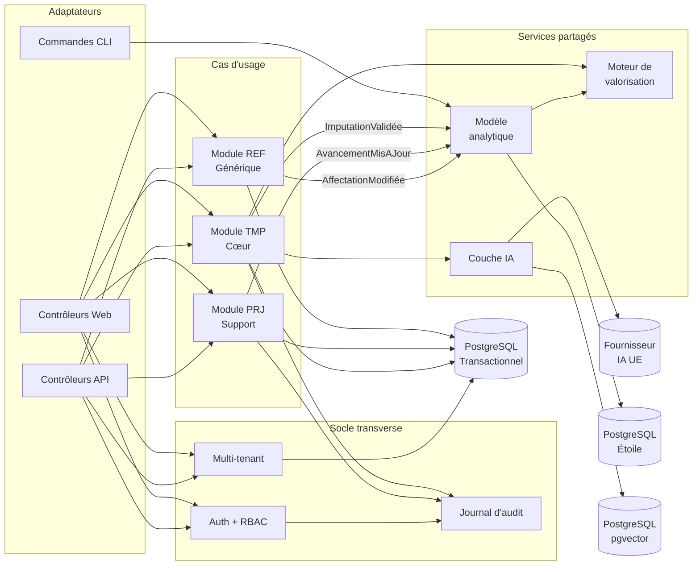

# C4 — Niveau 3 : Composants internes — HotOnes (Lot 1)

**Projet :** HotOnes — ERP SaaS agence digitale / ESN
**Date :** 2026-08-31
**Périmètre :** Monolithe modulaire — modules lot 1 (EPIC-000..003)
**Réf. tech-spec :** §2.3, §5

---

## Diagramme des composants (monolithe modulaire — lot 1)

```mermaid
C4Component
    title Composants internes — Monolithe modulaire HotOnes (Lot 1)

    Person(user_p1, "P1 Camille\n(Collaborateur)")
    Person(user_pm, "P2 Marc\n(Chef de projet)")
    Person(user_dir, "P6 Élodie\n(Direction)")
    Person(admin, "Admin Tenant")

    Container_Boundary(frankenphp_bound, "Application FrankenPHP (Symfony 8.1)") {

        %% ─── Adaptateurs d'entrée ───
        Component(web_ctrl, "Contrôleurs Web\n(Adaptateur HTTP/Twig)", "Symfony Controller\nTwig · Stimulus · Turbo", "Traduit requête HTTP en appel\nde cas d'usage (ARC-15).\nJamais de logique métier (ARC-16).\nRendu serveur par défaut (ARC-25).")

        Component(api_ctrl, "Contrôleurs API\n(Adaptateur API Platform)", "API Platform 4.3.x\nStateProvider · StateProcessor\nDTO strict (ARC-55)", "Expose l'API interne (lot 1)\net publique (lot 3).\nDélègue aux cas d'usage (ARC-56).\nOpenAPI auto-générée (ARC-58).")

        Component(cli_ctrl, "Commandes CLI\n(Adaptateur Console)", "Symfony Console", "Reconstruction analytique (ARC-112).\nGénération de fixtures (ARC-87).\nTâches planifiées (ARC-62).")

        %% ─── Socle multi-tenant ───
        Component(tenant_core, "Socle Multi-tenant", "TenantMiddleware\nDoctrineFilter (ARC-33)\nRLS SessionVar (ARC-34/61)\nTenantProvisioner (ENF-SAAS-2)", "Pose le tenant en début de requête,\nfiltre ORM automatique,\neffacement en fin de requête (ARC-61).\nOnboarding < 15 min.")

        Component(auth_rbac, "Auth + RBAC", "Symfony Security\nVoters HAB-1..6\nPassport 2FA (ENF-SEC-2)\nSSO OIDC/SAML", "Authentification et contrôle d'accès.\nRègles d'habilitation dans les\ncas d'usage (ARC-19).\nTout accès donnée sensible tracé (HAB-6).")

        %% ─── Couche applicative — Cas d'usage par module ───
        Component(ref_app, "Module REF\n(Référentiels)", "GÉNÉRIQUE — traitement minimal\nAppServices CRUD\n(INV-2 : historisation\nà date d'effet)", "Organisation, Collaborateurs, Profils\n(coûts/taux historisés), Calendriers,\nCompétences, Clients, Devises,\nStatuts, Seuils d'alerte.\nOnboarding tenant (US-019).")

        Component(prj_app, "Module PRJ\n(Projets)", "SUPPORT — traitement intermédiaire\nCommands: CreateProject,\nUpdateBudget, DetectDrift\nQueries: LandingView,\nDriftAlertQuery\n(INV-4/8, ARC-17)", "Projets, Lots, Jalons, Affectations.\nBudget bidimensionnel charge/montant.\nAvancement physique et RAF (INV-4).\nDétection de dérive (EF-PRJ-14).\nLien permanent projet→devis (INV-8).")

        Component(tmp_app, "Module TMP\n(Temps — CŒUR)", "CŒUR — traitement complet\nDomain riche : ImputationTemps\n(immuable INV-3), PériodeSaisie\nCommands: SubmitEntry,\nValidateWeek, ClosePeriod\nQueries: WeeklySheet,\nCompletionDashboard\n(ARC-17)", "Saisie hebdomadaire et quotidienne.\nValidation par lot (INV-3 : valorisation\nfigée à la validation).\nClôture de période.\nRelances automatiques (US-056).\nTableau de bord complétude (US-058).")

        Component(core_audit, "Journal d'audit", "AuditTrailService\n(INV-7 · HAB-6)", "Journalise toute action à effet métier.\nLecture de données sensibles tracée.\nConsultable par l'admin tenant.")

        %% ─── Moteur de valorisation (ARC-6) ───
        Component(valuation_engine, "Moteur de valorisation\n(ARC-6 — unique)", "MoteurDeValorisation\nMoney (objet-valeur)\nTaux à date d'effet (INV-2/3)", "Un seul moteur — jamais dupliqué\nni backend/frontend (ARC-6).\nInvoqué par ValidateWeek\net par les projections analytiques.\nTest RG-TMP-valorisation-* (ARC-103).")

        %% ─── Modèle analytique (ADR-9) ───
        Component(analytics, "Modèle analytique\nen étoile (ADR-9)", "ProjectionF_Imputation\nProjectionF_AvancementProjet\nProjectionF_Capacite\nCommandeReconstruction (ARC-112)\nTestNonDivergence (ARC-113)\n(ARC-111..114)", "Alimenté exclusivement par\nprojections d'événements.\nJamais écrit directement par\nle code métier (ARC-111).\nReconstruction testée en CI (ARC-113).\nRéconciliation périodique prod (ARC-114).")

        %% ─── Couche IA produit ───
        Component(ai_gateway, "Couche IA produit\n(ARC-5 · ADR-10)", "AiGateway (point unique)\nContextBuilder (ARC-73/HAB-5)\nTenantQuotaGuard (ARC-74)\nAiCallLogger (ARC-75)\nSourceCitationCollector (ARC-76)\nComputedValueInjector (ARC-77)\nFeatureSwitch (ARC-78)\nManualFallbackRouter (ARC-79)", "Pré-remplissage saisie (US-053).\nContexte filtré avant prompt.\nCitation des sources (ENF-IA-1).\nCommutateur par tenant (ENF-IA-9).\nChemin manuel équivalent (ENF-DISPO-5).")

        %% ─── Infrastructure partagée ───
        Component(shared_infra, "Infrastructure partagée", "Bus Messenger (sync+async)\nScheduler (ARC-62)\nCache Symfony\nMailer\nMigrations Doctrine", "Bus de messages interne.\nTâches planifiées versionnées.\nRelances, purges RGPD.")
    }

    %% ─── Dépôts et bases de données ───
    ContainerDb(pg_transac, "PostgreSQL\n(modèle transactionnel)", "Entités + RLS + INV-1..8")
    ContainerDb(pg_star, "PostgreSQL\n(modèle analytique en étoile)", "F_Imputation · F_Avancement\nF_Capacite · Dimensions")
    ContainerDb(pg_vectors, "PostgreSQL\n(pgvector)", "Vecteurs sémantiques\npré-remplissage IA")

    System_Ext(ai_provider_ext, "Fournisseur IA (UE)", "Inférence — clé par tenant")

    %% ─── Relations utilisateurs → adaptateurs ───
    Rel(user_p1, web_ctrl, "Interface saisie de temps\nResponsive (ENF-UX-3)", "HTTPS")
    Rel(user_pm, web_ctrl, "Vue projet, atterrissage\ndétection de dérive", "HTTPS")
    Rel(user_dir, web_ctrl, "Tableau de bord\nIndicateurs explicables", "HTTPS")
    Rel(admin, web_ctrl, "Administration tenant\nParamétrage, onboarding", "HTTPS")
    Rel(user_p1, api_ctrl, "Saisie mobile\n(API JSON)", "HTTPS/JSON")

    %% ─── Adaptateurs → socle transverse ───
    Rel(web_ctrl, tenant_core, "Résolution du tenant\ncourant (ARC-61)")
    Rel(api_ctrl, tenant_core, "Résolution du tenant\ncourant (ARC-61)")
    Rel(web_ctrl, auth_rbac, "Authentification\n+ vérification rôles")
    Rel(api_ctrl, auth_rbac, "Authentification\n+ vérification rôles")

    %% ─── Adaptateurs → cas d'usage ───
    Rel(web_ctrl, ref_app, "Paramétrage\nreferentiels")
    Rel(web_ctrl, prj_app, "Gestion projets\nlots, jalons")
    Rel(web_ctrl, tmp_app, "Saisie temps\nvalidation")
    Rel(api_ctrl, ref_app, "CRUD référentiels\nvia DTO")
    Rel(api_ctrl, prj_app, "CRUD projets\nvia DTO")
    Rel(api_ctrl, tmp_app, "Saisie API\n(mobile, intégrations)")
    Rel(cli_ctrl, analytics, "Reconstruction complète\n(ARC-112)")

    %% ─── Cas d'usage → moteur ───
    Rel(tmp_app, valuation_engine, "Valorisation à la\nvalidation (INV-3)")
    Rel(analytics, valuation_engine, "Valorisation pour\nprojection F_Imputation")

    %% ─── Cas d'usage → IA ───
    Rel(tmp_app, ai_gateway, "Pré-remplissage semaine\n(US-053, consentement)")

    %% ─── Émission d'événements → analytique ───
    Rel(tmp_app, analytics, "ImputationValidée\nPériodeClôturée\n(Messenger bus)")
    Rel(prj_app, analytics, "AvancementMisAJour\n(Messenger bus)")
    Rel(ref_app, analytics, "AffectationModifiée\n(pour F_Capacite)")

    %% ─── Audit ───
    Rel(tmp_app, core_audit, "Journalise actions\nmétier (INV-7)")
    Rel(prj_app, core_audit, "Journalise actions\nmétier (INV-7)")
    Rel(auth_rbac, core_audit, "Journalise accès\ndonnées sensibles (HAB-6)")

    %% ─── Infrastructure → base de données ───
    Rel(tenant_core, pg_transac, "Politique RLS + filtre\nORM (ARC-33/34)")
    Rel(ref_app, pg_transac, "CRUD référentiels")
    Rel(prj_app, pg_transac, "CRUD projets / lots")
    Rel(tmp_app, pg_transac, "CRUD imputations\n(immuables après INV-3)")
    Rel(analytics, pg_star, "Écriture projections\n(INSERT/UPDATE faits)")
    Rel(ai_gateway, pg_vectors, "Lecture/écriture\nvecteurs (ARC-41)")

    %% ─── IA → fournisseur externe ───
    Rel(ai_gateway, ai_provider_ext, "Inférence\nContexte filtré (ARC-73)\nUE uniquement (CTR-5)", "HTTPS")
```

---

## Description des composants

### Adaptateurs d'entrée

| Adaptateur | Règle clé | Rôle |
|-----------|-----------|------|
| Contrôleurs Web | `ARC-15/16` | Traduit HTTP → cas d'usage, résultat → réponse Twig/Turbo. Aucune logique. |
| Contrôleurs API | `ARC-55/56/58` | `StateProvider` / `StateProcessor` appelle un cas d'usage. DTO strict. OpenAPI générée. |
| Commandes CLI | `ARC-17/62` | Reconstruction analytique, fixtures, planifications. Prouve que les cas d'usage sont invocables sans HTTP. |

### Socle multi-tenant (`ARC-33/34/61`)

La double barrière est invisible du code métier mais active sur toute requête :
1. `DoctrineFilter` injecte `WHERE tenant_id = :current_tenant` sur chaque requête ORM.
2. La politique RLS PostgreSQL bloque toute requête SQL n'ayant pas le bon `app.current_tenant` en variable de session.
3. Le contexte est effacé en fin de requête pour neutraliser la persistance du mode worker (`ARC-47`).

Le `TenantProvisioner` crée un tenant complet (schéma RLS, rôles par défaut, paramétrage de base) en moins de 15 minutes, sans intervention infra (`ENF-SAAS-2`).

### Auth + RBAC (`ARC-19`, `HAB-1..6`)

Les habilitations sont évaluées dans les **cas d'usage**, pas dans les adaptateurs. Un `Voter` Symfony implémente chaque règle `HAB-n`. Les règles critiques (`HAB-1` coût invisible du CP, `HAB-5` filtrage IA à la source) sont écrites manuellement, relues ligne à ligne, couvertes par des tests écrits depuis l'exigence (`ARC-106/108`).

### Module REF — Référentiels (GÉNÉRIQUE)

Traitement minimal (`ARC-101`) : entités de persistance portant le comportement, services applicatifs CRUD. La complexité réelle porte sur l'historisation à date d'effet (`INV-2`) : les profils avec coûts/taux sont versionnés (SCD Type 2). Le fait est rattaché à la **version de profil en vigueur à sa date**, jamais à la version courante.

### Module PRJ — Projets (SUPPORT)

Traitement intermédiaire : entités riches avec comportement, objets-valeurs sur les grandeurs (`Budget`, `Avancement`, `Atterrissage`), mais séparation domaine/persistance non systématique. Les événements de domaine (`ProjetCréé`, `AvancementMisAJour`) alimentent les projections analytiques. Le lien permanent projet → devis source (`INV-8`) est une contrainte de base de données, pas uniquement du code.

### Module TMP — Temps (CŒUR)

Traitement complet : modèle de domaine riche, objets-valeurs (`DuréeImputation`, `PériodeSaisie`, `ValeurImputation`), événements de domaine, politiques de validation et de clôture. L'invariant central est `INV-3` : une imputation validée est **immuable** — la valorisation (coût, prix, marge) est figée au moment de la validation et ne change jamais par la suite, même si les taux du profil évoluent.

La clôture de période (`US-057`) génère un instantané de référence. Toute modification ultérieure d'une imputation validée est refusée par le domaine — pas par un contrôle applicatif seul, mais par une contrainte explicite dans l'entité.

### Moteur de valorisation (`ARC-6`)

Un seul moteur dans `Tmp/Domain/Service/MoteurDeValorisation`, invoqué à deux endroits :
- Lors de la validation d'une imputation (synchrone)
- Lors de la projection `F_Imputation` (pour le modèle analytique)

Ces deux chemins doivent produire le même résultat. Si ce n'est pas le cas, `ARC-113` (test de non-divergence) le détecte en CI avant la production.

**Jamais côté client.** Un recalcul affiché dans l'interface vient toujours du serveur — jamais d'une réimplémentation JavaScript (`ARC-27`). Deux implémentations produiront deux valeurs, et c'est la confiance dans les chiffres qui en pâtit.

### Modèle analytique en étoile (`ADR-9`, `ARC-111..114`)

Les projections (`ProjectionF_Imputation`, `ProjectionF_AvancementProjet`, `ProjectionF_Capacite`) sont des services découplés du domaine, activés par les événements via Symfony Messenger. Elles écrivent dans les tables de faits ; le code métier ne les touche jamais directement.

La `CommandeReconstructionComplète` (`ARC-112`) reconstruit l'intégralité du modèle analytique depuis le seul modèle transactionnel. Elle est testée en CI (`ARC-113`) : les projections incrémentales + la reconstruction complète doivent produire les mêmes agrégats sur le jeu de données de référence. Toute différence bloque le build.

### Couche IA produit (`ARC-5`, `ADR-10`)

Le `ContextBuilder` est l'élément central de sécurité : il interroge le modèle transactionnel en appliquant le filtre tenant (`ARC-33/34`) ET les habilitations de l'utilisateur (`HAB-5`) avant de construire le contexte envoyé au fournisseur. Il n'y a pas de seconde chance : si la donnée n'est pas dans le contexte, le modèle ne peut pas la restituer.

La première fonction IA du lot 1 (US-053 — pré-remplissage de la saisie de temps) mobilise uniquement les affectations de la semaine visible par l'utilisateur. Le consentement est recueilli avant le premier usage. L'AIPD est un prérequis bloquant à la MEP.

---

## Dépendances entre modules

**Règles de dépendance vérifiées par Deptrac (`ARC-63`) :**

| Règle | Enforcement |
|-------|------------|
| Aucun module ne dépend d'un autre autrement que par contrat explicite | Deptrac — bloquant CI |
| La couche applicative ne dépend d'aucune classe HTTP Symfony | Deptrac — bloquant CI |
| Aucune classe ressource API n'est une entité de persistance | Deptrac — bloquant CI |
| REF ne dépend ni de PRJ ni de TMP | Deptrac — bloquant CI |
| PRJ peut lire des contrats REF, pas accéder à ses entités | Deptrac — bloquant CI |
| TMP peut lire des contrats REF et PRJ, pas accéder à leurs entités | Deptrac — bloquant CI |

---

## Dosage DDD par module — lot 1 (`ARC-100`)

| Module | Classement | Rationale |
|--------|-----------|-----------|
| **TMP** Temps | **Cœur** | `INV-3` (immuabilité), valorisation, politiques de clôture — complexité différenciante |
| **PRJ** Projets | Support | Entités riches avec invariants (`INV-4/8`), mais pas de séparation domaine/persistance systématique |
| **REF** Référentiels | Générique | CRUD paramétré + historisation (`INV-2`) — cérémonies DDD inutiles ici |
| Socle multi-tenant | Infrastructure | Aucune logique métier — uniquement plomberie technique |
| Modèle analytique | Lecture seule | Aucun modèle de domaine — dérivé du transactionnel (`ARC-101`, `ADR-9`) |

> Ce dosage est **documenté et opposable** (`ARC-100`). Il est révisable si un module accumule des règles métier complexes (révision tracée, `ARC-102`).

---

**Documents associés :**
- `c4-context.md` — niveau 1 (contexte système)
- `c4-container.md` — niveau 2 (conteneurs)
- `tech-spec.md` §5 (conception des composants détaillée)
- `architecture/erd.md` — schéma de données (document parallèle)
