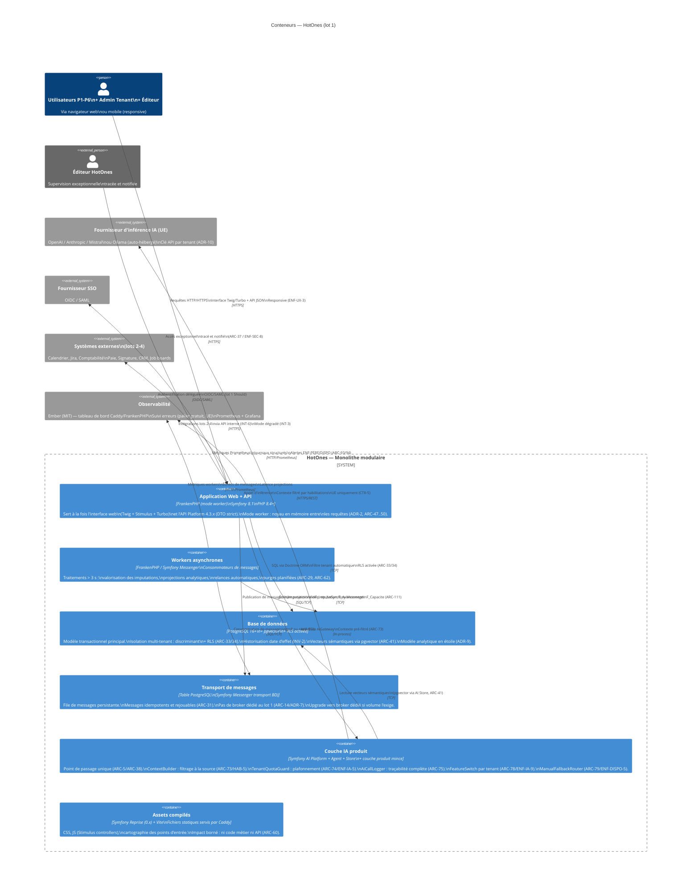

# C4 — Niveau 2 : Conteneurs HotOnes

**Projet :** HotOnes — ERP SaaS agence digitale / ESN
**Date :** 2026-08-31
**Réf. tech-spec :** §2.2, §2.4

---

## Diagramme des conteneurs

---

## Description des conteneurs

### 1. Application Web + API (FrankenPHP — mode worker)

**Technologies :** FrankenPHP (Caddy intégré), Symfony 8.1, PHP 8.4+, API Platform 4.3.x, Twig, Stimulus, Turbo
**ADR :** ADR-1, ADR-2, ADR-4, ADR-5

Ce conteneur unique sert à la fois :

- L'**interface web** : rendu serveur Twig, enrichi par Stimulus (contrôleurs JS ciblés) et Turbo (navigation partielle sans rechargement). Mode par défaut : rendu serveur (`ARC-25`).
- L'**API interne** : adaptateur API Platform en mode DTO strict. Les `StateProvider` et `StateProcessor` appellent les cas d'usage de la couche applicative (`ARC-56`). Jamais d'exposition directe d'entités (`ARC-55`).

**Mode worker :** l'application reste chargée en mémoire entre les requêtes (gain clé sur `ENF-PERF-2`). Contrainte critique : aucun état ne survit entre deux requêtes (`ARC-47`). Le contexte de tenant est positionné en début de requête et effacé en fin (`ARC-61`). Le gestionnaire d'entités et le contexte de sécurité sont réinitialisés (`ARC-48`).

**Responsabilités de sécurité :**
- Authentification (local + SSO)
- Application des habilitations dans les cas d'usage (`ARC-19`)
- Filtrage tenant par Doctrine + RLS PostgreSQL (`ARC-33/34`)

### 2. Workers asynchrones

**Technologies :** FrankenPHP / Symfony Messenger (consommateurs), Symfony Scheduler
**ADR :** ADR-7

Consommateurs de la file de messages (transport BD). Traitements découplés de la requête HTTP :

| Worker | Déclencheur | Traitement |
|--------|-------------|-----------|
| Projection analytique | Événement de domaine (`ImputationValidée`, `AvancementMisAJour`) | Écriture dans `F_Imputation`, `F_AvancementProjet`, `F_Capacite` |
| Valorisation différée | Queue Messenger | Calcul coût/marge après validation de temps |
| Relances saisie | Scheduler (J+2) | Email de relance aux collaborateurs en retard (US-056) |
| Purge / anonymisation | Scheduler périodique | RGPD — suppression logique (`INV-6`, `ENF-RGPD-2`) |

Tous les messages sont idempotents et rejouables (`ARC-31`). Les échecs sont visibles d'un administrateur tenant avec possibilité de rejeu (`ARC-32`).

### 3. Base de données PostgreSQL + pgvector

**Technologies :** PostgreSQL 16+, pgvector, RLS (Row-Level Security)
**ADR :** ADR-6, ADR-9

Responsable de :

- **Modèle transactionnel** : entités métier avec discriminant `tenant_id` sur chaque table, contraintes d'exclusion pour l'historisation à date d'effet (`INV-2`), suppression logique uniquement (`INV-6`).
- **Isolation multi-tenant** : double barrière — filtre ORM automatique (`ARC-33`) + politique RLS (`ARC-34`). La RLS est la seconde barrière indépendante du code applicatif.
- **Modèle analytique en étoile** : tables de dimensions (`D_Temps`, `D_Collaborateur`, `D_Profil`, etc.) et tables de faits (`F_Imputation`, `F_AvancementProjet`, `F_Capacite`). Alimentées uniquement par projection (`ARC-111`).
- **Vecteurs sémantiques** : extension pgvector, accédée via Symfony AI Store (`ARC-41`). Pas de base vectorielle dédiée.
- **Transport de messages** : table Messenger (voir conteneur dédié).

### 4. Transport de messages (table PostgreSQL)

**Technologies :** PostgreSQL (table `messenger_messages`), Symfony Messenger
**ADR :** ADR-7

File persistante dans la base de données. Choix motivé par `ARC-14` (minimiser les systèmes) : pas de broker dédié (RabbitMQ, Redis) tant que le volume de messages ne le justifie pas. La mesure détermine le moment d'upgrade, pas une hypothèse.

Les messages portent le `tenant_id` et sont soumis à la même politique d'isolation que les entités métier.

### 5. Couche IA produit

**Technologies :** Symfony AI (Platform, Agent, Store, AI Bundle), couche produit mince interne
**ADR :** ADR-10

Point de passage unique vers les fournisseurs d'inférence (`ARC-5`). La couche produit ajoute ce qu'aucun composant générique ne porte :

| Composant produit | Règle CDC | Garantie |
|-------------------|-----------|---------|
| `ContextBuilder` | `ARC-73` / `HAB-5` | Filtrage des données à la source, avant le prompt — jamais après |
| `TenantQuotaGuard` | `ARC-74` / `ENF-IA-5` | Plafonnement par tenant et par fonction ; dégradation gracieuse |
| `AiCallLogger` | `ARC-75` / `ENF-IA-4` | Journal : fonction, utilisateur, tenant, modèle, jetons, coût, latence |
| `SourceCitationCollector` | `ARC-76` / `ENF-IA-1` | Références sources restituables (explicabilité) |
| `ComputedValueInjector` | `ARC-77` / `ENF-IA-3` | Valeurs calculées insérées dans le texte — jamais générées par le LLM |
| `FeatureSwitch` | `ARC-78` / `ENF-IA-9` | Commutateur par tenant + par fonction |
| `ManualFallbackRouter` | `ARC-79` / `ENF-DISPO-5` | Route vers le chemin manuel si IA indisponible |

Le `ContextBuilder` est le **composant critique de sécurité de la couche IA** : il garantit que les données transmises au modèle respectent les habilitations de l'utilisateur. Un test d'intrusion dédié (injection de consigne, extraction par recoupement) valide cette garantie avant chaque MEP incluant une fonction IA (`ARC-106`, `ENF-SEC-6`).

### 6. Assets compilés

**Technologies :** Symfony Reprise 0.x (expérimental), Vite, Caddy (serveur statique)
**ADR :** ADR-5

Fichiers statiques (CSS, JS Stimulus) pré-compilés, servis directement par Caddy. Le versionnement par empreinte (`ARC-60`) protège contre les problèmes de cache. L'impact d'une rupture d'API de Reprise est borné : il ne touche que la configuration de build, pas le code métier ni l'API.

---

## Points d'attention transverses

### Parité environnements (ADR-11)

L'image de développement utilise **la même base FrankenPHP** que la production (`ARC-86`). Le mode worker est exercé dès le développement. Développer en mode requête classique et déployer en mode worker est la meilleure façon de découvrir les fuites d'état en production.

### Frontières de modules (ADR-8 / ARC-63)

À l'intérieur du conteneur FrankenPHP, les modules (REF, PRJ, TMP, Shared…) sont des frontières logiques vérifiées par Deptrac en CI — pas des services séparés. Un module ne dépend d'un autre que par un contrat explicitement déclaré (`ARC-65`).

### Pas de Redis, pas de broker au lot 1

Conformément à `ARC-14` (minimiser les systèmes), il n'y a pas de Redis (cache, session) ni de broker de messages au lot 1. Les sessions Symfony utilisent le stockage natif (compatible mode worker après réinitialisation `ARC-48`). Le cache applicatif est géré par Symfony Cache en mémoire ou sur système de fichiers. L'upgrade vers Redis ou un broker est déclenché par la mesure, pas par anticipation.

---

**Documents associés :**
- `c4-context.md` — niveau 1 (contexte)
- `c4-component.md` — niveau 3 (composants internes, lot 1)
- `tech-spec.md` §2.4 (stack détaillée)
