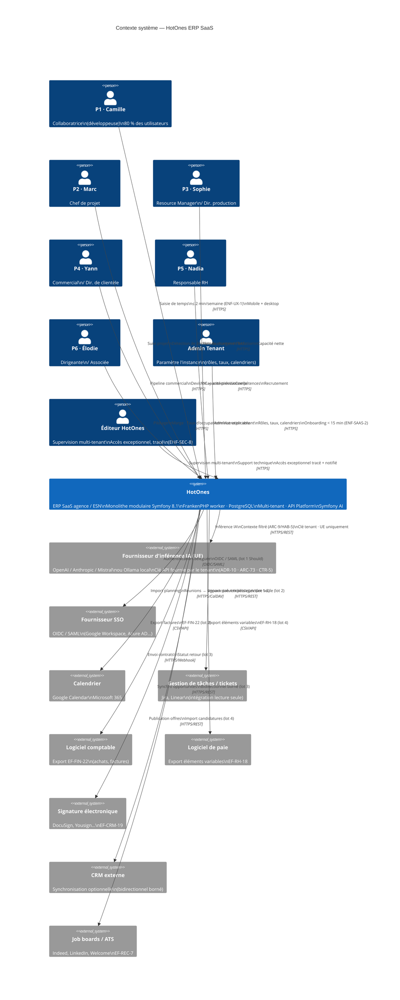

# C4 — Niveau 1 : Contexte système HotOnes

**Projet :** HotOnes — ERP SaaS agence digitale / ESN
**Date :** 2026-08-31
**Réf. tech-spec :** §2.1

---

## Diagramme de contexte

---

## Légende et notes

### Utilisateurs

| Persona | Fréquence | Volume | Exigence clé |
|---------|-----------|--------|-------------|
| P1 Camille — Collaborateur | Quotidien, 2-5 min | 80 % des comptes | `ENF-UX-1` : saisie ≤ 2 min/semaine — bloquant lot 1 |
| P2 Marc — Chef de projet | Quotidien-hebdo, 20-40 min | 10-15 % | Détection de dérive avant 50 % budget (`OBJ-2`) |
| P3 Sophie — Resource Manager | Hebdo, 1-2 h | 1-5 % | Plan de charge 4-12 semaines sans tableur |
| P4 Yann — Commercial | Quotidien, 15-30 min | 3-8 % | Capacité réelle avant engagement de date |
| P5 Nadia — RH | Hebdo, 1-3 h | 1-3 % | Données entretien cloisonnées (`HAB-2`) |
| P6 Élodie — Dirigeante | Hebdo-mensuel, 30 min | 1 % | Indicateurs explicables, réconciliés comptabilité |
| Admin Tenant | Occasionnel | 1 par tenant | Onboarding < 15 min sans intervention infra (`ENF-SAAS-2`) |
| Éditeur HotOnes | Exceptionnel | Équipe produit | Accès tracé et notifié au tenant (`ENF-SEC-8`, `ARC-37`) |

### Systèmes externes — priorités par lot

| Priorité | Système | Lot | Nature |
|----------|---------|-----|--------|
| Must lot 1 | Fournisseur IA (UE) | 1 | Sortant — clé par tenant, filtrage à la source (`ARC-9`) |
| Should lot 1 | SSO (OIDC/SAML) | 1 | Entrant — fallback authentification locale |
| Should lot 2 | Calendrier | 2 | Entrant — signaux pré-remplissage (consentement `INT-5`) |
| Should lot 2 | Jira/Linear | 2 | Entrant — lecture statut tickets (`EF-PRJ-25`) |
| Should lot 2 | Comptabilité | 2 | Sortant — export factures (`EF-FIN-22`) |
| Should lot 3 | Signature électronique | 3 | Sortant + retour statut (`EF-CRM-19`) |
| Could lot 3 | CRM externe | 3 | Bidirectionnel borné |
| Should lot 4 | Logiciel de paie | 4 | Sortant — éléments variables (`EF-RH-18`) |
| Could lot 4 | Job boards / ATS | 4 | Sortant + entrant (`EF-REC-7`) |

### Contraintes de souveraineté

`CTR-5` / `ENF-RGPD-7` : tout hébergement et tout traitement IA est dans l'Union européenne. Le fournisseur d'inférence est choisi par le tenant parmi les fournisseurs supportés disposant de régions UE (ou un point d'accès Ollama auto-hébergé). HotOnes ne transit pas de données tenant vers un hébergement hors UE.

### Points ouverts liés au contexte

- `ARB-3` / `CTR-5` : choix du fournisseur d'inférence IA UE par l'éditeur (pour l'offre avec inférence incluse, `ARB-24`) — à trancher au lot 0.
- `ARB-25` : hébergement de production UE — à instruire au lot 2.

---

**Document suivant :** `c4-container.md` (niveau 2 — conteneurs)
