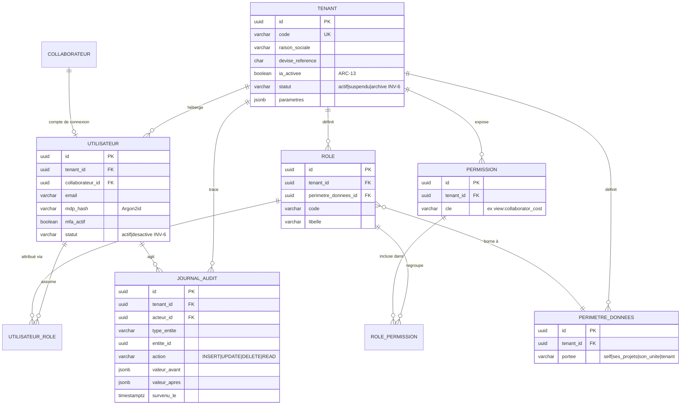
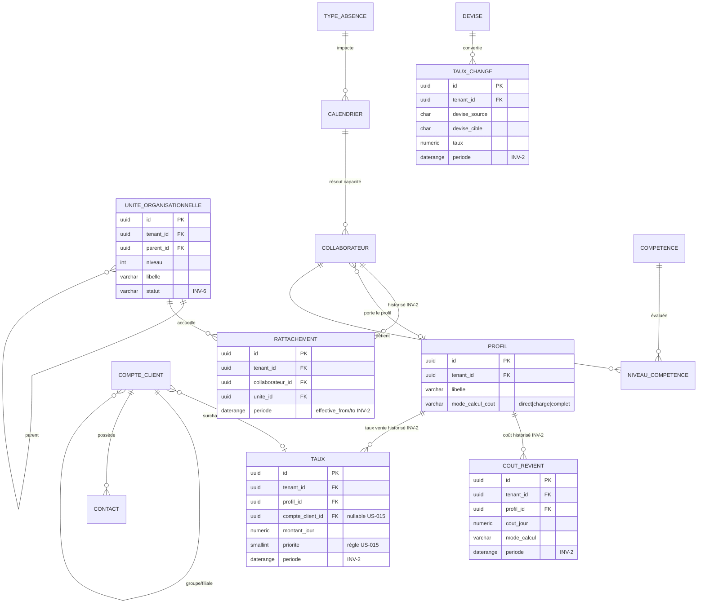
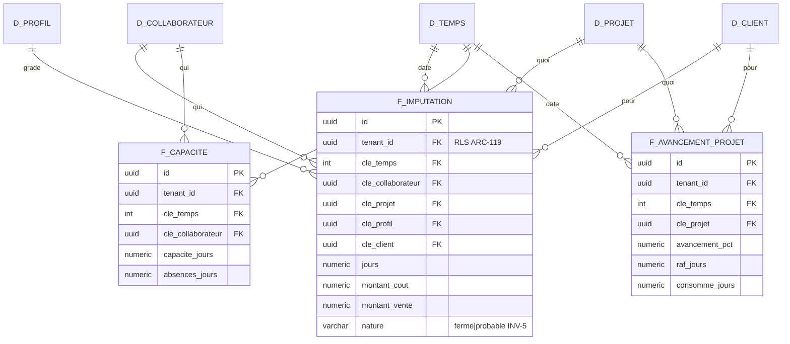

# Modèle de données — HotOnes (ERP agence digitale / ESN)

> **Périmètre** : LOT 1 (socle + modules REF, PRJ, TMP) et fondations transverses.
> **SGBD** : PostgreSQL 16+ (+ pgvector, `btree_gist`). **Isolation** : discriminant partagé `tenant_id` + Row-Level Security (double barrière, `ADR-6`).
> **Sources** : `cdc/06` (invariants `INV-1..8`), `analysis/technical-options.md` (§5, ADR-6/ADR-9), `analysis/constraints.md` (INV-\*, HAB-\*, ENF-\*), `backlog/index.md` (US lot 1).
> **Auteur** : Database Architect — **Date** : 2026-08-31

Ce document fixe le **modèle physique cible** du lot 1. Il traduit chaque invariant structurel en contrainte de base de données, pas en règle applicative : conformément à `INV-1` et à `ARC-104`, les invariants sont **garantis en base**, jamais seulement dans le code.

---

## 1. Conventions transverses

Ces règles s'appliquent à **toutes** les tables métier ; elles ne sont pas répétées dans chaque définition.

| Convention | Règle | Motif |
|---|---|---|
| Clé primaire | `uuid` (`gen_random_uuid()`), **UUID v7 recommandé** (ordonnancement temporel, anti-fragmentation d'index) | `INV-1`, éviter fragmentation |
| Discriminant tenant | Colonne `tenant_id uuid NOT NULL REFERENCES tenant(id)` sur **chaque** table | `INV-1` |
| Horodatage | `cree_le timestamptz NOT NULL DEFAULT now()`, `modifie_le timestamptz` | Audit |
| Traçabilité auteur | `cree_par uuid`, `modifie_par uuid` (→ `utilisateur`) | `INV-7` |
| Pas de suppression | `statut`/`archive_le` au lieu de `DELETE` (privilège `DELETE` révoqué) | `INV-6` |
| Champs personnalisés | `champs_perso jsonb NOT NULL DEFAULT '{}'` indexé GIN | `ARB-5`, extensibilité par tenant |
| Devise | Montants en `numeric(14,2)`, jamais `float` ; code devise `char(3)` ISO 4217 | Exactitude financière |
| Historisation financière | Intervalle `daterange` + contrainte d'exclusion anti-chevauchement | `INV-2` |

---

## 2. Diagramme ERD

Le modèle logique est unique ; il est présenté en quatre vues thématiques reliées par `tenant_id` et les clés partagées, pour la lisibilité.

### 2.1 Socle multi-tenant, RBAC et audit (EPIC-000)



### 2.2 Référentiels (EPIC-001)



### 2.3 Cœur transactionnel — Projets et Temps (EPIC-002, EPIC-003)

```mermaid
erDiagram
    DEVIS ||--o{ PROJET : "engendre INV-8"
    COMPTE_CLIENT ||--o{ PROJET : "commande"
    PROJET ||--o{ LOT : "structuré en"
    LOT ||--o{ JALON : "jalonné"
    PROJET ||--o{ AVENANT : "révisé INV-2"
    PROJET ||--o{ BUDGET_LIGNE : "budgété charge/montant"
    LOT ||--o{ AVANCEMENT : "avancement/RAF INV-4"
    PROJET ||--o{ AFFECTATION : "staffe"
    COLLABORATEUR ||--o{ AFFECTATION : "affecté"
    PROJET ||--o{ IMPUTATION : "consommé sur"
    LOT ||--o{ IMPUTATION : "détaillé par"
    COLLABORATEUR ||--o{ IMPUTATION : "saisit"
    IMPUTATION ||--o| VALORISATION : "figée INV-3"
    COLLABORATEUR ||--o{ ABSENCE : "déclare"
    TYPE_ABSENCE ||--o{ ABSENCE : "typée"
    COLLABORATEUR ||--o{ COMPTEUR_ABSENCE : "cumule"

    PROJET {
        uuid id PK
        uuid tenant_id FK
        uuid devis_id FK "permanent INV-8"
        uuid compte_client_id FK
        varchar code
        varchar statut "INV-6"
        boolean facturable
    }
    LOT {
        uuid id PK
        uuid tenant_id FK
        uuid projet_id FK
        varchar libelle
        numeric budget_jours
    }
    AFFECTATION {
        uuid id PK
        uuid tenant_id FK
        uuid projet_id FK
        uuid collaborateur_id FK
        varchar role_projet
        daterange periode
        numeric charge_prev_jours
        boolean ouverture_exceptionnelle
    }
    IMPUTATION {
        uuid id PK
        uuid tenant_id FK
        uuid collaborateur_id FK
        uuid projet_id FK
        uuid lot_id FK
        date date_activite
        int duree_minutes
        varchar nature "ferme|probable INV-5"
        varchar statut "brouillon|soumise|validee INV-3"
        jsonb champs_perso
    }
    VALORISATION {
        uuid id PK
        uuid tenant_id FK
        uuid imputation_id FK UK
        numeric snapshot_cout_jour "figé INV-3"
        numeric snapshot_taux_vente_jour "figé INV-3"
        numeric snapshot_taux_change
        numeric montant_cout
        numeric montant_vente
        date taux_source_effectif
        timestamptz validee_le
    }
    AVANCEMENT {
        uuid id PK
        uuid tenant_id FK
        uuid lot_id FK
        numeric avancement_physique_pct "INV-4 saisi"
        numeric raf_jours "INV-4 saisi indépendant"
        date date_mesure
    }
    ABSENCE {
        uuid id PK
        uuid tenant_id FK
        uuid collaborateur_id FK
        uuid type_absence_id FK
        daterange periode
        varchar maille "journee|demi_journee"
        varchar statut "attente|validee|refusee"
    }
    COMPTEUR_ABSENCE {
        uuid id PK
        uuid tenant_id FK
        uuid collaborateur_id FK
        uuid type_absence_id FK
        numeric acquis
        numeric pris
        numeric en_attente
        int annee_reference
    }
```

> **Note `INV-4`** : la table `AVANCEMENT` porte `avancement_physique_pct` et `raf_jours` comme **deux colonnes saisies indépendantes**. La **consommation** n'est jamais stockée là : elle est agrégée depuis `IMPUTATION` (`SUM(duree_minutes)`). Aucune des trois grandeurs n'est déduite d'une autre (`RG-PRJ-2`).
>
> **Note `INV-8`** : `PROJET.devis_id` est une FK **permanente**. `DEVIS` appartient au module CRM (lot 3) ; en lot 1 la colonne est **nullable** mais devient **immuable une fois renseignée** (trigger `BEFORE UPDATE` refusant tout changement d'un `devis_id` non nul). Les avenants du devis sont chaînés côté CRM et rattachés au projet.

### 2.4 Schéma analytique en étoile (ADR-9 — voir §5)



---

## 3. Application des invariants `INV-1..8`

Chaque invariant est traduit par une **contrainte physique**, pas par une consigne applicative.

| Réf | Traduction physique dans PostgreSQL |
|---|---|
| **INV-1** — tenant sur toute entité | Colonne `tenant_id uuid NOT NULL` + FK `tenant(id)` sur **chaque** table ; **RLS activée + forcée** (double barrière §4). Index composite préfixé `tenant_id`. |
| **INV-2** — historisation à date d'effet | Tables dédiées (`cout_revient`, `taux`, `taux_change`, `rattachement`, `avenant`) portant un intervalle `daterange` ; **contrainte d'exclusion `EXCLUDE USING gist`** interdisant tout chevauchement (couvre le refus CA-5 de US-011/US-016). Aucune donnée passée réécrite lors d'une révision. |
| **INV-3** — imputation immuable + valorisation figée | `IMPUTATION` : trigger interdisant `UPDATE`/`DELETE` d'une ligne `statut='validee'`. `VALORISATION` : colonnes `snapshot_*` figées à la validation, jamais recalculées si un taux change ultérieurement (US-060 CA-2). |
| **INV-4** — avancement / RAF / consommation distincts | `AVANCEMENT.avancement_physique_pct` + `AVANCEMENT.raf_jours` = deux colonnes **saisies** ; la consommation est **agrégée** depuis `IMPUTATION`. Trois chemins de donnée indépendants. |
| **INV-5** — charge ferme ≠ probable | Colonne `nature varchar CHECK (nature IN ('ferme','probable'))` sur `IMPUTATION` et `F_IMPUTATION` ; jamais fusionnées, la distinction survit à tous les agrégats analytiques. |
| **INV-6** — aucune suppression physique | Privilège SQL `DELETE` **révoqué** au rôle applicatif ; colonne `statut`/`archive_le` partout ; suppression d'un référentiel référencé refusée (US-010/US-012/US-014 CA-5), désactivation proposée. |
| **INV-7** — journalisation métier | Table `JOURNAL_AUDIT` (acteur, type_entité, entité_id, action, `valeur_avant`/`valeur_apres` en `jsonb`, horodatage, `tenant_id`). Alimentée par triggers sur les tables sensibles + par la couche applicative pour les lectures sensibles (`HAB-6`). |
| **INV-8** — lien permanent projet → devis | FK `PROJET.devis_id` permanente + immuable (trigger refusant la modification d'une valeur non nulle) ; chaînage des avenants côté CRM. Condition de la comparaison vendu/réalisé. |

### 3.1 DDL — `IMPUTATION` (unité immuable, `INV-3` / `INV-5`)

```sql
CREATE TABLE imputation (
    id               uuid PRIMARY KEY DEFAULT gen_random_uuid(),
    tenant_id        uuid NOT NULL REFERENCES tenant(id),
    collaborateur_id uuid NOT NULL REFERENCES collaborateur(id),
    projet_id        uuid NOT NULL REFERENCES projet(id),
    lot_id           uuid     NULL REFERENCES lot(id),
    date_activite    date NOT NULL,
    duree_minutes    integer NOT NULL CHECK (duree_minutes > 0),
    nature           varchar(10) NOT NULL DEFAULT 'ferme'
                        CHECK (nature IN ('ferme','probable')),      -- INV-5
    statut           varchar(12) NOT NULL DEFAULT 'brouillon'
                        CHECK (statut IN ('brouillon','soumise','validee')),
    champs_perso     jsonb NOT NULL DEFAULT '{}'::jsonb,             -- ARB-5
    cree_le          timestamptz NOT NULL DEFAULT now(),
    cree_par         uuid NOT NULL
);

-- INV-3 : une imputation validée est immuable
CREATE OR REPLACE FUNCTION imputation_immuable() RETURNS trigger AS $$
BEGIN
    IF OLD.statut = 'validee' THEN
        RAISE EXCEPTION 'INV-3 : imputation validée immuable (id=%)', OLD.id;
    END IF;
    RETURN NEW;
END;
$$ LANGUAGE plpgsql;

CREATE TRIGGER trg_imputation_immuable
    BEFORE UPDATE OR DELETE ON imputation
    FOR EACH ROW EXECUTE FUNCTION imputation_immuable();
```

### 3.2 DDL — `VALORISATION` (snapshot figé, `INV-3`)

```sql
CREATE TABLE valorisation (
    id                     uuid PRIMARY KEY DEFAULT gen_random_uuid(),
    tenant_id              uuid NOT NULL REFERENCES tenant(id),
    imputation_id          uuid NOT NULL UNIQUE REFERENCES imputation(id),
    projet_id              uuid NOT NULL REFERENCES projet(id),
    -- Snapshots figés à la validation, JAMAIS recalculés (US-060 CA-2)
    snapshot_cout_jour     numeric(12,2) NOT NULL,
    snapshot_taux_vente_jour numeric(12,2) NOT NULL,
    snapshot_taux_change   numeric(18,8) NOT NULL DEFAULT 1,
    devise_code            char(3) NOT NULL,
    montant_cout           numeric(14,2) NOT NULL,
    montant_vente          numeric(14,2) NOT NULL,
    taux_source_effectif   date NOT NULL,      -- date d'effet du taux appliqué (audit)
    validee_le             timestamptz NOT NULL,
    validee_par            uuid NOT NULL
);
```

### 3.3 DDL — `TAUX` historisé à date d'effet (`INV-2`, anti-chevauchement)

```sql
CREATE EXTENSION IF NOT EXISTS btree_gist;

CREATE TABLE taux (
    id                uuid PRIMARY KEY DEFAULT gen_random_uuid(),
    tenant_id         uuid NOT NULL REFERENCES tenant(id),
    profil_id         uuid NOT NULL REFERENCES profil(id),
    compte_client_id  uuid     NULL REFERENCES compte_client(id),   -- portée US-015
    montant_jour      numeric(12,2) NOT NULL CHECK (montant_jour >= 0),
    devise_code       char(3) NOT NULL,
    priorite          smallint NOT NULL DEFAULT 100,                -- règle US-015
    periode           daterange NOT NULL,                           -- [effet, fin)
    cree_par          uuid NOT NULL,
    cree_le           timestamptz NOT NULL DEFAULT now(),
    -- INV-2 : pas de chevauchement pour un même (tenant, profil, portée client)
    EXCLUDE USING gist (
        tenant_id WITH =,
        profil_id WITH =,
        coalesce(compte_client_id, '00000000-0000-0000-0000-000000000000'::uuid) WITH =,
        periode WITH &&
    )
);
-- Résolution du taux à une date : WHERE periode @> date_activite (l'entrée courante
-- a une borne haute infinie). Même mécanique pour cout_revient et taux_change.
```

> **Décision de modélisation.** `cout_revient` (coût) et `taux` (vente) sont **deux tables séparées** (le task le demande explicitement) : un chef de projet a accès au taux de vente mais **jamais** au coût (`HAB-1`). La séparation physique permet d'appliquer une **RLS/permission distincte** sur le coût, plutôt qu'un simple masquage d'affichage. `US-011` mentionne une table combinée `profile_rate_history` ; nous retenons la séparation pour la conformité `HAB-1`, les deux tables partageant la même mécanique d'historisation.

---

## 4. Isolation multi-tenant — double barrière (`ADR-6`, `ARC-2`, `ENF-SEC-4`)

L'isolation est **BLOQUANTE avant MEP** (`ENF-SEC-4`) et vérifiée par test d'intrusion. Elle repose sur **deux barrières indépendantes**, testées séparément : si l'une tombe, l'autre tient (CA-4 de US-005 : « RLS seul suffit »).

### 4.1 Barrière 1 — filtre ORM Doctrine automatique (`ARC-33`)

Un `SQLFilter` Doctrine ajoute `tenant_id = :tenant` à **toute** requête, transparent pour le code métier. Le tenant est posé au début de chaque requête et **effacé à la fin** (mode worker FrankenPHP, `ARC-61` : aucun état ne fuit entre requêtes).

```php
final class TenantFilter extends SQLFilter
{
    public function addFilterConstraint(ClassMetadata $target, string $alias): string
    {
        if (!$target->hasField('tenantId')) {
            return '';
        }
        return sprintf('%s.tenant_id = %s', $alias, $this->getParameter('tenant'));
    }
}
```

### 4.2 Barrière 2 — Row-Level Security PostgreSQL (`ARC-34`)

Barrière de dernier recours : même une requête SQL brute (bug, injection, requête analytique directe) ne peut pas franchir le tenant. Le rôle applicatif **n'est pas propriétaire** des tables et **n'a pas `BYPASSRLS`** (moindre privilège — OWASP A01).

```sql
-- Appliqué à CHAQUE table métier (INV-1)
ALTER TABLE imputation ENABLE ROW LEVEL SECURITY;
ALTER TABLE imputation FORCE  ROW LEVEL SECURITY;   -- vaut aussi pour le propriétaire

CREATE POLICY tenant_isolation_imputation ON imputation
    USING      (tenant_id = current_setting('app.current_tenant')::uuid)
    WITH CHECK (tenant_id = current_setting('app.current_tenant')::uuid);

-- Par requête (worker-safe) : SET LOCAL borné à la transaction courante
--   SET LOCAL app.current_tenant = '3f2a...';
-- Si le paramètre n'est pas positionné, current_setting(...) échoue → 0 ligne visible
-- (comportement voulu : aucune requête analytique directe sans contexte tenant, US-005 CA-4).
```

> **Sécurité (skill).** Le rôle de connexion applicatif dispose de `SELECT/INSERT/UPDATE` mais **pas** de `DELETE` (`INV-6`) ni de `BYPASSRLS`. Les migrations et la reconstruction analytique s'exécutent sous un **rôle distinct** à privilèges élevés, jamais celui de l'application. Combinaison directement opposable au test d'intrusion `ENF-SEC-4`.

### 4.3 DDL — `TENANT` (racine, `INV-1`)

```sql
CREATE TABLE tenant (
    id               uuid PRIMARY KEY DEFAULT gen_random_uuid(),
    code             varchar(50) NOT NULL UNIQUE,
    raison_sociale   varchar(200) NOT NULL,
    devise_reference char(3) NOT NULL DEFAULT 'EUR',
    ia_activee       boolean NOT NULL DEFAULT false,        -- ARC-13 (off par défaut)
    statut           varchar(12) NOT NULL DEFAULT 'actif'
                        CHECK (statut IN ('actif','suspendu','archive')),  -- INV-6
    parametres       jsonb NOT NULL DEFAULT '{}'::jsonb,    -- niveaux org, statuts, seuils (ARB-5)
    cree_le          timestamptz NOT NULL DEFAULT now()
);
```

---

## 5. Schéma analytique en étoile (`ADR-9`)

Le modèle décisionnel est **physique** dans PostgreSQL, alimenté **exclusivement par projection d'événements de domaine** (`TempsValidés`, `AvancementSaisi`, …). Aucune écriture directe depuis un use case (`ARC-111`). Ceci rend la divergence des chiffres (`RSQ-5`) **structurellement impossible**.

### 5.1 Structure

| Table | Grain | Rôle |
|---|---|---|
| `F_IMPUTATION` | 1 ligne / imputation valorisée | Coûts, CA, marge, occupation |
| `F_CAPACITE` | 1 ligne / collaborateur / jour | Taux d'occupation, disponibilité |
| `F_AVANCEMENT_PROJET` | 1 ligne / projet / date de mesure | Atterrissage, dérive (`INV-4`) |
| `D_TEMPS` | 1 ligne / jour | Axe temporel (semaine, mois, exercice) |
| `D_COLLABORATEUR`, `D_PROJET`, `D_CLIENT`, `D_PROFIL` | dimensions conformes | Axes partagés par tous les faits |

### 5.2 Tenant + RLS sur l'analytique (`ARC-119`)

**Le modèle analytique porte lui aussi `tenant_id` + RLS** — la double barrière s'applique aux faits et dimensions exactement comme au transactionnel (US-005 CA-4). Une requête analytique cross-tenant retourne **0 ligne** même si le filtre ORM est désactivé (RLS seul suffit).

### 5.3 Test de non-divergence (`ARC-113`) et réconciliation (`ARC-119`)

- **CI (bloquant)** : un job compare les agrégats du modèle étoile aux recalculs directs sur les tables sources ; tout écart > seuil (0,01 € ou 0,1 %) → build rouge, merge interdit (US-005 CA-2).
- **Production** : réconciliation périodique (toutes les 6 h, par tenant) ; écart → alerte `analytical_model_divergence`, jamais de correction automatique (US-005 CA-3).
- **Reconstruction** (`ARC-114`) : commande idempotente, tenant par tenant, avec **swap atomique** des tables, sans impact sur les autres tenants ni sur la disponibilité (US-005 CA-1, CA-5).

```sql
-- Exemple : F_IMPUTATION, RLS forcée comme au transactionnel
ALTER TABLE f_imputation ENABLE ROW LEVEL SECURITY;
ALTER TABLE f_imputation FORCE  ROW LEVEL SECURITY;
CREATE POLICY tenant_isolation_f_imputation ON f_imputation
    USING (tenant_id = current_setting('app.current_tenant')::uuid);

CREATE INDEX idx_f_imputation_pilotage
    ON f_imputation (tenant_id, cle_projet, cle_temps);   -- ENF-PERF-3 (< 3 s)
```

---

## 6. Stratégie de migration et de reprise

### 6.1 Cadre (`HYP-1`)

Sous `HYP-1` (MVP partiel, **pas** en production), le chantier de reprise est réduit. L'exigence dominante n'est **pas** la reprise du MVP mais l'**onboarding répétable de chaque nouveau tenant**.

| Réf | Exigence | Prio | Traduction data |
|---|---|---|---|
| `REP-3` | Import tableur d'onboarding : collaborateurs, clients, projets en cours, soldes de congés | **M** | Tables de staging par tenant (`import_*`), mapping colonnes → entités, transaction par lot, `champs_perso` pour l'irrégulier |
| `REP-4` | Contrôle de cohérence + rapport d'anomalies | **M** | Validation en staging **avant** commit : unicité SIREN/tenant, référentiels résolus (profil, calendrier), pas de chevauchement de taux (`INV-2`), soldes ≥ 0 → rapport bloquant/non bloquant |
| `REP-1` | Reprise des référentiels MVP si qualité suffisante | S | Sinon ressaisie |
| `REP-2` | Reprise historique projets **ssi** ≥ 10 projets exploitables | C | Alimente l'estimation assistée (`EF-CRM-24`), lot 3 |

**Principe** : tout import passe par des **tables de staging** contrôlées (`REP-4`) puis une projection idempotente vers le modèle cible ; jamais d'`INSERT` direct dans les tables métier depuis un fichier. Le rapport d'anomalies distingue erreurs bloquantes (référentiel manquant) et avertissements (doublon probable). L'ouverture d'un tenant vise **< 15 min** (`ENF-SAAS-2`, US-019).

### 6.2 Risque `HYP-1`

> **Si `HYP-1` est fausse** (MVP réellement en production avec données vivantes), ce chapitre change de nature : plan de reprise complet, **stratégie de bascule**, période de double saisie/cohabitation. Impact : **+3 à 5 mois** et risque projet nettement supérieur. À réévaluer avant le lot 1 (`CDR-1`).

---

## 7. Index et performance

Objectif : `ENF-PERF-2` (saisie de temps **< 500 ms P95**), `ENF-PERF-3` (tableaux de bord < 3 s), dimensionnement tenant grand = 150 collaborateurs, pointe fin de mois ×5.

| Index | Table | Sert |
|---|---|---|
| `(tenant_id, collaborateur_id, date_activite)` | `imputation` | Grille de saisie hebdo/quotidienne (US-050/051) — **ENF-PERF-2** |
| `(tenant_id, projet_id, statut)` | `imputation` | Validation par lot, agrégats projet (US-055) |
| `(tenant_id, profil_id, periode)` GiST | `taux`, `cout_revient` | Résolution du tarif en vigueur (`INV-2`) |
| `(tenant_id, projet_id, cle_temps)` | `f_imputation` | Dashboards financiers (US-060, **ENF-PERF-3**) |
| GIN sur `champs_perso` | toutes tables à champs perso | Filtres sur champs personnalisés (`ARB-5`) |

```sql
CREATE INDEX idx_imputation_saisie
    ON imputation (tenant_id, collaborateur_id, date_activite);   -- ENF-PERF-2
CREATE INDEX idx_imputation_validation
    ON imputation (tenant_id, projet_id, statut);
CREATE INDEX idx_imputation_champs_perso
    ON imputation USING gin (champs_perso);                       -- ARB-5
```

**Principes** : tout index métier est **préfixé par `tenant_id`** (l'isolation est le premier prédicat de toute requête, `INV-1`). Les champs personnalisés en `jsonb` restent **indexables** via GIN sans migration de schéma. Les indicateurs décisionnels sont **toujours** lus depuis le modèle étoile, jamais recalculés à la volée sur le transactionnel en production (`INV-2`, note US-005).

---

## Synthèse

Le modèle de données du lot 1 est présenté en `project-management/architecture/erd.md` : **4 vues ERD Mermaid** (socle/RBAC, référentiels, cœur projets-temps, étoile analytique) couvrant TENANT et l'ensemble des entités REF/PRJ/TMP.

Points structurants, **non rétro-adaptables**, posés dès ce premier schéma :
- **`INV-1`** : `tenant_id` + FK sur chaque table, **double barrière** (filtre Doctrine `ARC-33` + RLS forcée `ARC-34`), rôle applicatif sans `DELETE` ni `BYPASSRLS`.
- **`INV-2`** : historisation par `daterange` + contrainte d'exclusion GiST anti-chevauchement (`taux`, `cout_revient`, `taux_change`, `rattachement`, `avenant`).
- **`INV-3`** : `IMPUTATION` immuable (trigger) + `VALORISATION` à snapshots figés — priorités absolues du lot 1.
- **`INV-4/5/6/7/8`** : colonnes distinctes avancement/RAF/consommation, `nature` ferme/probable, désactivation au lieu de suppression, `JOURNAL_AUDIT`, FK permanente projet→devis.
- **Analytique** (`ADR-9`) : étoile physique par projection, `tenant_id` + RLS, test de non-divergence CI (`ARC-113`) + réconciliation prod (`ARC-119`).
- **Reprise** : priorité à `REP-3` (import tableur d'onboarding) via staging contrôlé (`REP-4`) ; risque `HYP-1` documenté (+3 à 5 mois si MVP en prod).
- **Performance** : index préfixés `tenant_id` pour `ENF-PERF-2` (< 500 ms), `jsonb`/GIN pour les champs personnalisés.

**Décision à noter pour la revue** : séparation physique `COUT_REVIENT` / `TAUX` (au lieu de la table combinée suggérée par US-011) pour appliquer `HAB-1` (coût jamais exposé au chef de projet) par permission/RLS distincte, pas par masquage d'affichage. Fichier livré : `/Users/tmonier/Projects/hotTwos/project-management/architecture/erd.md`.
