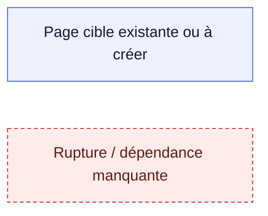
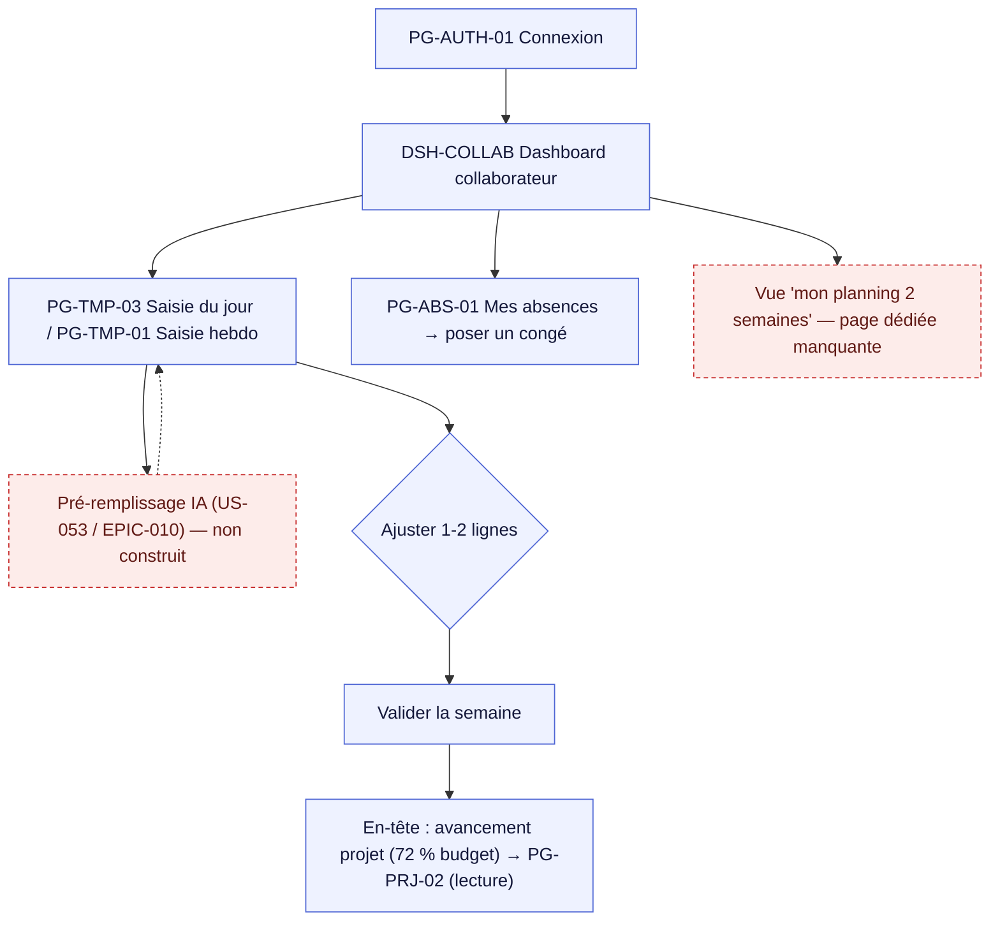
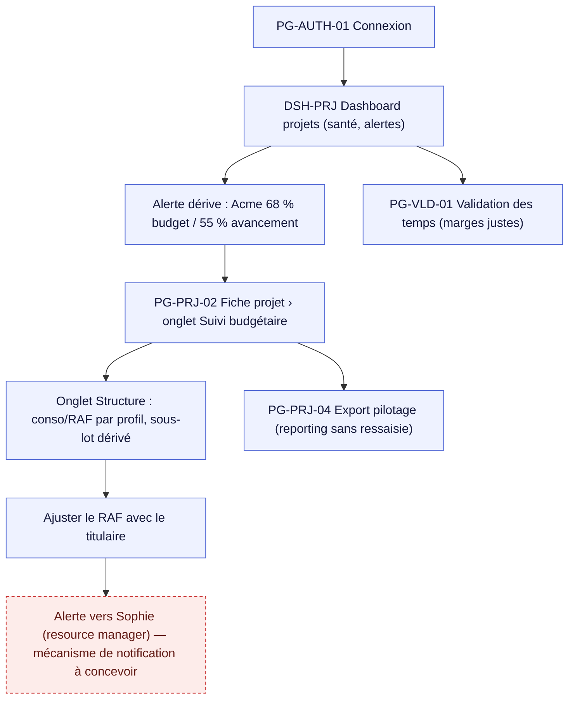
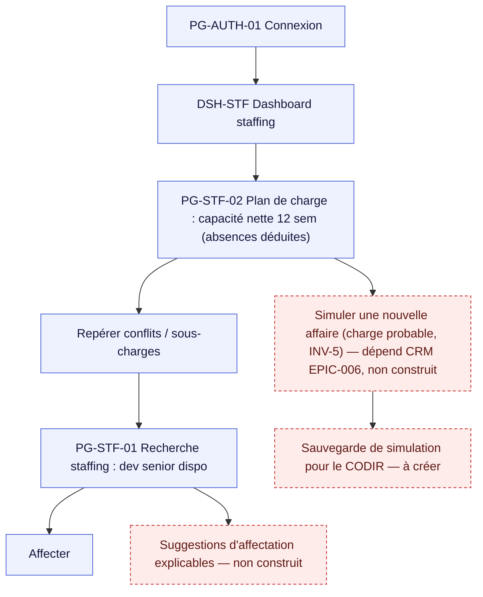
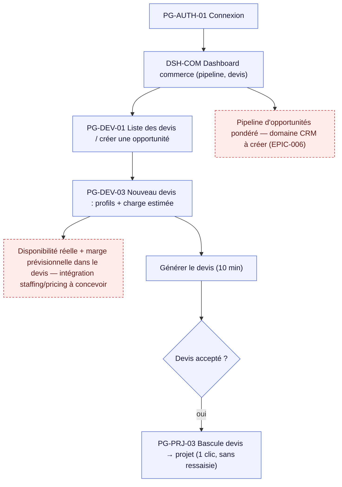
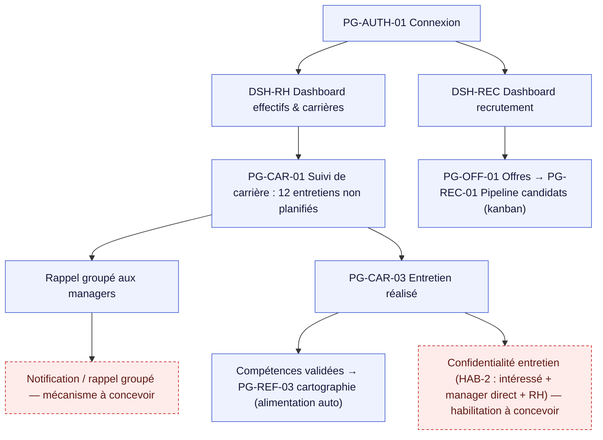
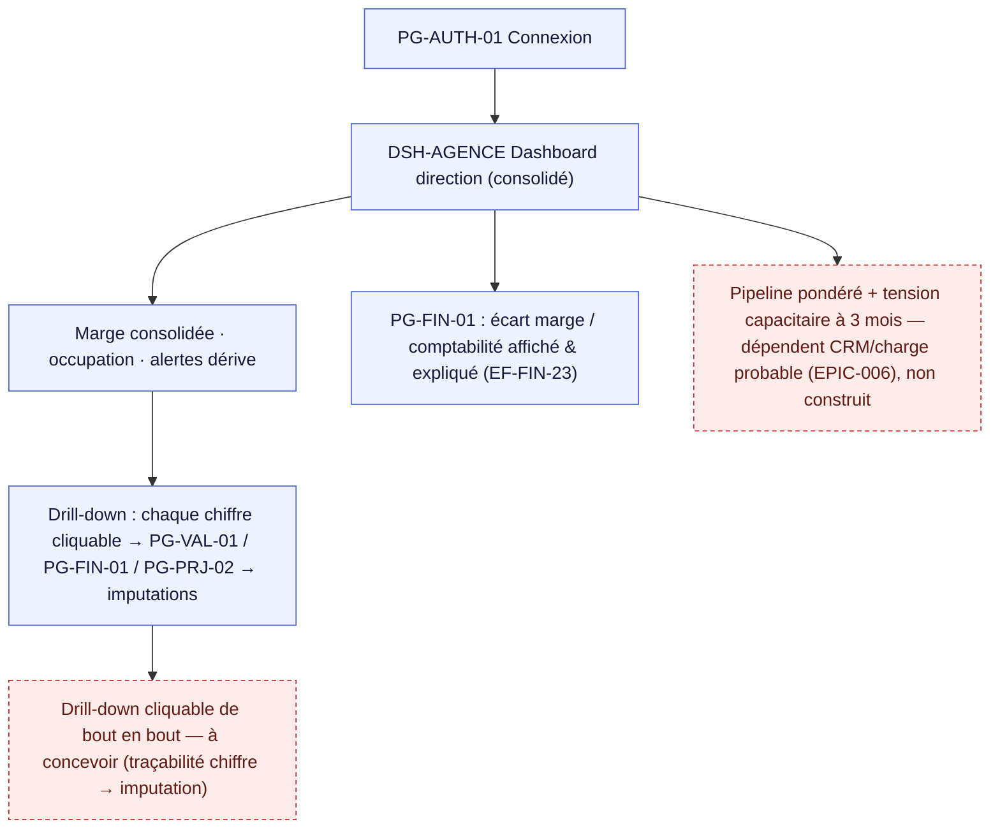

# Parcours par persona (P1–P6) — `parcours-personas.md`

> **Livrable US-081** (Sprint 19 — EPIC-013). Cartographie des parcours principaux.
> **Sources** : `personas.md` (JTBD, scénarios clés, critères de rejet) + `page-inventory.md` (IDs de pages).
> **Statut** : 🟡 Draft — en attente de **validation PO**.
> **Mis à jour** : 2026-09-11.

## Conventions
- 1 diagramme Mermaid `flowchart` par persona (parcours principal), nœuds étiquetés `PG-xxx / DSH-xxx` (IDs de `page-inventory.md`).
- **Ruptures** (page manquante, action sans écran, dépendance non construite) en style `rupture` + récapitulées au §7.
- Chaque parcours rappelle le **JTBD** et le **critère de rejet** du persona (ligne rouge de conception).

---

## 1. P1 — Camille (collaboratrice) · **80 % des utilisateurs**
**JTBD** : « Valider la semaine passée et vérifier la semaine à venir, en < 2 min. »
**Critère de rejet** : saisie > 2 min, ou sentiment de flicage.

Notes : parcours **mobile** (lundi matin). En-tête contextuel = contrepartie visible (avancement/marge). Congés en libre-service (pas d'email).

## 2. P2 — Marc (chef de projet)
**JTBD** : « Voir la dérive avant 50 % de budget et agir. »
**Critère de rejet** : ressaisie de ce qui existe ailleurs ; chiffres faux.

Notes : la dérive doit être **connue avant 50 %** (OBJ-2, seuils existants). Intégration Jira (avancement) = systèmes tiers (lot 3, hors socle).

## 3. P3 — Sophie (resource manager / dir. production)
**JTBD** : « Arbitrer le staffing sur 12 semaines et simuler une nouvelle affaire. »
**Critère de rejet** : plan de charge irréaliste ; suggestions inexpliquées.

Notes : la **capacité nette** (congés/absences déduits) existe (plan de charge). La **simulation** et les **suggestions** sont les principaux manques.

## 4. P4 — Yann (commercial)
**JTBD** : « Produire un devis fondé sur la capacité réelle et le basculer en projet sans ressaisie. »
**Critère de rejet** : blocage sur une affaire faute de paramétrage ; capacité irréaliste.

Notes : tout le domaine **Commerce/Devis** est **à créer** (EPIC-006). Le lien **Devis → Projet sans ressaisie** est un objectif structurant (cycle de vie).

## 5. P5 — Nadia (RH)
**JTBD** : « Piloter la campagne d'entretiens sans relancer 40 personnes ; maintenir la cartographie des compétences. »
**Critère de rejet** : duplication du SIRH ; données d'évaluation exposées (HAB-2).

Notes : tout le **cycle RH** est **à créer** (EPIC-008). **HAB-2** (confidentialité des évaluations) est un invariant de conception. Pas de duplication SIRH (import/référence).

## 6. P6 — Élodie (dirigeante)
**JTBD** : « Préparer le CODIR en 30 min avec des chiffres traçables et l'écart comptable expliqué. »
**Critère de rejet** : chiffre inexplicable ; écart comptable inexpliqué.

Notes : le **dashboard dirigeant** (DSH-AGENCE) est **à créer** ; la **traçabilité cliquable** jusqu'aux imputations est le cœur de la confiance (critère de rejet).

---

## 7. Récapitulatif des ruptures

| ID | Persona | Rupture | Impact | Priorité refonte | Dépendance |
|----|---------|---------|--------|------------------|------------|
| R1 | P1 | Pré-remplissage IA de la saisie absent | Dégradé (saisie plus longue) | Must (adoption P1) | US-053 / EPIC-010 |
| R2 | P1 | Pas de vue « mon planning 2 semaines » | Dégradé | Should | Staffing/affectations |
| R3 | P2 | Alerte de dérive → notification vers resource manager | Dégradé | Should | Mécanisme notifications |
| R4 | P3 | Simulation d'affaire (charge probable) + sauvegarde CODIR + suggestions explicables | Bloquant (objectif clé) | Must (à l'arrivée d'EPIC-006) | CRM EPIC-006 |
| R5 | P4 | Domaine Commerce/Devis entier + dispo réelle & marge dans le devis + devis→projet | Bloquant | Must | CRM EPIC-006 |
| R6 | P5 | Cycle RH entier (offres, kanban recrutement, contrats, carrières, entretiens) + rappel groupé + HAB-2 | Bloquant | Must | RH EPIC-008 |
| R7 | P6 | Dashboard dirigeant + drill-down cliquable + pipeline pondéré + tension 3 mois | Bloquant (valeur direction) | Must | Dashboard à créer + EPIC-006 |

## 8. Pages orphelines (hors parcours principaux)
Atteintes via des **flux d'administration / paramétrage** (P6 / administrateur), pas par un parcours métier principal :
- PG-FIN-02/03/04/05 (configs finance), PG-REF-01…06 (référentiels), PG-ADM-01 (périodes), PG-ORG-01 (organisation), PG-PRC-01 (profils & taux), PG-REL-01 (relances).
- PG-CMN-04 **Styleguide** : page **interne** (dev/design) — orpheline assumée.
- PG-ERR-403/404/500 : pages **système** (hors parcours nominal).

> Ces pages ne sont pas des ruptures : elles relèvent d'un **parcours d'administration** (à cartographier séparément si besoin) et non des 6 parcours métiers principaux.

## 9. Validation PO
- [ ] Les 6 parcours principaux reflètent les scénarios de `personas.md`.
- [ ] Les critères de rejet sont bien portés par chaque parcours.
- [ ] Les ruptures et leurs priorités sont validées (entrée d'US-085).
- [ ] Feu vert pour démarrer US-083 (mapping pages ↔ composants).
