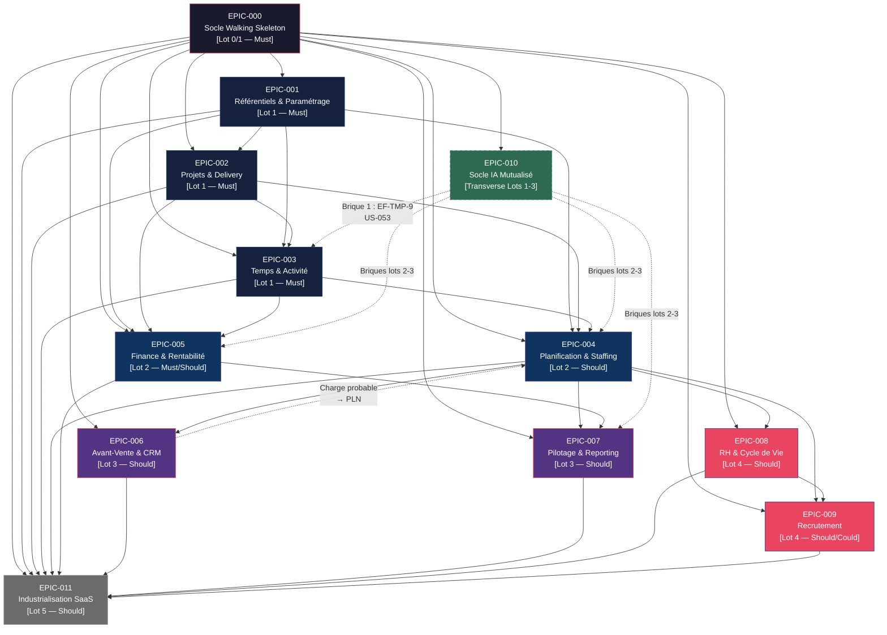

# Matrice des Dépendances — EPICs HotOnes

**Projet :** HotOnes — refonte ERP agence digitale / ESN
**Date :** 2026-08-31
**Source de vérité :** `project-management/backlog/epics/`

> **Règle fondamentale :** La dépendance de données entre les lots est **stricte et non parallélisable** — les données du lot N doivent exister en production avant que le lot N+1 puisse livrer de la valeur métier. L'architecture peut être développée en avance de phase ; la mise en production reste séquentielle.

---

## 1. Graphe des dépendances (Mermaid)



---

## 2. Tableau des dépendances

| EPIC | Lot | Prérequis directs | Bloqué par (hors EPIC-000) | Dépendants immédiats |
|------|-----|-------------------|----------------------------|----------------------|
| **EPIC-000** Socle Walking Skeleton | 0/1 | AUD-1, AUD-2, AUD-3 | — | Tous les EPICs |
| **EPIC-001** Référentiels | 1 | EPIC-000 | — | EPIC-002, 003, 004, 005, 011 |
| **EPIC-002** Projets | 1 | EPIC-000, EPIC-001 | — | EPIC-003, 004, 005, 011 |
| **EPIC-003** Temps | 1 | EPIC-000, EPIC-001, EPIC-002 | AIPD (`ENF-RGPD-5`) pour US-053 | EPIC-004, 005, 011 |
| **EPIC-010** Socle IA | 1→3 | EPIC-000, ADR-10 | AIPD par usage | EPIC-003 (brique 1), 004, 005, 007 |
| **EPIC-004** Planification | 2 | EPIC-000, 001, 002, 003 | Lot 1 en production | EPIC-005, 006, 007, 008, 009, 011 |
| **EPIC-005** Finance | 2 | EPIC-000, 001, 002, 003, 004 | Lot 1 en production | EPIC-007, 011 |
| **EPIC-006** CRM | 3 | EPIC-000, 001, 004 | Lot 2 en production | EPIC-004 (rétroaction charge probable), 007, 011 |
| **EPIC-007** Pilotage | 3 | EPIC-000, 001, 002, 003, 004, 005, 006 | Lot 2 en production | — (consommateur terminal) |
| **EPIC-008** RH | 4 | EPIC-000, 001, 003, 004 | Lot 3 validé + AI Act (`CTR-3`) + AIPD | EPIC-009, 011 |
| **EPIC-009** Recrutement | 4 | EPIC-000, 004, 008 | Lot 3 validé + AI Act (`CTR-3`) + AIPD | EPIC-008 (rétroaction), 011 |
| **EPIC-011** SaaS | 5 | EPIC-000 + tous lots 1→4 stables | Tous lots en production | — (dernier lot) |

---

## 3. Chemin critique (lots)

```
LOT 0/1
  EPIC-000 (Socle)
    └── EPIC-001 (REF) ──┐
    └── EPIC-002 (PRJ) ──┤── EPIC-003 (TMP) ← Point de défaillance unique
                                                (adoption = condition de tout)
LOT 2 (après lot 1 en production)
  EPIC-004 (PLN) ──────────────────────────────────────────┐
  EPIC-005 (FIN)                                           │

LOT 3 (après lot 2 en production)                         │
  EPIC-006 (CRM) ──────────────────────────────────────────┤ (rétroaction PLN)
  EPIC-007 (PIL)                                           │

LOT 4 (après lot 3 validé + prérequis réglementaires)     │
  EPIC-008 (RH) ──────────────────────────────────────────┐│
  EPIC-009 (REC)                                          ││

LOT 5 (tous lots stables)                                 ││
  EPIC-011 (SaaS)                                         ││

TRANSVERSE (lots 1→3)                                     ││
  EPIC-010 (IA) ─ brique 1 dans LOT 1 ────────────────────┘┘
```

---

## 4. Contraintes réglementaires bloquantes (hors dépendances techniques)

| Contrainte | Référence | Bloque |
|-----------|-----------|--------|
| Audit technique MVP (`AUD-1`) | Avant lot 1 | EPIC-000 |
| Cartographie fonctionnelle MVP (`AUD-2`) | Avant lot 1 | EPIC-000 |
| Mesure situations de référence (`AUD-3`) | Avant lot 1 | OBJ-1..7 |
| AIPD signaux d'activité (`ENF-RGPD-5`) | Avant US-053 | EPIC-010 brique 1, EPIC-003 |
| Qualification AI Act (`CTR-3`/`ARB-14`) | Avant conception RH/REC | EPIC-008, EPIC-009 |
| AIPD RH et recrutement (`ENF-RGPD-5`) | Avant fonction IA RH | EPIC-008, EPIC-009 |

---

**Documents liés :** `backlog/epics/EPIC-*.md`, `analysis/constraints.md`, `analysis/research-summary.md`
