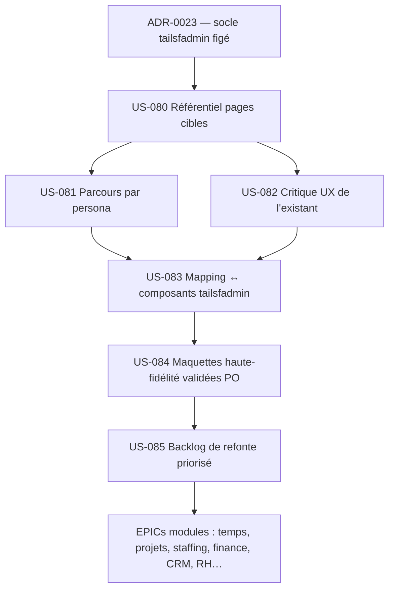

# EPIC-013 : Recensement des pages cibles, parcours utilisateurs et conception UX définitive

## Métadonnées
- **ID**: EPIC-013
- **Statut**: 🔄 In Progress (S19 : 4/6 livrées · S20 : US-082 + US-084 en cours)
- **Priorité**: High — Must Have (MoSCoW)
- **Module**: UX (transverse)
- **Lot**: transverse (fast-track — précède l'extension du dev front des lots suivants)
- **MMF**: Un référentiel exhaustif des pages cibles et des parcours utilisateurs par persona (P1–P6), assorti d'une critique UX de l'existant et de maquettes haute-fidélité remises à niveau sur le thème `tailsfadmin`, permettant de figer *quelles* pages construire, *pour qui*, *avec quelles informations* — et d'alimenter les EPICs modules avec un backlog de refonte priorisé.
- **Créé le**: 2026-09-09
- **Mis à jour**: 2026-09-09

---

## Description

EPIC-012 a posé un premier design system (ère Skote) sur les écrans du lot 1. Depuis, la direction
technique a évolué : ADR-0019 a basculé le front sur **Tailwind v4 CSS-first** (abandon Bootstrap/Skote),
puis le **socle de thème a été externalisé** dans le bundle réutilisable `tailsfadmin/tailsfadmin-bundle`
(voir **ADR-0023** — chantier technique préalable). Le produit ne porte donc plus de code de thème :
layout, composants et tokens viennent du bundle.

Ce socle étant figé, il manque encore la brique amont la plus structurante : **un recensement raisonné
de ce qu'il faut construire**. Aujourd'hui ~30 écrans existent, hérités du walking skeleton et conçus
au fil de l'eau, sans vision d'ensemble des pages cibles ni cartographie des parcours par persona.

Cet EPIC comble ce manque par une **phase de conception forte**, en quatre temps :

1. **Recenser** exhaustivement les pages cibles (existantes + à venir), par module, avec pour chacune :
   objectif, persona(s) primaire(s), informations affichées, actions, données sources.
2. **Cartographier** les parcours utilisateurs par persona (P1–P6) — du *job-to-be-done* à la séquence
   d'écrans — pour révéler les manques, les ruptures et les pages orphelines.
3. **Critiquer** l'UX de l'existant (produit historique **hotones** comme source d'inspiration), au regard
   des heuristiques d'ergonomie, pour améliorer plutôt que reproduire.
4. **Concevoir** des maquettes haute-fidélité des écrans prioritaires, **remises à niveau sur le thème
   `tailsfadmin`**, validées PO, et en déduire un **backlog de refonte priorisé** qui irrigue les EPICs
   modules (temps, projets, staffing, finance, CRM, RH…).

> Consigne PO (mémoire projet) : la conception UX/UI (maquettes validées) précède tout dev front.
> EPIC-013 est le préalable de conception des reskins/refontes portés par les EPICs modules.

---

## Objectifs Business

- **OBJ-7 (adoption)** — Concevoir les pages *à partir des besoins réels des personas* (et non de l'inertie
  de l'existant) réduit la charge cognitive et conditionne l'adoption — au premier chef pour P1 (80 % des
  utilisateurs) : si Camille rejette l'outil, toute la valeur s'effondre.
- **RSQ-1 (résistance à la saisie)** — Des parcours courts et lisibles renforcent la contrepartie perçue
  (planning, feedback) et servent la complétude (OBJ-1).
- **Cohérence multi-écrans** — Un référentiel de pages + un mapping unique vers les composants `tailsfadmin`
  garantit que chaque nouvel écran est « une greffe sur un terrain stable », sans dette de style.
- **Pilotage produit** — Le recensement transforme un backlog implicite (« reskiner l'existant ») en un
  backlog explicite, priorisé et traçable, réutilisable par tous les EPICs modules.

---

## User Stories

| Réf. | ID | Nom | Intention | Persona(s) | Points (est.) |
|------|----|-----|-----------|-----------|---------------|
| C1 | US-080 | Référentiel exhaustif des pages cibles | Recenser toutes les pages (existantes + à venir) par module : objectif, persona primaire, informations, actions, données sources → `page-inventory.md` | Tous | 5 |
| C2 | US-081 | Cartographie des parcours par persona (P1–P6) | Tracer les parcours clés (JTBD → séquence d'écrans) pour chaque persona, avec diagrammes Mermaid ; révéler ruptures et pages orphelines | P1–P6 | 5 |
| C3 | US-082 | Audit et critique UX de l'existant (inspiré hotones) | Analyse critique des écrans actuels (heuristiques Nielsen, ergonomie cognitive) au regard de hotones ; recommandations d'amélioration priorisées | Tous | 5 |
| C4 | US-083 | Mapping pages ↔ composants `tailsfadmin` (+ gaps) | Associer chaque type de page/section aux layouts et composants `<twig:tsf:…>` du bundle ; identifier les composants manquants à créer côté app | Tous | 3 |
| C5 | US-084 | Maquettes haute-fidélité des écrans prioritaires (design-canvas) | Maquettes des écrans prioritaires, alignées sur le thème `tailsfadmin`, améliorant hotones ; validées PO (gate `design-canvas/VALIDATION.md`) | Tous | 8 |
| C6 | US-085 | Backlog de refonte/reskin priorisé (MoSCoW) | Déduire du recensement + maquettes le backlog priorisé des écrans à (re)concevoir, ventilé vers les EPICs modules | Tous | 3 |

**Total indicatif : ~29 pts** (à affiner en affinage).

> Ordre conseillé : US-080 → US-081 → US-082 (analyse), puis US-083 → US-084 (conception), puis US-085 (synthèse backlog).
> Prérequis PO : US-084 (maquettes validées) précède tout dev front porté par les EPICs modules.

### Vue d'ensemble des livrables (flux)

---

## Critères de Succès

### Critères bloquants
- [ ] Le socle de thème est bien externalisé (`tailsfadmin-bundle` adopté, ADR-0023) — la conception cible le thème définitif, pas un socle transitoire.
- [ ] 100 % des ~30 écrans existants sont recensés dans le référentiel de pages, avec persona primaire et informations affichées.
- [ ] Les parcours des 6 personas (P1–P6) sont cartographiés (au moins le parcours principal de chaque persona).
- [ ] Les maquettes des écrans prioritaires sont validées PO avant tout dev front (traçabilité de la validation).

### Critères fonctionnels
- [ ] Un référentiel `page-inventory.md` fait autorité : une ligne par page cible, ventilée par module et persona.
- [ ] Chaque page cible est mappée à un layout (`admin` / `auth`) et à un jeu de composants `<twig:tsf:…>`, ou signale explicitement un composant manquant.
- [ ] La critique UX de l'existant produit des recommandations actionnables, reliées aux findings recette antérieurs (F-S5-4, F-S5-5, F1…).
- [ ] Le backlog de refonte est priorisé (MoSCoW) et rattaché aux EPICs modules cibles.

### Critères non-fonctionnels
- [ ] Accessibilité prise en compte dès la conception (WCAG 2.2 AA visé : contrastes, cibles ≥ 44 px, focus, ARIA, clavier).
- [ ] Parité tactile : aucune action critique accessible uniquement au survol.
- [ ] Les maquettes réutilisent les tokens et composants du bundle (pas de dérive de style hors design system).

---

## Progression

4/6 US · 67 % · 29 points · **S19** : US-080, US-081, US-083, US-085 ✅ (16 pts livrés).
**S20 (en cours, démarré 2026-09-14)** : US-082 (audit) + US-084 (maquettes HF) — accès `hotones` débloqué →
bouclage attendu **6/6** en clôture S20.

---

## Dépendances

### Prérequis
- **ADR-0023** — adoption de `tailsfadmin/tailsfadmin-bundle` (chantier technique préalable : socle de thème externalisé). *Bundle d'abord* (arbitrage PO 2026-09-09).
- **EPIC-000** (socle Twig/Stimulus, AssetMapper) et **ADR-0019** (Tailwind v4 CSS-first).
- Accès au produit historique **hotones** (source d'inspiration à recenser/critiquer) — *à fournir* (repo, chemin ou captures).
- Socle UX existant réutilisable : `personas.md` (P1–P6), `architecture/ux-conception-lot1.md`, `architecture/design-system.md`, `design-canvas/` (3 écrans déjà validés + réf. TailAdmin).

### Dépendants / synergies
- **EPIC-012** (intégration design) — EPIC-013 réoriente et prolonge le travail de conception vers le thème `tailsfadmin` ; l'US-063 (intégration layout Skote) est rendue caduque par ADR-0023.
- **Tous les EPICs modules** (003 Temps, 002 Projets, 004 Staffing, 005 Finance, 006 CRM, 007 Pilotage, 008 RH…) consomment le référentiel de pages et le backlog de refonte produits ici.

---

## Notes

> **Conception forte** : l'objectif n'est pas de reproduire hotones mais de le **critiquer et l'améliorer**,
> en s'appuyant sur les parcours réels des personas et sur la richesse de composants du bundle `tailsfadmin`
> (Card, Table/TableAdvanced, Chart, Form, Calendar, Modal, Dropdown…).
>
> **Bundle d'abord** (arbitrage PO 2026-09-09) : le chantier technique d'adoption du bundle (ADR-0023 +
> story de migration) est réalisé *avant* la conception, pour que les maquettes ciblent le thème définitif.
>
> **Outillage** : agents `ux-ergonome`, `ui-designer`, `accessibility-expert` orchestrés par
> `uiux-orchestrator` ; commandes `/uiux:user-flow`, `/workflow:design`, `/project:add-story`,
> `/gate:validate-story` ; maquettes via *claude-design* (`design-canvas/`).
>
> **Priorisation de la conception** : commencer par les écrans les plus utilisés / à plus fort enjeu
> d'adoption (saisie P1, complétude, valorisation, pilotage projet) avant les écrans de paramétrage.
>
> **Relation EPIC-012** : à trancher en affinage — soit clôturer EPIC-012 (US Skote livrées, layout
> caduc) et porter la suite dans EPIC-013, soit garder EPIC-012 comme historique. Éviter le doublon.
