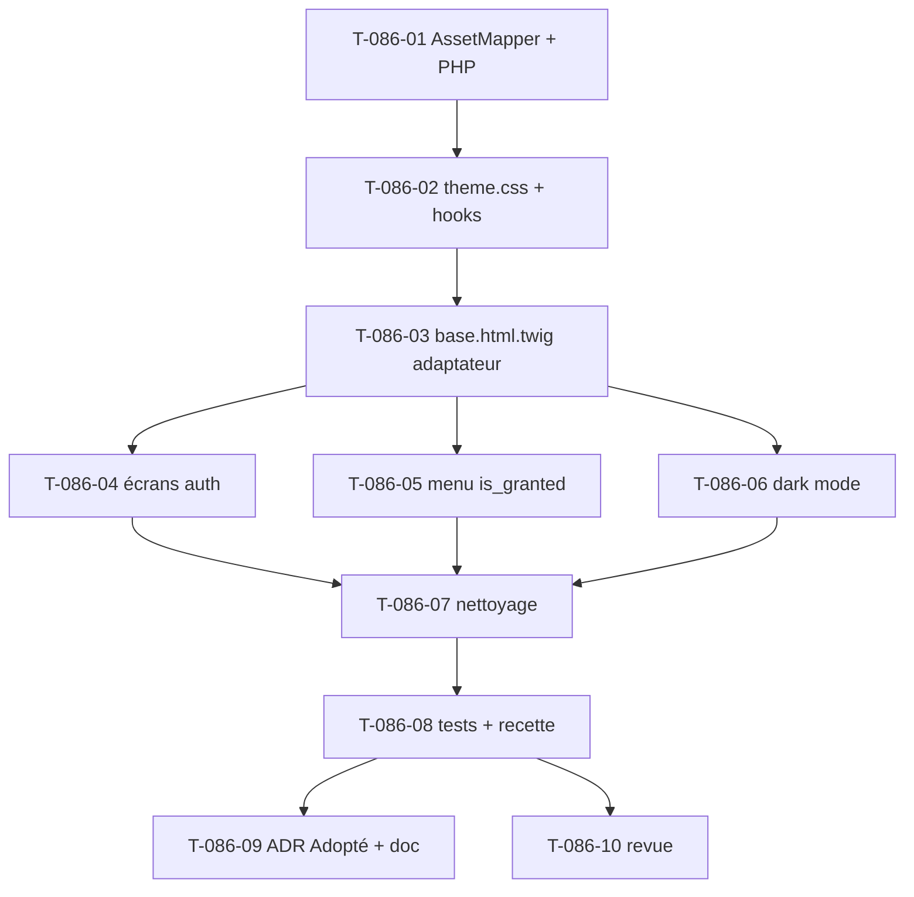

# US-086: Adoption du socle de thème `tailsfadmin-bundle` (externalisation du layout)

## Métadonnées
- **ID**: US-086
- **EPIC**: EPIC-012 (remplace US-063 — intégration layout Skote, rendue caduque par ADR-0023)
- **Sprint**: À planifier (chantier technique préalable, *bundle d'abord*)
- **Statut**: 🔴 To Do
- **Points**: 5
- **Persona**: Tous (P1–P6) — enabler technique transverse ; préserve l'expérience de tous les rôles
- **Créé le**: 2026-09-09
- **Mis à jour**: 2026-09-09

## Traçabilité
- **Implémente**: ADR-0023 (externalisation du socle de thème), EPIC-012 (layout définitif), OBJ-7 (adoption)
- **Dépend de**: ADR-0019 (Tailwind v4 CSS-first, `symfonycasts/tailwind-bundle`), EPIC-000 (socle Twig/Stimulus/AssetMapper)
- **Prérequis de**: **EPIC-013** (recensement & conception — les maquettes ciblent le thème définitif) ; downstream US-085 (backlog de reskin)
- **Spec Technique**: `docs/adr/0023-adoption-tailsfadmin-bundle.md`, `vendor/tailsfadmin/tailsfadmin-bundle/README.md`

## User Story

**En tant que** équipe produit (au service de tous les rôles P1–P6),
**je veux** que le socle de thème (layout, composants, tokens, chrome) provienne du bundle `tailsfadmin/tailsfadmin-bundle` plutôt que du code embarqué dans le repo,
**afin de** figer un thème définitif, réutilisable et maintenu par Composer, sur lequel la conception UX (EPIC-013) et les reskins pourront s'appuyer sans dette de style.

## Critères d'Acceptation

### CA-1 (Nominal) : Le layout de l'app provient du bundle

```gherkin
GIVEN le bundle tailsfadmin-bundle est installé et activé (Flex)
  AND les paths AssetMapper du bundle sont déclarés (bundles/tailsfadmin, bundles/tailsfadmin-vendor)
WHEN base.html.twig est réécrit en adaptateur mince étendant @Tailsfadmin/layout/admin.html.twig
THEN tous les écrans applicatifs héritent du layout du bundle (sidebar, header, breadcrumb) sans reskin écran par écran
  AND les écrans d'authentification (login, mot de passe oublié) utilisent @Tailsfadmin/layout/auth.html.twig
  AND les routes attendues par le layout (home, locale_switch) sont résolues
  AND `make ci` est vert (cs, rector, phpstan max, deptrac, tests)
```

### CA-2 (Nominal) : Thème CSS branché en un import, hooks de test préservés

```gherkin
GIVEN l'entrée Tailwind de l'app (assets/styles/tailwind.css) importe le theme.css du bundle
WHEN le CSS est compilé via `php bin/console tailwind:build`
THEN le rendu applique les tokens et composants du bundle (rebranding via --color-brand-* après l'import)
  AND les hooks CSS assertés par les tests restent fonctionnels (.flash-error, .flash-success, dialog.summary-dialog, .status-badge*, .visually-hidden)
  AND le poids du CSS reste maîtrisé (purge JIT, pas de doublon de tokens)
```

### CA-3 (Alternatif) : Le menu de sidebar préserve le filtrage par permissions

```gherkin
GIVEN la navigation actuelle masque les entrées selon les permissions (is_granted)
  AND le menu du bundle est déclaré dans config/packages/tailsfadmin.yaml
WHEN un utilisateur sans la permission requise affiche la sidebar
THEN l'entrée de menu correspondante n'apparaît pas (parité avec le comportement actuel)
  AND aucune route protégée n'est atteignable via un lien de menu visible à tort
```

### CA-4 (Alternatif) : Convergence du dark mode vers la stratégie du bundle

```gherkin
GIVEN le bundle pilote le thème par la classe .dark sur <html>
  AND l'app utilisait data-theme="dark" (+ résidu data-bs-theme)
WHEN l'utilisateur bascule le thème via le contrôleur de thème du bundle
THEN la préférence est persistée et appliquée sans FOUC au chargement suivant
  AND le résidu data-bs-theme et theme_toggle_controller.js applicatif sont retirés
```

### CA-5 (Erreur) : Aucune régression fonctionnelle

```gherkin
GIVEN la suite de tests et la recette navigateur couvrent les écrans existants
WHEN la migration du socle est appliquée
THEN tous les tests passent (make ci vert)
  AND la recette navigateur des écrans pilotes (login, /mon-compte, un écran admin) est re-passée sans régression
  AND les textes et libellés assertés par les tests fonctionnels restent présents
```

### CA-6 (Erreur) : Garde-fou sur les libs JS tierces

```gherkin
GIVEN certains composants du bundle dépendent de libs tierces (ApexCharts, flatpickr, FullCalendar, jsvectormap, Dropzone)
WHEN un tel composant est employé sans avoir lancé `php bin/console tailsfadmin:assets:install`
THEN une erreur explicite en console rappelle la commande à lancer (au lieu d'un « Failed to resolve module specifier »)
  AND les composants sans dépendance externe (theme, sidebar, modal, dropdown, alert-dismiss, preloader, search, submenu) fonctionnent sans cette commande
```

## Critères UI/UX

### Web
- Layout `admin` (sidebar + header + breadcrumb) sur les écrans applicatifs ; layout `auth` sur login/mot de passe oublié.
- Thème clair/sombre fonctionnel (classe `.dark`), sans FOUC.
- Navigation cohérente et responsive (sidebar rétractable), filtrée par permissions.

### Mobile
- Sidebar en drawer avec overlay ; cibles tactiles ≥ 44 × 44 px ; aucune action clé au seul survol.

## Tasks

| ID | Type | Description | Statut | Estimation |
|----|------|-------------|--------|------------|
| T-086-01 | [OPS] | Déclarer les paths AssetMapper du bundle (`bundles/tailsfadmin`, `bundles/tailsfadmin-vendor`) ; aligner `composer.json` PHP `>=8.5` | 🔲 | 1h |
| T-086-02 | [FE-WEB] | Importer `theme.css` du bundle dans `assets/styles/tailwind.css` ; rebrand `--color-brand-*` ; conserver les hooks CSS assertés (`.flash-*`, `dialog.summary-dialog`, `.status-badge*`, `.visually-hidden`) | 🔲 | 3h |
| T-086-03 | [FE-WEB] | Réécrire `base.html.twig` en adaptateur mince sur `@Tailsfadmin/layout/admin.html.twig` (mapping des blocs : `title`, `page_title`, `topbar_actions`, `body`…) | 🔲 | 4h |
| T-086-04 | [FE-WEB] | Basculer les écrans d'auth (login, mot de passe oublié) sur `@Tailsfadmin/layout/auth.html.twig` ; ajouter/vérifier les routes `home` et `locale_switch` | 🔲 | 3h |
| T-086-05 | [BE] | Menu sidebar : `config/packages/tailsfadmin.yaml` + préservation du filtrage `is_granted` (contribution menu builder ou garde-fou) | 🔲 | 4h |
| T-086-06 | [FE-WEB] | Convergence dark mode : adopter le `theme_controller` du bundle, retirer `theme_toggle_controller.js` et le résidu `data-bs-theme` | 🔲 | 2h |
| T-086-07 | [OPS] | Nettoyage : retirer les contrôleurs Stimulus applicatifs redondants (`sidebar_toggle`, `tabs` si couverts) ; retirer les tokens dupliqués | 🔲 | 2h |
| T-086-08 | [TEST] | Adapter les tests fonctionnels impactés (sélecteurs de layout) ; re-passer la recette navigateur des écrans pilotes ; `make ci` vert | 🔲 | 4h |
| T-086-09 | [DOC] | Passer ADR-0023 en *Adopté* ; noter la relation EPIC-012/US-063 (caduque) ; consigner dans le CHANGELOG | 🔲 | 1h |
| T-086-10 | [REV] | Revue `symfony-reviewer` + `accessibility-expert` (parité tactile, focus, contraste) avant merge | 🔲 | 2h |

### Ordre conseillé (dépendances)



## Progression

0/10 tasks complétées (0%)

## Definition of Done

- [ ] Tous les critères d'acceptation validés (CA-1 → CA-6)
- [ ] Bundle piné (`^1.1`), paths AssetMapper déclarés, PHP `>=8.5` aligné
- [ ] `base.html.twig` réécrit en adaptateur sur le layout `admin` du bundle ; écrans auth sur le layout `auth`
- [ ] Menu sidebar déclaratif avec filtrage `is_granted` préservé (aucune régression de visibilité/sécurité)
- [ ] Dark mode convergé (`.dark`), sans FOUC ; résidu `data-bs-theme` retiré
- [ ] Hooks CSS assertés par les tests préservés ; `make ci` vert ; recette navigateur des écrans pilotes re-passée
- [ ] Accessibilité WCAG 2.2 AA vérifiée sur les écrans pilotes (contraste, focus, cibles, ARIA)
- [ ] ADR-0023 passé en *Adopté* ; CHANGELOG mis à jour ; revue effectuée

---

## Notes

**Périmètre** : cette story **externalise et câble le socle** (layout, thème CSS, chrome), elle ne reskine
pas chaque écran. Le reskin fin écran par écran (avec les composants `<twig:tsf:…>`) est piloté par le
backlog de refonte d'EPIC-013 (US-085 → EPICs modules). L'adaptateur mince `base.html.twig` fait basculer
les ~35 templates existants sur le nouveau socle **d'un coup et à faible risque**, sans les réécrire.

**Points ouverts hérités d'ADR-0023** (à trancher pendant le dev) :
1. Filtrage `is_granted` du menu déclaratif (T-086-05) — **enjeu sécurité**, ne pas livrer sans.
2. Stratégie dark mode `.dark` vs `data-theme` (T-086-06).
3. Migration éventuelle des hooks CSS de test vers des composants du bundle — **hors périmètre** ici
   (gardés côté app), à planifier ultérieurement.

**Garde-fous projet** : tout via Docker (`make …`) ; commit sélectif (ne pas balayer les changements
préexistants de `design-canvas/`, `RESUME-*`, `.gastown-ignore`) ; auditer la dépendance (règle 11).

**Outillage** : `symfony-reviewer`, `accessibility-expert` ; commande bundle `tailsfadmin:assets:install`
(à n'exécuter que si des composants Chart/Calendar/Datepicker/Upload sont réellement employés).
