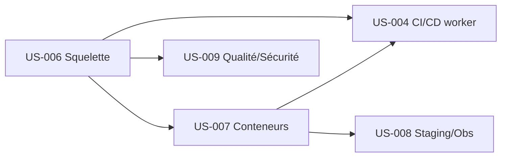

# Sprint 0 : Fondations & Outillage

## Informations

| Attribut | Valeur |
|----------|--------|
| Numéro | 0 |
| Début | 2026-08-18 (lundi) |
| Fin | 2026-08-29 (vendredi) |
| Durée | 10 jours ouvrés (2 semaines) |
| Capacité (prévision) | ~28 points |
| Lot | Lot 0 — Cadrage et fondations (volet outillage) |

## Sprint Goal

> **Installer le socle technique de HotOnes : un squelette Symfony 8 en mode worker et architecture en couches, un environnement de développement conteneurisé reproductible, un staging déployable, et l'outillage qualité/sécurité automatisé — afin que le Sprint 1 puisse construire les briques applicatives sur un socle sûr, reproductible et vérifié en continu.**

Ce sprint ne produit **pas de valeur métier utilisateur** : il produit la **capacité de construire** en sécurité. Sans lui, le Sprint 1 (multi-tenant applicatif, auth, RBAC, analytique) n'a ni projet, ni pipeline, ni environnement sur lesquels s'appuyer.

> **Périmètre.** Ce Sprint 0 couvre le **volet outillage/infra** du Lot 0 du CDC. Les autres livrables du Lot 0 sont **non-logiciels** et suivis hors backlog de dev : audits `AUD-1`/`AUD-2` (existant), `AUD-3` (situations de référence), AIPD `ENF-RGPD-5`, qualification AI Act `CTR-3`, design system (`cdc/11`), arbitrages `ARB-*`. **`AUD-1`/`AUD-2` doivent être réalisés en parallèle** — ils peuvent réviser le scénario de refonte (`CDR-5`).

## ⚠️ Hypothèse de capacité (à confirmer — ARB-20 / HYP-15)

Comme le Sprint 1, la capacité suppose l'équipe cible constituée. À 1 personne (`HYP-15`), le contenu tient mais le calendrier s'allonge.

## Definition of Done (rappel — cf. `definition-of-done.md`)

- [ ] Reproductible : tout se réinstalle depuis le dépôt en une commande documentée
- [ ] Aucun secret réel dans le dépôt (`ARC-88`)
- [ ] Chaîne CI verte (les 11 étapes bloquantes opérationnelles, même si certaines sont « à blanc » tant qu'il n'y a pas de code métier)
- [ ] Mode worker exercé dès le développement (`ARC-86`)
- [ ] Conventions de développement versionnées à la racine (`ARC-105`)
- [ ] Documentation d'installation à jour (README)

## Sprint Backlog — 28 points

| ID | Titre | Points | Statut | Dépend de |
|----|-------|--------|--------|-----------|
| US-006 | Squelette applicatif Symfony 8 + FrankenPHP worker + architecture | 8 | 🔵 To Do | — |
| US-007 | Environnement de développement conteneurisé + données de test | 5 | 🔵 To Do | US-006 |
| US-004 | Chaîne CI/CD et exécution en mode worker | 5 | 🔵 To Do | US-006, US-007 |
| US-008 | Staging, gestion des secrets et observabilité de base | 5 | 🔵 To Do | US-006, US-007 |
| US-009 | Outillage qualité/sécurité automatisé + conventions agent | 5 | 🔵 To Do | US-006 |

**Total engagé : 28 points.**

## Critères de sortie du sprint (bloquants pour démarrer le Sprint 1)

- [ ] `make up` (ou équivalent) démarre l'environnement complet en une commande
- [ ] Une route de démonstration servie **en mode worker** répond 200 ; frontières Deptrac vertes
- [ ] Pipeline CI/CD à 11 étapes opérationnelle (`ADR-12`), merge bloqué si rouge (`ARC-89`)
- [ ] Staging déployable en zone UE, secrets hors dépôt
- [ ] PHPStan max + détecteur de secrets + Rector + scan CVE branchés ; conventions versionnées

## Ordonnancement

## Risques

| Risque | Réf | Mitigation |
|---|---|---|
| Mise au point de la stack jeune (FrankenPHP worker, Reprise 0.x) | `RSQ-19`, ch.12 §17 | Provision 15-25 j prévue ; borner l'impact (ARC-60) |
| Le choix du socle « devient un projet » | `RSQ-13` | Décisions déjà arrêtées (16 ADR) — ne pas rouvrir (`ARB-18`) |
| Fuite d'état worker non détectée tôt | `RSQ-15` | Parité worker dès le dev (`ARC-86`) + test worker en CI dès US-004 |

## Cérémonies

Planning J1 · Daily quotidien · Review J10 (démo : env qui démarre, route worker, CI verte, staging) · Rétro J10.

## Notes

Sprint créé après revue : le Sprint 1 initial supposait ces fondations « déjà là ». Elles sont désormais explicitées en stories (US-006..009 + US-004 reclassée). Le Sprint 1 est recentré sur les briques **applicatives** (US-001, US-002, US-003, US-005 = 29 pts).
