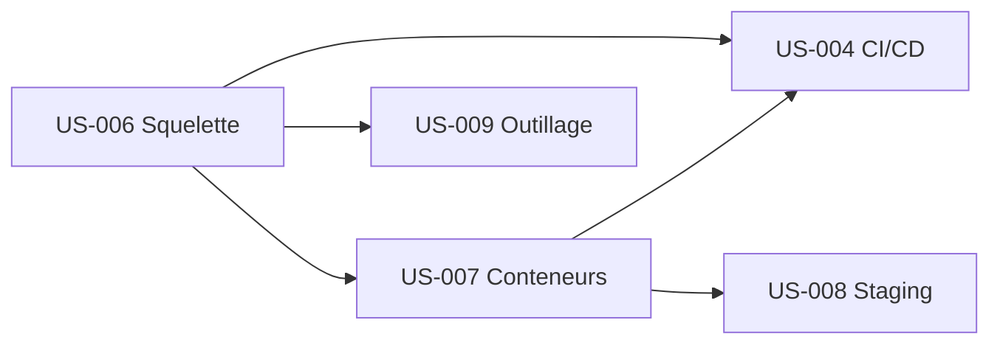

# Task Board — Sprint 0 (Fondations & Outillage)

## Légende
🔲 À faire · 🔄 En cours · 👀 En review · ✅ Terminé · 🚫 Bloqué

> Détail de chaque tâche : `tasks/US-<ID>-tasks.md`. Ce board se met à jour via `/project:move-task T-XXX-YY <statut>`.

## 🔲 À Faire (45 tâches · 101h)

| Lot | US | Tâches | Heures | Détail |
|-----|----|--------|--------|--------|
| Squelette | US-006 | T-006-01 → T-006-10 (10) | 29h | `tasks/US-006-tasks.md` |
| Conteneurs | US-007 | T-007-01 → T-007-08 (8) | 18h | `tasks/US-007-tasks.md` |
| CI/CD | US-004 | T-004-01 → T-004-10 (10) | 18h | `tasks/US-004-tasks.md` |
| Staging | US-008 | T-008-01 → T-008-08 (8) | 19h | `tasks/US-008-tasks.md` |
| Outillage | US-009 | T-009-01 → T-009-09 (9) | 17h | `tasks/US-009-tasks.md` |
| Transverse | — | T-TECH-01 → T-TECH-03 (3) | 4h | `tasks/technical-tasks.md` |

## 🔄 En Cours
| ID | US | Tâche | Démarré | Assigné |
|----|-----|-------|---------|---------|
| — | | | | |

## 👀 En Review
| ID | US | Tâche | Reviewer |
|----|-----|-------|----------|
| — | | | |

## ✅ Terminé
| ID | US | Tâche | Réel | Terminé |
|----|-----|-------|------|---------|
| — | | | | |

## 🚫 Bloqué
| ID | US | Raison | Action |
|----|-----|--------|--------|
| — | | | |

## Métriques

- **Tâches** : 45 total (48 avec transverses) · 0 terminées (0 %)
- **Heures** : ~101h estimées (+4h transverses) · 0h consommées · ~105h restantes
- **Ordre de démarrage** : US-006 → US-007 → (US-009 ∥ US-004) → US-008

## Ordonnancement inter-US

