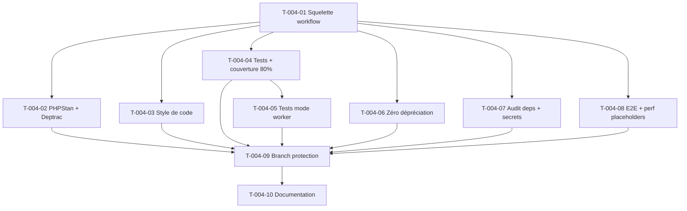

# Tâches — US-004 : Chaîne CI/CD et exécution en mode worker

**EPIC**: EPIC-000
**Sprint**: Sprint 0
**Points**: 5
**Story parente**: [US-004](../../../backlog/user-stories/US-004-cicd-mode-worker.md)
**Traçabilité**: ADR-12, ADR-2, ARC-47, ARC-50, ARC-51, ARC-61, ENF-MAINT-1, ENF-MAINT-2

> Convention ID : `T-004-XX`. Estimation en heures. Types : `[OPS]` `[TEST]` `[DOC]` `[REV]`.
> Pipeline GitHub Actions à **11 étapes bloquantes** conformément à ADR-12 : PHPStan max, Deptrac, style, tests + couverture ≥ 80 %, isolation multi-tenant, mode worker, zéro dépréciation, audit dépendances, détection secrets, E2E, perf.

---

## T-004-01 — [OPS] Squelette pipeline GitHub Actions (workflow, cache composer, matrice)

**Estimation** : 3h
**Dépend de** : US-006 (squelette applicatif), US-007 (environnement conteneurisé)

### Description
Créer le workflow GitHub Actions racine qui orchestre l'ensemble de la chaîne CI/CD. Mettre en place le déclenchement sur `pull_request` et `push` vers `main`, la mise en cache des dépendances Composer (clé basée sur `composer.lock`), et une matrice de version PHP alignée sur la stack (PHP 8.5).

### Fichiers
- `.github/workflows/ci.yml` (nouveau)
- `.github/workflows/_reusable-setup.yml` (job réutilisable : checkout, setup-php, cache) — optionnel si mutualisation
- `composer.json` (vérification des contraintes de version PHP)

### Critères de validation
- Le workflow se déclenche sur toute PR ciblant `main` et sur push vers `main`
- Le cache Composer réduit le temps d'installation des dépendances lors des runs suivants (vérifiable dans les logs Actions : `Cache restored`)
- Le job `setup` s'exécute sur `ubuntu-latest` avec PHP 8.5
- Durée du job `setup` seul < 1 minute (hors cold cache)

### Commandes
```bash
gh workflow view ci.yml
gh run list --workflow=ci.yml
act pull_request -W .github/workflows/ci.yml  # test local optionnel
```

---

## T-004-02 — [OPS] Étapes analyse statique PHPStan max + Deptrac (frontières)

**Estimation** : 2h
**Dépend de** : T-004-01

### Description
Ajouter au workflow les jobs `static-analysis` (PHPStan niveau max) et `architecture` (Deptrac) comme étapes bloquantes indépendantes, exécutées en parallèle du job `tests`. Réutiliser la configuration livrée par US-009 (T-009-01, T-009-02 côté outillage local) en l'exécutant ici en mode CI.

### Fichiers
- `.github/workflows/ci.yml` (jobs `phpstan`, `deptrac`)
- `phpstan.neon` (référencé, configuré via US-009)
- `deptrac.yaml` (référencé, définit les frontières Domain/Application/Infrastructure — ADR-8)

### Critères de validation
- CA-3 et CA-5 de US-004 validés : une erreur PHPStan ou une violation Deptrac fait échouer le job avec code de sortie non nul
- Les erreurs PHPStan sont publiées en annotations sur la PR (via `github-actions[bot]` check annotations)
- Le rapport Deptrac liste la violation avec le chemin de dépendance complet en cas d'échec

### Commandes
```bash
vendor/bin/phpstan analyse src/ --error-format=github
vendor/bin/deptrac analyse --report-uncovered
```

---

## T-004-03 — [OPS] Étape style de code (php-cs-fixer/ecs)

**Estimation** : 1h
**Dépend de** : T-004-01

### Description
Ajouter le job `code-style` qui exécute PHP-CS-Fixer (ou ECS) en mode `--dry-run` pour vérifier la conformité PSR-12 sans modifier les fichiers. Bloquant si une violation est détectée.

### Fichiers
- `.github/workflows/ci.yml` (job `code-style`)
- `.php-cs-fixer.dist.php`

### Critères de validation
- Un fichier mal formaté fait échouer le job avec un diff explicite dans les logs
- Le job passe en < 30 secondes sur le squelette actuel

### Commandes
```bash
vendor/bin/php-cs-fixer fix --dry-run --diff
```

---

## T-004-04 — [OPS] Étapes tests + couverture ≥ 80 % avec gate bloquant (ENF-MAINT-1)

**Estimation** : 2h
**Dépend de** : T-004-01

### Description
Ajouter le job `tests` exécutant PHPUnit avec génération de couverture (Xdebug ou PCOV), publier le rapport de couverture en artefact de pipeline, et ajouter une étape qui échoue explicitement si la couverture globale est inférieure à 80 %.

### Fichiers
- `.github/workflows/ci.yml` (job `tests`, étape `upload-artifact` + `coverage-check`)
- `phpunit.xml.dist` (configuration couverture)

### Critères de validation
- CA-1 validé : le rapport de couverture est publié en artefact consultable depuis l'onglet Actions de la PR
- Une couverture < 80 % fait échouer le job avec un message explicite (`Coverage 76% is below the 80% threshold`)
- Les modules identifiés comme critiques (auth, habilitation, isolation tenant) sont marqués pour viser 100 % (note documentée, seuil différencié non automatisé au Sprint 0)

### Commandes
```bash
vendor/bin/phpunit --coverage-clover=coverage.xml --coverage-text
php bin/coverage-check.php coverage.xml --min=80
```

---

## T-004-05 — [OPS] Étape tests d'exécution en mode worker (ARC-50)

**Estimation** : 3h
**Dépend de** : T-004-04, US-007 (parité worker en dev, ADR-11)

### Description
Ajouter le job `worker-tests` qui démarre le serveur d'application en mode worker (FrankenPHP, `max_requests` configuré comme en production) dans le conteneur de CI, puis exécute une suite de tests d'intégration simulant des requêtes HTTP consécutives sur la même instance worker afin de vérifier l'absence d'état résiduel entre requêtes (ARC-47, ARC-50, ARC-61). Prévoir un test « fuite d'état » volontairement injecté en fixture de démonstration pour valider que le harnais détecte bien le problème (CA-2).

### Fichiers
- `.github/workflows/ci.yml` (job `worker-tests`)
- `tests/Worker/WorkerStateResetTest.php` (nouveau, squelette)
- `docker-compose.ci.yml` ou service FrankenPHP dédié au job

### Critères de validation
- CA-2 validé : un test avec fuite de contexte tenant injectée échoue avec le message `State leak detected: tenant context not reset between requests`
- CA-6 (base) : un test séquentiel de requêtes alternant deux tenants confirme la réinitialisation du contexte à chaque requête (le scénario complet multi-tenant se complète en Sprint 1 avec US-001, cf. note US-004)
- Le job s'exécute en configuration `max_requests` identique à la production

### Commandes
```bash
docker compose -f docker-compose.ci.yml up -d frankenphp
vendor/bin/phpunit --testsuite=worker tests/Worker
```

---

## T-004-06 — [OPS] Étape tolérance zéro dépréciations (ARC-51)

**Estimation** : 1h
**Dépend de** : T-004-01

### Description
Ajouter le job `deprecations` qui exécute Symfony DebugClassLoader en mode strict (ou équivalent PHPUnit `--display-deprecations`) combiné à `rector process --dry-run` pour détecter toute dépréciation PHP 8.5 / Symfony. Poster un commentaire automatique sur la PR listant les dépréciations détectées.

### Fichiers
- `.github/workflows/ci.yml` (job `deprecations`)
- `rector.php` (référencé, configuré via US-009 T-009-02)
- `phpunit.xml.dist` (activation `SYMFONY_DEPRECATIONS_HELPER=max[total]=0`)

### Critères de validation
- CA-4 validé : une dépréciation détectée fait échouer le job avec fichier/ligne identifiés
- Un commentaire automatique liste les dépréciations sur la PR (via `actions/github-script` ou équivalent)

### Commandes
```bash
SYMFONY_DEPRECATIONS_HELPER=max[total]=0 vendor/bin/phpunit
vendor/bin/rector process src/ --dry-run
```

---

## T-004-07 — [OPS] Étapes audit dépendances + détection de secrets

**Estimation** : 2h
**Dépend de** : T-004-01

### Description
Ajouter les jobs `dependency-audit` (`composer audit` + scan CVE Trivy/Grype sur l'image Docker) et `secrets-detection` (gitleaks ou detect-secrets) en tant que réplique CI du hook pré-commit livré par US-009 (T-009-03, T-009-04), pour couvrir les cas où le hook local aurait été contourné.

### Fichiers
- `.github/workflows/ci.yml` (jobs `dependency-audit`, `secrets-detection`)
- `.gitleaks.toml` ou `.secrets.baseline` (référencé, configuré via US-009)

### Critères de validation
- CA-5 (US-009) validé côté CI : une vulnérabilité CRITICAL/HIGH fait échouer le job avec CVE, sévérité et version corrigée listés
- Un secret injecté dans un fichier fait échouer le job `secrets-detection` avec fichier/ligne/type identifiés
- Duplication assumée et documentée avec le hook local (défense en profondeur, ADR-15)

### Commandes
```bash
composer audit --format=json
trivy image --severity CRITICAL,HIGH ghcr.io/hotones/app:ci
gitleaks detect --source=. --no-git -v
```

---

## T-004-08 — [OPS] Étapes E2E parcours critiques + tests de perf (placeholders au Sprint 0)

**Estimation** : 2h
**Dépend de** : T-004-01

### Description
Ajouter les jobs `e2e` et `performance` au workflow, conformément aux 11 étapes ADR-12. Au Sprint 0, ces jobs sont des placeholders fonctionnels (structure du job, outil choisi installé — ex. Symfony Panther pour l'E2E, un script de mesure P95 basique) qui passent volontairement (pas de scénario métier encore disponible), afin que la structure à 11 étapes soit complète dès le Sprint 0 et que les futurs sprints n'aient qu'à enrichir le contenu.

### Fichiers
- `.github/workflows/ci.yml` (jobs `e2e`, `performance`)
- `tests/E2E/.gitkeep` + `tests/E2E/README.md` (note : à remplir dès qu'un parcours critique existe)
- `tests/Performance/.gitkeep`

### Critères de validation
- Les deux jobs apparaissent dans la liste des status checks de la PR et se terminent en succès (placeholder)
- Un `README.md` documente explicitement que ces jobs sont des coquilles à enrichir dès les premières US fonctionnelles (Sprint 1+)
- La pipeline complète (11 jobs) ne dépasse pas 10 minutes au total (ENF-MAINT-2)

### Commandes
```bash
vendor/bin/phpunit --testsuite=e2e || echo "placeholder OK"
```

---

## T-004-09 — [OPS] Branch protection : merge bloqué si chaîne rouge (ARC-89)

**Estimation** : 1h
**Dépend de** : T-004-02, T-004-03, T-004-04, T-004-05, T-004-06, T-004-07, T-004-08

### Description
Configurer la protection de la branche `main` sur GitHub : exiger que tous les status checks de la pipeline (les 11 jobs) passent avant de permettre le merge, interdire le push direct sur `main`, exiger au moins une review.

### Fichiers
- Configuration GitHub (Settings → Branches) — documentée en Terraform/script si IaC disponible, sinon configuration manuelle documentée
- `.github/CODEOWNERS` (optionnel, si revue obligatoire par équipe)

### Critères de validation
- CA-1 validé : le bouton merge reste verrouillé tant qu'un job échoue, et se déverrouille quand tous les jobs sont verts
- Un push direct sur `main` est refusé par GitHub
- La liste des required status checks correspond exactement aux 11 jobs de la pipeline

### Commandes
```bash
gh api repos/:owner/:repo/branches/main/protection --method PUT --input branch-protection.json
gh api repos/:owner/:repo/branches/main/protection
```

---

## T-004-10 — [DOC] Documentation du pipeline

**Estimation** : 1h
**Dépend de** : T-004-01 à T-004-09

### Description
Documenter la pipeline dans le README technique : liste des 11 étapes, ordre d'exécution, durée cible, comment reproduire chaque job en local, comment interpréter un échec par job.

### Fichiers
- `docs/ci-cd.md` (nouveau)
- `README.md` (lien vers `docs/ci-cd.md`)

### Critères de validation
- Chacun des 11 jobs est documenté avec sa commande de reproduction locale
- Le document explicite la note de traçabilité US-004 (isolation multi-tenant complétée en Sprint 1 via US-001)

### Commandes
```bash
markdownlint docs/ci-cd.md
```

---

## Graphe de dépendances



## Résumé

| # | Tâche | Type | Heures |
|---|-------|------|--------|
| T-004-01 | Squelette pipeline GitHub Actions | OPS | 3h |
| T-004-02 | PHPStan max + Deptrac | OPS | 2h |
| T-004-03 | Style de code | OPS | 1h |
| T-004-04 | Tests + couverture ≥ 80% | OPS | 2h |
| T-004-05 | Tests mode worker | OPS | 3h |
| T-004-06 | Zéro dépréciation | OPS | 1h |
| T-004-07 | Audit dépendances + secrets | OPS | 2h |
| T-004-08 | E2E + perf (placeholders) | OPS | 2h |
| T-004-09 | Branch protection | OPS | 1h |
| T-004-10 | Documentation du pipeline | DOC | 1h |
| **Total** | **10 tâches** | | **18h** |
