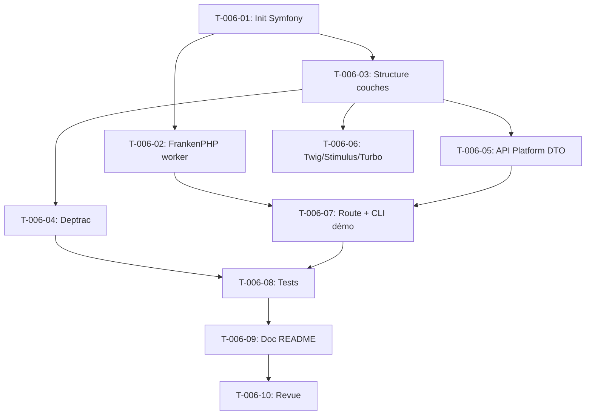

# Tâches — US-006 : Squelette Symfony 8 + FrankenPHP worker + architecture

## Rappel US

- **US**: US-006 — Squelette applicatif Symfony 8 + FrankenPHP worker + architecture en couches
- **EPIC**: EPIC-000
- **Sprint**: Sprint 0
- **Points**: 8
- **Dépend de**: —
- **Implémente**: ADR-1, ADR-2, ADR-3, ADR-4, ADR-5, ADR-8, ARC-15, ARC-16, ARC-17, ARC-18

> **En tant que** membre de l'équipe technique, **je veux** un projet Symfony 8.1 initialisé avec une arborescence `src/` organisée en couches (Domain / Application / Infrastructure) et ses trois adaptateurs (web, API, CLI), FrankenPHP configuré en mode worker, Deptrac garant des frontières, API Platform exposant uniquement des DTO de démonstration et un front Twig + Turbo minimal, **afin que** l'équipe puisse construire sur un socle sûr et reproductible.

Stack : Symfony 8.1 full-stack (SANS Flutter), FrankenPHP worker, API Platform 4.3.x DTO strict, Twig + Stimulus + Turbo, Reprise/Vite, Deptrac, PostgreSQL + pgvector (voir US-007).

---

## Vue d'ensemble

| ID | Type | Tâche | Estimation | Dépend de | Statut |
|----|------|-------|------------|-----------|--------|
| T-006-01 | [BE] | Initialiser le projet Symfony 8.1 (composer/flex, config de base) | 2h | — | 🔲 |
| T-006-02 | [OPS] | Configurer FrankenPHP en mode worker (Caddyfile, runtime, ARC-47/61) | 4h | T-006-01 | 🔲 |
| T-006-03 | [BE] | Structurer `src/` en couches Domain/Application/Infrastructure + adaptateurs web/API/CLI, autoload PSR-4 | 3h | T-006-01 | 🔲 |
| T-006-04 | [OPS] | Configurer Deptrac (frontières de modules, ARC-63) | 3h | T-006-03 | 🔲 |
| T-006-05 | [BE] | Installer + configurer API Platform 4.3 en mode DTO strict (provider + processor de démo, ARC-18) | 4h | T-006-03 | 🔲 |
| T-006-06 | [FE-WEB] | Configurer Twig + Stimulus + Turbo + build assets Reprise/Vite (ADR-5) | 4h | T-006-03 | 🔲 |
| T-006-07 | [BE] | Route de démonstration servie en worker + cas d'usage invocable en CLI (ARC-17) | 2h | T-006-02, T-006-05 | 🔲 |
| T-006-08 | [TEST] | Tests : route worker 200, frontière Deptrac rouge sur violation, exposition d'entité refusée | 3h | T-006-04, T-006-07 | 🔲 |
| T-006-09 | [DOC] | README architecture + conventions de couches | 2h | T-006-08 | 🔲 |
| T-006-10 | [REV] | Revue de code | 2h | T-006-09 | 🔲 |

**Total estimé : 29h**

---

## Détail des tâches

### T-006-01 — [BE] Initialiser le projet Symfony 8.1

**Description**
Créer le squelette Symfony 8.1 via Composer/Flex, en configuration minimale (skeleton, pas webapp) puisque FrankenPHP et Twig seront ajoutés dans des tâches dédiées. Fixer les versions PHP (8.4+) et verrouiller `composer.lock`.

**Fichiers à créer/modifier**
- `composer.json`
- `composer.lock`
- `.env`, `.env.example`
- `config/bundles.php`
- `config/packages/framework.yaml`
- `.gitignore`
- `symfony.lock`

**Commandes**
```bash
composer create-project symfony/skeleton:"8.1.*" hotones
composer require symfony/flex
composer config platform.php 8.4
```

**Critères de validation**
- [ ] `composer.json` fixe `"php": ">=8.4"` et `symfony/*` en `8.1.*`
- [ ] `php bin/console about` s'exécute sans erreur
- [ ] Aucun avertissement de dépréciation au boot (ARC-51)
- [ ] `.env.example` ne contient aucune valeur réelle

---

### T-006-02 — [OPS] Configurer FrankenPHP en mode worker

**Description**
Ajouter FrankenPHP (Caddy + PHP embarqué) en mode worker, avec un `Caddyfile` de développement et un runtime worker (`frankenphp` runtime pour Symfony). Documenter la gestion explicite de l'état inter-requêtes (ARC-47, ARC-61) : pas de propriétés statiques mutables, pas de singletons avec état métier.

**Fichiers à créer/modifier**
- `frankenphp/Caddyfile`
- `frankenphp/worker.php` (ou `public/index.php` adapté au runtime worker)
- `composer.json` (ajout `runtime/frankenphp-symfony`)
- `config/packages/frankenphp.yaml` (si applicable)

**Commandes**
```bash
composer require runtime/frankenphp-symfony
frankenphp run --config frankenphp/Caddyfile
curl -k https://localhost:8443/demo
```

**Critères de validation**
- [ ] Le serveur démarre en mode worker (log `worker mode: true`)
- [ ] Une requête HTTP répond sans redémarrer le worker
- [ ] Aucune fuite d'état observée sur 10 requêtes successives (PID worker stable)
- [ ] Note ARC-47/61 documentée dans le README (règle : pas d'état statique mutable)

---

### T-006-03 — [BE] Structurer `src/` en couches + adaptateurs

**Description**
Mettre en place l'arborescence Clean Architecture / DDD légère imposée par ADR-8 : `src/Domain`, `src/Application`, `src/Infrastructure`, avec sous-dossiers `Infrastructure/Web` (contrôleurs Symfony), `Infrastructure/Api` (providers/processors API Platform), `Infrastructure/Cli` (commandes console). Configurer l'autoload PSR-4.

**Fichiers à créer/modifier**
- `src/Domain/.gitkeep` (ou premier VO de démo)
- `src/Application/.gitkeep`
- `src/Infrastructure/Web/`
- `src/Infrastructure/Api/`
- `src/Infrastructure/Cli/`
- `src/Infrastructure/Persistence/`
- `composer.json` (bloc `autoload.psr-4`)

**Commandes**
```bash
mkdir -p src/Domain src/Application src/Infrastructure/{Web,Api,Cli,Persistence}
composer dump-autoload
```

**Critères de validation**
- [ ] Les 3 adaptateurs (web, API, CLI) sont isolés sous `src/Infrastructure/`
- [ ] Aucune logique métier dans les adaptateurs (vérifié en revue)
- [ ] `composer dump-autoload` ne produit aucune erreur de résolution de classe

---

### T-006-04 — [OPS] Configurer Deptrac (frontières de modules)

**Description**
Installer Deptrac et définir les règles de frontières : Domain ne dépend de rien, Application dépend uniquement de Domain, Infrastructure dépend de Application et Domain. Versionner `deptrac.yaml` à la racine (ARC-63).

**Fichiers à créer/modifier**
- `deptrac.yaml`
- `composer.json` (require-dev `qossmic/deptrac`)

**Commandes**
```bash
composer require --dev qossmic/deptrac
vendor/bin/deptrac analyse
```

**Critères de validation**
- [ ] `vendor/bin/deptrac analyse` retourne le code 0 sur le squelette initial
- [ ] Le rapport liste Domain, Application, Infrastructure avec leurs règles
- [ ] Une violation volontaire (import `Infrastructure` dans `Domain`) fait échouer la commande avec un code non nul

---

### T-006-05 — [BE] Installer et configurer API Platform 4.3 (DTO strict)

**Description**
Installer API Platform 4.3.x (pas 5.0 alpha), configurer le mode DTO strict : aucune ressource `#[ApiResource]` sur une entité Doctrine. Créer un endpoint de démonstration avec DTO d'entrée/sortie explicites, un `Provider` et un `Processor` sur mesure (ARC-18).

**Fichiers à créer/modifier**
- `config/packages/api_platform.yaml`
- `src/Infrastructure/Api/Dto/DemoOutput.php`
- `src/Infrastructure/Api/Provider/DemoProvider.php`
- `src/Infrastructure/Api/Resource/DemoResource.php`

**Commandes**
```bash
composer require api-platform/symfony:"^4.3"
php bin/console cache:clear
curl -k https://localhost:8443/api/demo
```

**Critères de validation**
- [ ] `composer.json` fixe `api-platform/symfony` en `4.3.*` (pas `^5.0`)
- [ ] Aucune entité Doctrine n'est annotée `#[ApiResource]`
- [ ] Une tentative d'exposition directe d'entité lève une exception explicite au chargement des métadonnées
- [ ] L'endpoint `/api/demo` retourne un JSON conforme au DTO de sortie

---

### T-006-06 — [FE-WEB] Configurer Twig + Stimulus + Turbo + Reprise/Vite

**Description**
Mettre en place le rendu serveur minimal (une page de démonstration) avec Twig, Stimulus et Turbo, et configurer le build d'assets via Symfony Reprise (expérimental 0.x) et Vite (ADR-5). Documenter le risque de rupture d'API (ARC-60).

**Fichiers à créer/modifier**
- `templates/demo/index.html.twig`
- `assets/controllers/hello_controller.js`
- `vite.config.js`
- `config/packages/twig.yaml`
- `config/packages/reprise.yaml` (si applicable)

**Commandes**
```bash
composer require twig symfony/stimulus-bundle symfony/ux-turbo
composer require symfony/reprise
npm install
npm run build
```

**Critères de validation**
- [ ] La page `/demo` s'affiche via Twig avec un contrôleur Stimulus fonctionnel
- [ ] Le build Vite/Reprise se termine sans erreur
- [ ] Aucune règle métier réimplémentée côté client (ARC-27)

---

### T-006-07 — [BE] Route de démo worker + cas d'usage CLI

**Description**
Implémenter le cas d'usage `Application` de démonstration, invoqué à la fois par la route HTTP `/demo` (adaptateur web, mode worker) et par une commande console `app:demo:run` (adaptateur CLI), sans instanciation de composants HTTP côté CLI (ARC-17).

**Fichiers à créer/modifier**
- `src/Application/UseCase/RunDemo.php`
- `src/Infrastructure/Web/Controller/DemoController.php`
- `src/Infrastructure/Cli/Command/DemoRunCommand.php`

**Commandes**
```bash
php bin/console app:demo:run
curl -k https://localhost:8443/demo
```

**Critères de validation**
- [ ] `GET /demo` répond 200 avec `{"status": "ok"}` en < 200 ms (hors première requête à chaud)
- [ ] `php bin/console app:demo:run` termine avec le code 0
- [ ] Aucun objet `Request`/`Response` Symfony instancié côté CLI
- [ ] Les deux adaptateurs appellent le même cas d'usage `Application`

---

### T-006-08 — [TEST] Tests worker, Deptrac, exposition d'entité

**Description**
Écrire les tests PHPUnit couvrant les CA-1 à CA-5 : réponse 200 en mode worker, exécution CLI, frontière Deptrac verte puis rouge sur violation injectée, refus d'exposition directe d'entité Doctrine.

**Fichiers à créer/modifier**
- `tests/Infrastructure/Web/DemoControllerTest.php`
- `tests/Infrastructure/Cli/DemoRunCommandTest.php`
- `tests/Architecture/DeptracBoundaryTest.php`
- `tests/Infrastructure/Api/EntityExposureRefusedTest.php`

**Commandes**
```bash
vendor/bin/phpunit
vendor/bin/deptrac analyse
```

**Critères de validation**
- [ ] Test CA-1 : `/demo` retourne 200 avec le payload attendu
- [ ] Test CA-2 : commande CLI retourne code 0, aucune classe HTTP chargée
- [ ] Test CA-3 : Deptrac 0 violation sur le squelette
- [ ] Test CA-4 : violation injectée fait échouer Deptrac avec message détaillé
- [ ] Test CA-5 : chargement d'une entité `#[ApiResource]` lève une exception explicite

---

### T-006-09 — [DOC] README architecture + conventions de couches

**Description**
Rédiger la documentation d'architecture : schéma des couches (Domain/Application/Infrastructure), règles de dépendance Deptrac, convention des 3 adaptateurs, note ARC-47/61 sur l'état inter-requêtes worker.

**Fichiers à créer/modifier**
- `README.md` (section Architecture)
- `docs/architecture/couches.md`
- `docs/architecture/deptrac-rules.md`

**Commandes**
```bash
# aucune commande — rédaction
```

**Critères de validation**
- [ ] README explique la structure `src/` et les 3 adaptateurs
- [ ] Règles Deptrac documentées avec exemple de violation
- [ ] Section dédiée aux précautions FrankenPHP worker (ARC-47/61)

---

### T-006-10 — [REV] Revue de code

**Description**
Revue de code croisée du squelette complet : conformité SOLID/DRY/YAGNI, respect des frontières de couches, absence de logique métier dans les adaptateurs, cohérence des tests avec les CA.

**Fichiers à créer/modifier**
- Aucun (revue via PR GitHub)

**Commandes**
```bash
gh pr create --fill
vendor/bin/phpunit
vendor/bin/deptrac analyse
```

**Critères de validation**
- [ ] Checklist PR (`09-git-workflow.md`) complétée
- [ ] Aucune violation Deptrac
- [ ] Tous les tests passent en CI
- [ ] Approbation d'au moins un reviewer

---

## Graphe de dépendances



---

## Résumé par type

| Type | Nb tâches | Heures |
|------|-----------|--------|
| [BE] | 4 | 11h |
| [OPS] | 2 | 7h |
| [FE-WEB] | 1 | 4h |
| [TEST] | 1 | 3h |
| [DOC] | 1 | 2h |
| [REV] | 1 | 2h |
| **Total** | **10** | **29h** |
