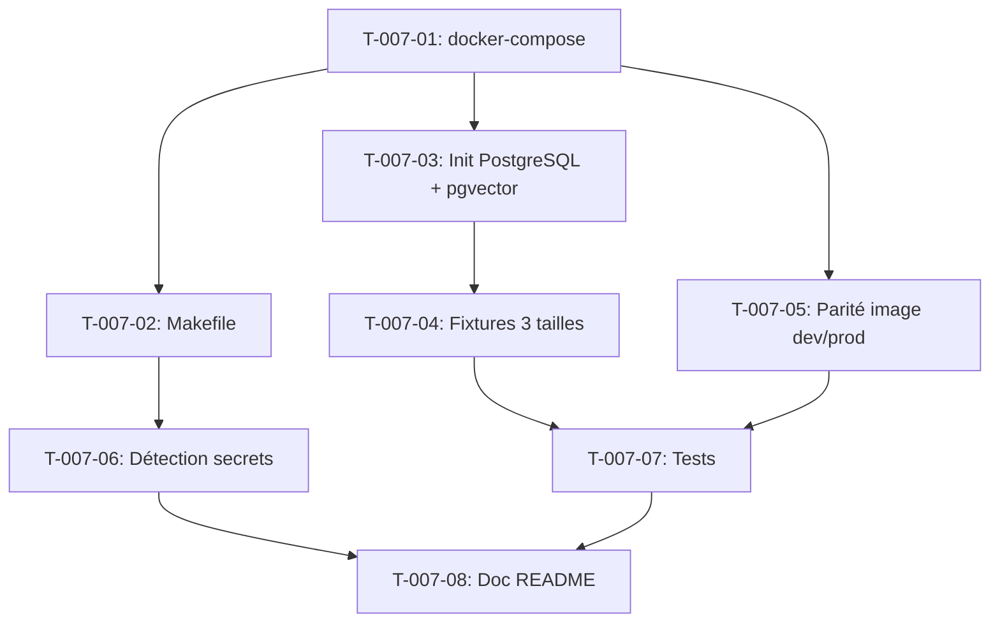

# Tâches — US-007 : Environnement conteneurisé + données de test

## Rappel US

- **US**: US-007 — Environnement de développement conteneurisé et données de test
- **EPIC**: EPIC-000
- **Sprint**: Sprint 0
- **Points**: 5
- **Dépend de**: US-006 (squelette applicatif)
- **Implémente**: ADR-11, ADR-6, ARC-86, ARC-87, ARC-88

> **En tant que** membre de l'équipe technique, **je veux** un environnement de développement démarrable en une commande unique, fondé sur la même image FrankenPHP worker qu'en production, avec PostgreSQL + pgvector, et des jeux de données de test des trois tailles de tenant régénérables à la demande — sans qu'aucun secret réel ne figure jamais dans le dépôt, **afin que** l'équipe puisse construire sur un socle sûr et reproductible.

Stack : Docker Compose, FrankenPHP worker (même image que prod), PostgreSQL 16 + pgvector, fixtures Symfony, détection de secrets pre-commit.

---

## Vue d'ensemble

| ID | Type | Tâche | Estimation | Dépend de | Statut |
|----|------|-------|------------|-----------|--------|
| T-007-01 | [OPS] | docker-compose (service app FrankenPHP worker + PostgreSQL 16 + pgvector) | 4h | US-006 | 🔲 |
| T-007-02 | [OPS] | Makefile / commande unique de démarrage (`make up`) | 1h | T-007-01 | 🔲 |
| T-007-03 | [DB] | Init PostgreSQL + activation extension pgvector | 2h | T-007-01 | 🔲 |
| T-007-04 | [DB] | Commande de génération de jeux de données de test 3 tailles de tenant (ARC-87) | 4h | T-007-03 | 🔲 |
| T-007-05 | [OPS] | Parité image dev = prod (même base FrankenPHP, ARC-86) | 2h | T-007-01 | 🔲 |
| T-007-06 | [OPS] | Détection de secrets au commit (gitleaks/pre-commit, ARC-88) | 2h | T-007-02 | 🔲 |
| T-007-07 | [TEST] | Test : démarrage de l'env en une commande + régénération des données | 2h | T-007-04, T-007-05 | 🔲 |
| T-007-08 | [DOC] | README environnement de développement | 1h | T-007-06, T-007-07 | 🔲 |

**Total estimé : 18h**

---

## Détail des tâches

### T-007-01 — [OPS] docker-compose (FrankenPHP worker + PostgreSQL 16 + pgvector)

**Description**
Créer le `docker-compose.yml` avec deux services : `app` (image FrankenPHP worker construite depuis le `Dockerfile` du squelette US-006) et `postgres` (image `pgvector/pgvector:pg16`). Exposer les ports 8443 (HTTPS local) et 5432. Volumes pour la persistance des données PostgreSQL et le hot-reload du code applicatif.

**Fichiers à créer/modifier**
- `docker-compose.yml`
- `Dockerfile` (multi-stage : build assets, runtime FrankenPHP)
- `.env` (variables `DATABASE_URL`, `POSTGRES_*`)
- `.dockerignore`

**Commandes**
```bash
docker compose config
docker compose up --build -d
docker compose ps
```

**Critères de validation**
- [ ] `docker compose up --build` démarre les 2 services sans erreur
- [ ] `https://localhost:8443/demo` répond 200
- [ ] PostgreSQL accessible sur `localhost:5432`
- [ ] Volumes persistants nommés (pas de perte de données à `docker compose down`)

---

### T-007-02 — [OPS] Makefile / commande unique de démarrage

**Description**
Créer un `Makefile` à la racine exposant les commandes principales : `make up` (démarrage complet), `make down`, `make dev` (build + up), `make logs`, `make sh` (shell dans le conteneur app). Centraliser les commandes Docker Compose pour l'équipe.

**Fichiers à créer/modifier**
- `Makefile`

**Commandes**
```bash
make dev
make logs
make down
```

**Critères de validation**
- [ ] `make dev` construit et démarre l'environnement complet
- [ ] `make down` arrête proprement les conteneurs
- [ ] Chaque cible `Makefile` a une aide (`make help`)

---

### T-007-03 — [DB] Init PostgreSQL + activation pgvector

**Description**
Configurer le script d'initialisation PostgreSQL pour activer l'extension `pgvector` au premier démarrage du conteneur (`CREATE EXTENSION IF NOT EXISTS vector;`), et vérifier la compatibilité avec Doctrine (types custom si nécessaire, ADR-6).

**Fichiers à créer/modifier**
- `docker/postgres/init/01-extensions.sql`
- `config/packages/doctrine.yaml`
- `migrations/VersionXXXX_EnableVectorExtension.php`

**Commandes**
```bash
docker compose exec postgres psql -U app -d hotones -c "SELECT extname FROM pg_extension WHERE extname = 'vector';"
php bin/console doctrine:migrations:migrate
```

**Critères de validation**
- [ ] `SELECT extname FROM pg_extension WHERE extname = 'vector'` retourne une ligne
- [ ] La migration Doctrine d'activation est versionnée et rejouable
- [ ] `doctrine:schema:validate` ne signale aucune erreur liée à l'extension

---

### T-007-04 — [DB] Génération des jeux de données de test (3 tailles de tenant)

**Description**
Implémenter une commande Symfony (fixtures) générant trois profils de données : small (1 tenant, ~50 utilisateurs), medium (5 tenants, ~200 utilisateurs), large (20 tenants, ~1000 utilisateurs). Respecter les invariants INV-1 (discriminant tenant) et INV-2 (taux historisés à date d'effet). Garantir l'idempotence (réinitialisation avant chaque génération).

**Fichiers à créer/modifier**
- `src/Infrastructure/Cli/Command/FixturesLoadCommand.php`
- `src/Infrastructure/Persistence/Fixtures/TenantSizeProfile.php`
- `src/Infrastructure/Persistence/Fixtures/SmallTenantFixtures.php`
- `src/Infrastructure/Persistence/Fixtures/MediumTenantFixtures.php`
- `src/Infrastructure/Persistence/Fixtures/LargeTenantFixtures.php`
- `Makefile` (cible `make fixtures SIZE=small`)

**Commandes**
```bash
php bin/console app:fixtures:load --size=small
php bin/console app:fixtures:load --size=medium
php bin/console app:fixtures:load --size=large
```

**Critères de validation**
- [ ] `make fixtures SIZE=small` (et medium, large) termine avec le code 0
- [ ] Un résumé du nombre d'entités créées par type est affiché
- [ ] Toutes les lignes portent le discriminant tenant (INV-1)
- [ ] Les taux/coûts sont historisés à date d'effet (INV-2)
- [ ] Deux exécutions consécutives produisent un résultat identique (idempotence)

---

### T-007-05 — [OPS] Parité image dev = prod (ARC-86)

**Description**
S'assurer que l'image Docker utilisée en développement est strictement identique à celle qui sera déployée en production (même `Dockerfile`, même tag de base FrankenPHP, pas de variante « dev » divergente). Documenter la stratégie de build multi-stage partagée.

**Fichiers à créer/modifier**
- `Dockerfile` (stage `base` commun dev/prod)
- `docker-compose.yml` (référence au même `Dockerfile`)
- `docs/architecture/parite-images.md`

**Commandes**
```bash
docker build --target runtime -t hotones-app:local .
docker compose exec app php -v
```

**Critères de validation**
- [ ] Le `Dockerfile` de dev et celui utilisé en CI/déploiement pointent vers le même stage de base
- [ ] Le mode worker est actif en développement (log `worker_mode: true`)
- [ ] 10 requêtes successives sont traitées par le même PID worker (pas de redémarrage)
- [ ] Aucune fuite d'état inter-requêtes détectée dans les logs

---

### T-007-06 — [OPS] Détection de secrets au commit (ARC-88)

**Description**
Installer un hook `pre-commit` utilisant `gitleaks` (ou `detect-secrets`) pour bloquer tout commit contenant un secret réel (clé API, mot de passe, token). Intégrer l'installation du hook dans `make setup`. Vérifier que les fichiers `.env.example` ne contiennent que des valeurs factices.

**Fichiers à créer/modifier**
- `.pre-commit-config.yaml`
- `.gitleaks.toml`
- `Makefile` (cible `make setup`)
- `.env.example` (revue des valeurs factices)
- `.gitignore` (`.env.local`, `.env.test.local`)

**Commandes**
```bash
gitleaks detect --source . --verbose
pre-commit install
git commit -am "test secret" # doit être bloqué si secret injecté volontairement
```

**Critères de validation**
- [ ] `make setup` installe le hook `pre-commit`
- [ ] Une tentative de commit avec une clé AWS factice (`AWS_SECRET_ACCESS_KEY=AKIA...`) est bloquée avec un code non nul
- [ ] Le message d'erreur identifie le fichier, la ligne et le motif détecté
- [ ] `.env.local` et `.env.test.local` sont dans `.gitignore`
- [ ] `.env.example` ne contient que des valeurs de type `changeme` / `your-api-key-here`

---

### T-007-07 — [TEST] Test démarrage en une commande + régénération des données

**Description**
Écrire les tests (script d'intégration + PHPUnit) couvrant les CA-1, CA-2, CA-3 et CA-5 : démarrage complet en une commande sous 5 minutes, régénération idempotente des 3 tailles de fixtures, stabilité du PID worker, message d'erreur explicite si PostgreSQL est indisponible.

**Fichiers à créer/modifier**
- `tests/Integration/EnvironmentBootstrapTest.php`
- `tests/Integration/FixturesIdempotenceTest.php`
- `scripts/ci/check-startup-time.sh`

**Commandes**
```bash
time make dev
docker compose stop postgres && php bin/console doctrine:schema:validate; echo $?
vendor/bin/phpunit --testsuite=integration
```

**Critères de validation**
- [ ] Test CA-1 : démarrage complet en moins de 5 minutes, `/demo` répond 200
- [ ] Test CA-2 : `make fixtures SIZE=medium` exécuté deux fois produit un résultat identique
- [ ] Test CA-3 : PID worker stable sur 10 requêtes successives
- [ ] Test CA-5 : PostgreSQL arrêté → message d'erreur explicite, code de sortie non nul, pas de crash silencieux

---

### T-007-08 — [DOC] README environnement de développement

**Description**
Documenter la procédure de démarrage (`make dev`), la régénération des fixtures (`make fixtures SIZE=...`), l'installation du hook de détection de secrets (`make setup`), et le temps de démarrage mesuré.

**Fichiers à créer/modifier**
- `README.md` (section Environnement de développement)
- `docs/dev-environment.md`

**Commandes**
```bash
# aucune commande — rédaction
```

**Critères de validation**
- [ ] README documente `make dev`, `make fixtures`, `make setup`
- [ ] Le temps de premier démarrage mesuré est indiqué (< 5 min)
- [ ] Une section explique la gestion des secrets et `.env.example`

---

## Graphe de dépendances



---

## Résumé par type

| Type | Nb tâches | Heures |
|------|-----------|--------|
| [OPS] | 4 | 9h |
| [DB] | 2 | 6h |
| [TEST] | 1 | 2h |
| [DOC] | 1 | 1h |
| **Total** | **8** | **18h**
