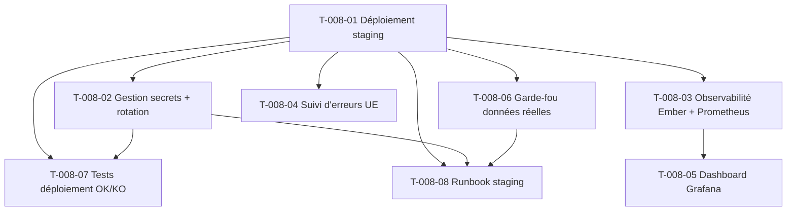

# Tâches — US-008 : Staging, gestion des secrets et observabilité de base

**EPIC**: EPIC-000
**Sprint**: Sprint 0
**Points**: 5
**Stack**: Symfony 8.1 + FrankenPHP + PostgreSQL — sans Flutter (aucune tâche `[FE-MOB]`)

---

## Vue d'ensemble

| ID | Type | Description | Estimation |
|----|------|-------------|------------|
| T-008-01 | [OPS] | Déploiement staging sur Railway (région UE) | 4h |
| T-008-02 | [OPS] | Gestion des secrets hors dépôt + rotation | 3h |
| T-008-03 | [OPS] | Observabilité Ember + export Prometheus | 3h |
| T-008-04 | [OPS] | Suivi d'erreurs (palier gratuit, résidence UE) | 2h |
| T-008-05 | [OPS] | Dashboard Grafana (P95, erreurs, disponibilité) | 3h |
| T-008-06 | [OPS] | Garde-fou anti données réelles en staging | 1h |
| T-008-07 | [TEST] | Tests déploiement OK / secret manquant KO | 2h |
| T-008-08 | [DOC] | Runbook staging | 1h |

**Total estimé : 19h**

---

## T-008-01 [OPS] Déploiement staging sur Railway (région UE)

**Estimation** : 4h
**Dépend de** : US-006 (squelette applicatif), US-007 (environnement conteneurisé)
**Implémente** : ADR-13

### Description

Créer et configurer le service Railway Hobby en zone UE (`eu-west`) pour héberger l'environnement de staging. Mettre en place le pipeline de déploiement automatique déclenché sur chaque push vers `main` une fois la CI verte, avec vérification post-déploiement (health-check).

### Fichiers / config

- `railway.toml` (config service, région, build FrankenPHP)
- `Dockerfile` ou `Dockerfile.staging` (réutilisation image US-007)
- `.github/workflows/deploy-staging.yml`
- `config/packages/staging/framework.yaml` (si config spécifique staging)
- Route `/health` (Symfony, contrôleur léger sans dépendance DB si possible, ou avec ping DB)

```toml
# railway.toml
[build]
builder = "DOCKERFILE"
dockerfilePath = "Dockerfile"

[deploy]
region = "eu-west"
healthcheckPath = "/health"
healthcheckTimeout = 120
restartPolicyType = "ON_FAILURE"
```

```yaml
# .github/workflows/deploy-staging.yml (extrait)
name: Deploy Staging
on:
  push:
    branches: [main]
jobs:
  deploy:
    needs: [ci] # dépend de la pipeline CI ADR-12 (11 étapes bloquantes)
    runs-on: ubuntu-latest
    steps:
      - uses: actions/checkout@v4
      - name: Deploy to Railway (staging)
        run: railway up --service staging --environment staging
        env:
          RAILWAY_TOKEN: ${{ secrets.RAILWAY_STAGING_TOKEN }}
      - name: Wait for health check
        run: |
          for i in {1..24}; do
            curl -fsS https://staging.hotones.example/health && exit 0
            sleep 5
          done
          echo "Health check failed after 2 minutes" && exit 1
```

### Critères de validation

- [ ] Le service Railway est créé en région `eu-west` (vérifiable via `railway status`)
- [ ] Un push sur `main` avec CI verte déclenche automatiquement le déploiement
- [ ] Le déploiement se termine avec un code de sortie 0
- [ ] `/health` répond HTTP 200 dans les 2 minutes suivant la fin du déploiement
- [ ] Le log de déploiement affiche la région (`eu-west`) et le SHA court du commit déployé
- [ ] La base PostgreSQL de staging est vide de toute donnée réelle à l'issue du premier déploiement

### Commandes

```bash
railway login
railway link --environment staging
railway up --service staging
railway status --service staging
curl -i https://staging.hotones.example/health
```

---

## T-008-02 [OPS] Gestion des secrets hors dépôt + procédure de rotation

**Estimation** : 3h
**Dépend de** : T-008-01
**Implémente** : ENF-SEC-10

### Description

Configurer l'ensemble des variables sensibles (`DATABASE_URL`, `APP_SECRET`, clés API tierces) exclusivement comme variables d'environnement Railway, jamais dans le dépôt git. Documenter et tester la procédure de rotation sans redéploiement du code (mise à jour de la variable + redémarrage automatique de l'application).

### Fichiers / config

- `.env.example` (placeholders uniquement, aucune valeur réelle)
- `.gitignore` (confirmation `.env`, `.env.local`, `.env.*.local` exclus)
- `.github/workflows/ci.yml` : étape "secret detection" (gitleaks / trufflehog, cf. ADR-12)
- `docs/runbooks/rotation-secrets.md` (procédure détaillée, référencée par T-008-08)

```yaml
# .github/workflows/ci.yml (extrait — détection secrets, ADR-12)
- name: Detect secrets
  uses: gitleaks/gitleaks-action@v2
  with:
    config-path: .gitleaks.toml
```

### Critères de validation

- [ ] Aucun secret (clé, mot de passe, token) n'est présent dans le dépôt git (scan gitleaks vert)
- [ ] Toutes les variables sensibles de staging sont définies dans Railway (interface ou CLI), jamais en clair dans le code
- [ ] La mise à jour d'une variable via `railway variables set` déclenche un redémarrage automatique de l'application
- [ ] L'application répond HTTP 200 sur `/health` dans les 60 secondes suivant le redémarrage
- [ ] Aucune valeur sensible (ancienne ou nouvelle) n'apparaît dans les logs applicatifs
- [ ] La procédure de rotation est reproductible sans nouveau commit ni nouveau build

### Commandes

```bash
railway variables set DATABASE_URL="postgresql://..." --service staging
railway variables list --service staging
railway logs --service staging | grep -i "environment reloaded"
gitleaks detect --source . --verbose
```

---

## T-008-03 [OPS] Observabilité : intégration Ember + export Prometheus

**Estimation** : 3h
**Dépend de** : T-008-01
**Implémente** : ADR-14

### Description

Installer et configurer le bundle Symfony exposant les métriques techniques (temps de réponse HTTP en P50/P90/P95/P99) via un endpoint `/metrics` au format Prometheus. Intégrer Ember (ou équivalent) comme couche de collecte/agrégation intermédiaire si applicable selon ADR-14.

### Fichiers / config

- `composer.json` (ajout `promphp/prometheus_client_php` ou équivalent Symfony)
- `config/packages/prometheus_metrics.yaml`
- `src/EventListener/MetricsRequestListener.php` (mesure durée requête)
- Route `/metrics` (protégée, non exposée publiquement — accès restreint au réseau Prometheus/Railway)

```yaml
# config/packages/prometheus_metrics.yaml
prometheus_metrics:
  namespace: 'hotones'
  histogram_buckets: [0.05, 0.1, 0.25, 0.5, 1, 2.5, 5]
```

```yaml
# prometheus.yml (côté scraper)
scrape_configs:
  - job_name: 'hotones-staging'
    metrics_path: /metrics
    static_configs:
      - targets: ['staging.hotones.example:443']
    scheme: https
```

### Critères de validation

- [ ] L'endpoint `/metrics` expose `http_request_duration_seconds` avec les percentiles P50/P90/P95/P99
- [ ] Prometheus scrape correctement l'endpoint (statut `UP` dans l'interface Prometheus)
- [ ] L'endpoint `/metrics` n'est pas accessible publiquement sans authentification/restriction réseau
- [ ] Au moins 10 requêtes de test génèrent des données mesurables dans Prometheus

### Commandes

```bash
composer require promphp/prometheus_client_php
curl -s https://staging.hotones.example/metrics | grep http_request_duration
for i in {1..10}; do curl -s -o /dev/null https://staging.hotones.example/health; done
```

---

## T-008-04 [OPS] Suivi d'erreurs — palier gratuit, résidence UE

**Estimation** : 2h
**Dépend de** : T-008-01
**Implémente** : ADR-14

### Description

Configurer un outil de suivi d'erreurs (Ember ou équivalent auto-hébergeable/gratuit avec résidence des données en UE) pour capturer les exceptions non gérées de l'application en staging, ainsi que les événements de violation de politique (déploiement échoué, garde-fou déclenché).

### Fichiers / config

- `config/packages/error_tracking.yaml`
- `.env` (variable `ERROR_TRACKING_DSN` — via Railway, cf. T-008-02)
- `src/Kernel.php` ou listener d'exceptions global

```yaml
# config/packages/error_tracking.yaml
error_tracking:
  dsn: '%env(ERROR_TRACKING_DSN)%'
  environment: '%env(APP_ENV)%'
  region: 'eu'
```

### Critères de validation

- [ ] L'outil de suivi d'erreurs est hébergé ou configuré en résidence de données UE
- [ ] Une exception non gérée déclenchée manuellement en staging apparaît dans le tableau de bord du suivi d'erreurs
- [ ] Le DSN/clé du service est géré comme variable sensible (cf. T-008-02), jamais en dur dans le code
- [ ] Les échecs de déploiement (variable manquante) génèrent une alerte dans le suivi d'erreurs

### Commandes

```bash
railway variables set ERROR_TRACKING_DSN="https://...@ember.eu/..." --service staging
curl -X POST https://staging.hotones.example/debug/trigger-error   # route de test temporaire
```

---

## T-008-05 [OPS] Dashboard Grafana : temps de réponse, erreurs, disponibilité

**Estimation** : 3h
**Dépend de** : T-008-03
**Implémente** : ADR-14, ENF-PERF-2

### Description

Connecter Grafana à la source de données Prometheus et construire un dashboard préconfiguré avec trois panneaux minimum : temps de réponse HTTP (P95), taux d'erreurs (5xx), disponibilité (`up`). Configurer une alerte sur dépassement du seuil P95 > 500 ms.

### Fichiers / config

- `observability/grafana/dashboards/staging-overview.json` (dashboard as code)
- `observability/grafana/provisioning/datasources/prometheus.yaml`
- `observability/grafana/provisioning/alerting/p95-threshold.yaml`

```yaml
# observability/grafana/provisioning/datasources/prometheus.yaml
apiVersion: 1
datasources:
  - name: Prometheus-Staging
    type: prometheus
    url: http://prometheus:9090
    access: proxy
    isDefault: true
```

```json
// observability/grafana/dashboards/staging-overview.json (extrait panneau P95)
{
  "title": "Temps de réponse HTTP",
  "targets": [{
    "expr": "histogram_quantile(0.95, sum(rate(http_request_duration_seconds_bucket[5m])) by (le))"
  }],
  "alert": {
    "conditions": [{ "evaluator": { "type": "gt", "params": [0.5] } }]
  }
}
```

### Critères de validation

- [ ] Le dashboard Grafana affiche le panneau "Temps de réponse HTTP" avec la métrique P95 sur les 15 dernières minutes
- [ ] La valeur P95 est calculée à partir d'au moins 10 requêtes de test post-déploiement
- [ ] Une alerte est configurée et se déclenche si P95 > 500 ms (seuil ENF-PERF-2)
- [ ] Les panneaux "taux d'erreurs 5xx" et "disponibilité" sont présents et fonctionnels
- [ ] Le dashboard est versionné (JSON as code) dans le dépôt

### Commandes

```bash
grafana-cli admin reset-admin-password <password>  # setup initial uniquement
curl -X POST http://grafana:3000/api/dashboards/db -H "Content-Type: application/json" -d @observability/grafana/dashboards/staging-overview.json
```

---

## T-008-06 [OPS] Garde-fou : refus de déploiement de données réelles en staging

**Estimation** : 1h
**Dépend de** : T-008-01
**Implémente** : ADR-13

### Description

Ajouter un contrôle explicite dans les scripts de migration/fixtures et dans la pipeline CI/CD qui refuse toute tentative de copie de données de production (ou de développement contenant des données réelles) vers l'environnement de staging.

### Fichiers / config

- `bin/console app:staging-guard` (commande Symfony de contrôle, ou script shell dédié)
- `.github/workflows/deploy-staging.yml` (étape de garde-fou avant tout job de copie de données)

```php
// src/Command/StagingGuardCommand.php (extrait)
if ($targetEnv === 'staging' && $this->containsRealDataMarker($source)) {
    $output->writeln('<error>REFUSÉ : le déploiement de données réelles en staging est interdit (ADR-13)</error>');
    $this->errorTracker->captureMessage('Policy violation: real data blocked from staging', ['adr' => 'ADR-13']);
    return Command::FAILURE;
}
```

### Critères de validation

- [ ] Toute tentative de copie de données réelles (`pg_dump production | psql staging`) vers staging est bloquée par le script/CI
- [ ] Le message "REFUSÉ : le déploiement de données réelles en staging est interdit (ADR-13)" s'affiche explicitement
- [ ] Le job se termine avec un code de sortie non nul
- [ ] L'événement est tracé dans le suivi d'erreurs (Ember) comme violation de politique

### Commandes

```bash
bin/console app:staging-guard --target=staging --source=production   # doit échouer (exit != 0)
echo $?
```

---

## T-008-07 [TEST] Tests : déploiement staging OK / secret manquant KO

**Estimation** : 2h
**Dépend de** : T-008-01, T-008-02
**Implémente** : CA-1, CA-4

### Description

Écrire les tests (fonctionnels/scénarios CI) validant que (1) un déploiement staging avec configuration complète aboutit et répond sur `/health`, et (2) un déploiement avec une variable obligatoire manquante (`DATABASE_URL`) échoue explicitement sans affecter la production ni laisser de downtime.

### Fichiers / config

- `tests/Functional/HealthCheckTest.php`
- `tests/Functional/EnvironmentConfigTest.php` (vérifie l'échec au démarrage si variable manquante)
- `.github/workflows/deploy-staging.yml` (job de test post-déploiement)

```php
// tests/Functional/EnvironmentConfigTest.php (extrait)
public function testStartupFailsWhenDatabaseUrlMissing(): void
{
    putenv('DATABASE_URL');
    $this->expectException(MissingRequiredEnvironmentVariableException::class);
    $this->expectExceptionMessage('Required environment variable DATABASE_URL is not set');
    self::bootKernel();
}
```

### Critères de validation

- [ ] Test vert : un déploiement staging complet aboutit et `/health` répond 200 en moins de 2 minutes
- [ ] Test vert : l'absence de `DATABASE_URL` provoque un échec explicite au démarrage avec message clair
- [ ] Test vert : en cas d'échec de déploiement, l'ancienne version reste active (pas de downtime constaté)
- [ ] Les deux scénarios sont exécutés automatiquement dans la CI (ADR-12)
- [ ] Couverture ≥ 80 % sur le code du garde-fou et du chargement de configuration (règle 07-testing)

### Commandes

```bash
docker compose exec app bin/phpunit tests/Functional/HealthCheckTest.php
docker compose exec app bin/phpunit tests/Functional/EnvironmentConfigTest.php
docker compose exec app bin/phpunit --coverage-text tests/Functional/
```

---

## T-008-08 [DOC] Runbook staging (déploiement, rollback, rotation des secrets)

**Estimation** : 1h
**Dépend de** : T-008-01, T-008-02, T-008-06
**Implémente** : documentation opérationnelle (règle 10-documentation)

### Description

Rédiger un runbook opérationnel décrivant les procédures : déploiement manuel/automatique sur staging, rollback en cas d'échec, rotation d'un secret, et marche à suivre en cas de déclenchement du garde-fou anti-données-réelles.

### Fichiers / config

- `docs/runbooks/staging.md`

```markdown
# Runbook — Environnement de staging

## Déploiement
1. Push sur `main` avec CI verte → déploiement automatique.
2. Vérifier `/health` (200 attendu sous 2 min).

## Rollback
railway rollback --service staging --deployment <id>

## Rotation d'un secret
railway variables set <NOM>="<valeur>" --service staging
# Redémarrage automatique, vérifier /health sous 60s

## Garde-fou données réelles
Si un job échoue avec "REFUSÉ : ADR-13" → ne jamais contourner.
Escalader au Tech Lead si besoin légitime identifié.
```

### Critères de validation

- [ ] Le runbook couvre déploiement, rollback, rotation de secret et garde-fou
- [ ] Chaque procédure inclut les commandes exactes et le résultat attendu
- [ ] Le runbook est lié depuis le README ou l'index de documentation du projet
- [ ] Relu par un second membre de l'équipe technique

### Commandes

```bash
# Aucune commande d'exécution — tâche de rédaction
git add docs/runbooks/staging.md
```

---

## Graphe de dépendances



## Résumé par type

| Type | Nombre de tâches | Total heures |
|------|-------------------|---------------|
| [OPS] | 6 | 16h |
| [TEST] | 1 | 2h |
| [DOC] | 1 | 1h |
| **Total** | **8** | **19h** |
