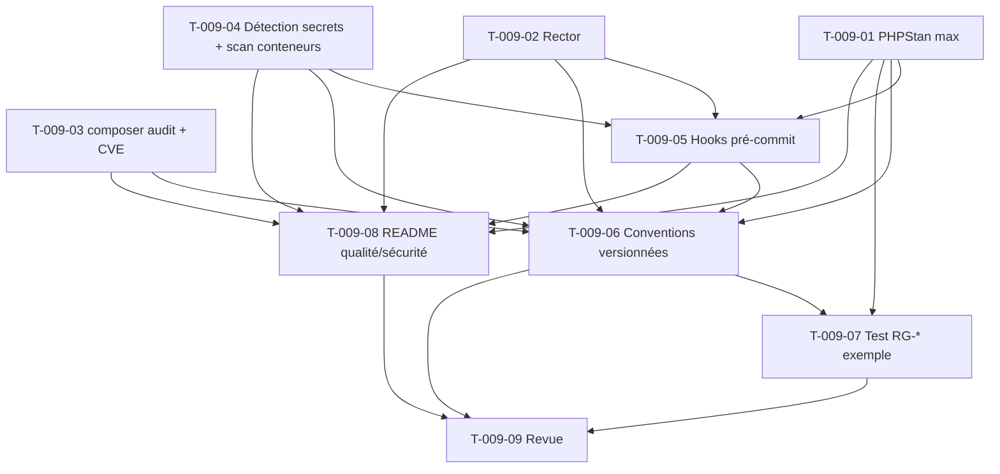

# Tâches — US-009 : Outillage qualité/sécurité et conventions de développement assisté

**EPIC**: EPIC-000
**Sprint**: Sprint 0
**Points**: 5
**Story parente**: [US-009](../../../backlog/user-stories/US-009-outillage-qualite-securite.md)
**Traçabilité**: ADR-15, ADR-16, ARC-51, ARC-53, ARC-103, ARC-105, ARC-106, ARC-108, ENF-SEC-11, ENF-MAINT-1

> Convention ID : `T-009-XX`. Estimation en heures. Types : `[OPS]` `[BE]` `[DOC]` `[TEST]`.
> Objectif : les **8 couches de sécurité** ADR-15 opérationnelles en local (`make quality`) + conventions de développement assisté versionnées (ADR-16, contrat équipe/agent).

---

## T-009-01 — [OPS] Configurer PHPStan niveau max (+ extensions Symfony/Doctrine)

**Estimation** : 2h
**Dépend de** : US-006 (squelette applicatif)

### Description
Installer et configurer PHPStan au niveau `max` avec le mode `bleedingEdge`, ainsi que les extensions `phpstan-symfony` et `phpstan-doctrine` pour une analyse contextuelle des services et entités. Interdire l'usage de `@phpstan-ignore-next-line` sans commentaire de justification adjacent (règle de baseline documentée, vérifiée manuellement en revue à défaut d'outil dédié au Sprint 0).

### Fichiers
- `phpstan.neon` (nouveau)
- `phpstan-baseline.neon` (généré, vide sur squelette initial)
- `composer.json` (require-dev : `phpstan/phpstan`, `phpstan/phpstan-symfony`, `phpstan/phpstan-doctrine`)

### Critères de validation
- CA-2 (US-009) validé : `vendor/bin/phpstan analyse src/` retourne le code de sortie 0 sur le squelette initial, sans erreur ni warning non supprimé
- `phpstan.neon` versionné, niveau `max` et `bleedingEdge: true` explicites
- Une convention documentée (README ou commentaire dans `phpstan.neon`) impose la justification de tout `@phpstan-ignore-next-line`

### Commandes
```bash
composer require --dev phpstan/phpstan phpstan/phpstan-symfony phpstan/phpstan-doctrine
vendor/bin/phpstan analyse src/ --level=max
```

---

## T-009-02 — [OPS] Configurer Rector (montée de version, dépréciations, ARC-53)

**Estimation** : 2h
**Dépend de** : US-006

### Description
Installer et configurer Rector avec les sets de règles Symfony (`SYMFONY_60` à `SYMFONY_80`) et PHP 8.4/8.5, afin d'automatiser la correction des dépréciations et la préparation aux montées de version (ARC-51, ARC-53). Valider le fonctionnement en mode `--dry-run` puis en mode correction sur un cas de démonstration.

### Fichiers
- `rector.php` (nouveau)
- `composer.json` (require-dev : `rector/rector`)
- `src/Service/DemoService.php` (fixture de démonstration temporaire pour valider CA-3, supprimée après validation ou conservée en test)

### Critères de validation
- CA-3 (US-009) validé : une dépréciation introduite volontairement est corrigée automatiquement par `rector process` (mode correction), avec code de sortie 0 et nombre de fichiers modifiés affiché
- Le code corrigé passe PHPStan max sans nouvelle erreur
- Une exécution `--dry-run` préalable affiche la transformation prévue sans modifier les fichiers

### Commandes
```bash
composer require --dev rector/rector
vendor/bin/rector process src/ --dry-run
vendor/bin/rector process src/
```

---

## T-009-03 — [OPS] composer audit + scan CVE des dépendances (Trivy/Grype), gate < 15 j (ENF-SEC-11)

**Estimation** : 2h
**Dépend de** : US-006, US-007 (image Docker disponible)

### Description
Configurer `composer audit` en local et scripter un scan CVE de l'image Docker de l'application (Trivy ou Grype), avec seuil bloquant sur les sévérités CRITICAL et HIGH. Documenter le processus de suivi ENF-SEC-11 : toute vulnérabilité non corrigée sous 15 jours déclenche une alerte (mécanisme documenté au Sprint 0, automatisation de l'alerte à affiner avec l'observabilité ADR-14).

### Fichiers
- `Makefile` ou `bin/quality/audit-deps.sh` (script `composer audit` + `trivy image`)
- `docs/security/dependency-audit.md` (processus de suivi 15 jours)

### Critères de validation
- CA-5 (US-009) validé : une dépendance CRITICAL/HIGH fait échouer le script avec CVE, sévérité et version corrigée listés
- Le script retourne un code de sortie non nul en cas de vulnérabilité bloquante
- Le processus de suivi 15 jours (ENF-SEC-11) est documenté avec le canal d'alerte désigné

### Commandes
```bash
composer audit --format=json
trivy image --severity CRITICAL,HIGH ghcr.io/hotones/app:local
```

---

## T-009-04 — [OPS] Détecteur de secrets + scanner de conteneurs

**Estimation** : 2h
**Dépend de** : US-006, US-007

### Description
Installer et configurer un détecteur de secrets (gitleaks ou detect-secrets) couvrant les patterns courants (clés AWS, tokens JWT, mots de passe en dur, DSN avec credentials), utilisable en local et réutilisé par le hook pré-commit (T-009-05) et la CI (US-004 T-004-07). Ajouter un scanner de conteneurs (Trivy en mode `config`/`fs` pour Dockerfile) en complément du scan CVE d'image (T-009-03).

### Fichiers
- `.gitleaks.toml` (nouveau, patterns configurés)
- `bin/quality/scan-secrets.sh`
- `Dockerfile` (vérifié par `trivy config`)

### Critères de validation
- CA-4 (US-009) validé : un secret introduit (`$apiKey = "sk-prod-abcdef123456"`) est détecté avec fichier, ligne et type identifiés
- Le scanner de conteneurs signale toute mauvaise pratique Dockerfile bloquante (ex. utilisateur root, secrets en `ARG`)

### Commandes
```bash
gitleaks detect --source=. --no-git -v
trivy config Dockerfile
```

---

## T-009-05 — [BE] Hooks de pré-commit (GrumPHP/CaptainHook) enchaînant les vérifications

**Estimation** : 2h
**Dépend de** : T-009-01, T-009-02, T-009-04

### Description
Installer et configurer GrumPHP (ou CaptainHook) pour enchaîner localement, avant chaque commit : PHPStan, style de code, détection de secrets. Bloquer le commit en cas d'échec d'une des étapes, avec message d'erreur explicite.

### Fichiers
- `grumphp.yml` (nouveau)
- `composer.json` (require-dev : `phpro/grumphp`, hook post-install)

### Critères de validation
- CA-4 (US-009) validé côté hook local : le commit contenant un secret est bloqué avec code de sortie non nul, message identifiant fichier/ligne/type
- Le hook s'exécute automatiquement après `composer install` (post-install-cmd)
- Un commit valide (sans violation) passe en moins de 30 secondes

### Commandes
```bash
composer require --dev phpro/grumphp
vendor/bin/grumphp git:init
git commit -m "test: hook"  # doit être bloqué si secret présent
```

---

## T-009-06 — [DOC] Conventions de développement versionnées à la racine (contrat équipe/agent, ARC-105)

**Estimation** : 3h
**Dépend de** : T-009-01 à T-009-05 (l'outillage documenté doit exister)

### Description
Rédiger et versionner les conventions de développement assisté à la racine du dépôt (`.claude/CLAUDE.md` et/ou `CONVENTIONS.md`), formalisant le contrat entre l'équipe et l'agent IA (claude-craft, ADR-16) : ARC-103 (nommage des tests par règle de gestion RG-*), ARC-104 (invariants portés en base, pas seulement en code applicatif), ARC-105 (conventions versionnées, modification par PR revue), ARC-106 (périmètre de sécurité jamais délégué sans relecture humaine — isolation multi-tenant, autorisation, secrets), ARC-107 (code livré avec ses tests), ARC-108 (tests écrits depuis l'exigence RG-*, pas depuis l'implémentation).

### Fichiers
- `.claude/CLAUDE.md` (mis à jour ou créé — conventions projet HotOnes)
- `CONVENTIONS.md` (nouveau, si séparé du CLAUDE.md)
- `docs/security/agent-scope.md` (périmètre de sécurité non délégué, ARC-106, avec liste explicite des zones à relecture humaine obligatoire)

### Critères de validation
- Le document liste explicitement ARC-103, ARC-104, ARC-105, ARC-106, ARC-107, ARC-108 avec leur application concrète au projet
- Toute modification future de ces conventions est explicitement soumise à PR revue (règle documentée, cohérente avec T-009-06 lui-même)
- Le périmètre non délégué (ARC-106) énumère au minimum : isolation multi-tenant, autorisation/habilitation, gestion des secrets

### Commandes
```bash
markdownlint .claude/CLAUDE.md CONVENTIONS.md
```

---

## T-009-07 — [TEST] Exemple « test nommé d'après une RG-* » (ARC-103) + PHPStan max vert sur le squelette

**Estimation** : 2h
**Dépend de** : T-009-01, T-009-06

### Description
Écrire un test unitaire de démonstration sur le squelette applicatif, nommé selon la convention ARC-103 (ex. `testRG001_NomDeLaRegle`), rédigé depuis une exigence fictive documentée (ARC-108) plutôt que depuis l'implémentation, afin de servir de référence concrète pour l'équipe et l'agent IA. Vérifier que le squelette complet (code + test) passe PHPStan niveau max sans erreur.

### Fichiers
- `tests/Unit/Demo/ExampleBusinessRuleTest.php` (nouveau, `testRG000_ExempleDeConvention`)
- `docs/rg/RG-000-exemple.md` (exigence fictive de référence, format RG-*)

### Critères de validation
- Le nom du test respecte strictement le format `test{RG-ID}_{Description}` (ARC-103)
- Le test est traçable vers une exigence RG-* documentée (ARC-108)
- `vendor/bin/phpstan analyse src/ tests/` retourne le code de sortie 0

### Commandes
```bash
vendor/bin/phpunit --filter=testRG000
vendor/bin/phpstan analyse src/ tests/
```

---

## T-009-08 — [DOC] README outillage qualité/sécurité

**Estimation** : 1h
**Dépend de** : T-009-01 à T-009-05

### Description
Documenter dans le README (ou `docs/quality.md`) la commande `make quality` (ou script équivalent) qui enchaîne les 8 couches de sécurité ADR-15 (les couches locales : PHPStan, style, audit deps, secrets, scanner conteneurs ; les couches CI-only — couverture, isolation multi-tenant, mode worker — étant référencées vers US-004). Documenter le statut PASS/FAIL par outil et le code de sortie global.

### Fichiers
- `Makefile` (cible `quality` enchaînant T-009-01 à T-009-04)
- `docs/quality.md` (nouveau)
- `README.md` (lien vers `docs/quality.md`)

### Critères de validation
- CA-1 (US-009) validé : `make quality` retourne un statut individuel PASS/FAIL par outil, code de sortie 0 si tout passe
- La durée totale documentée est mesurée et indiquée (objectif < 3 minutes en local)
- Le rapport final récapitule explicitement les 8 couches ADR-15, avec renvoi vers US-004 pour les couches exécutées uniquement en CI

### Commandes
```bash
time make quality
```

---

## T-009-09 — [REV] Revue

**Estimation** : 1h
**Dépend de** : T-009-01 à T-009-08

### Description
Revue croisée de l'outillage qualité/sécurité et des conventions versionnées : vérifier la cohérence entre ADR-15 (8 couches), ADR-16 (conventions agent) et l'implémentation effective, valider que le périmètre de sécurité non délégué (ARC-106) est correctement documenté et compris par l'équipe.

### Fichiers
- Aucun fichier créé — revue transverse de tous les livrables T-009-01 à T-009-08

### Critères de validation
- Checklist DoD de US-009 cochée intégralement
- Les 5 critères d'acceptation (CA-1 à CA-5) de US-009 revalidés manuellement
- Aucune non-conformité ouverte sans justification documentée

### Commandes
```bash
make quality
git log --oneline -- .claude/CLAUDE.md CONVENTIONS.md
```

---

## Graphe de dépendances



## Résumé

| # | Tâche | Type | Heures |
|---|-------|------|--------|
| T-009-01 | PHPStan niveau max (+ext. Symfony/Doctrine) | OPS | 2h |
| T-009-02 | Rector (montée version, dépréciations) | OPS | 2h |
| T-009-03 | composer audit + scan CVE (Trivy/Grype) | OPS | 2h |
| T-009-04 | Détecteur de secrets + scanner conteneurs | OPS | 2h |
| T-009-05 | Hooks pré-commit (GrumPHP/CaptainHook) | BE | 2h |
| T-009-06 | Conventions versionnées (contrat équipe/agent) | DOC | 3h |
| T-009-07 | Test exemple nommé RG-* + PHPStan vert | TEST | 2h |
| T-009-08 | README outillage qualité/sécurité | DOC | 1h |
| T-009-09 | Revue | REV | 1h |
| **Total** | **9 tâches** | | **17h** |
