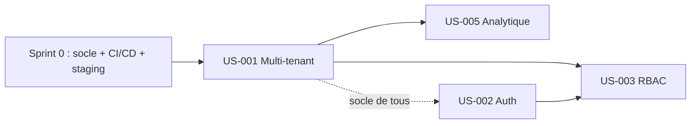

# Sprint Backlog — Sprint 1 (Walking Skeleton)

> Board du sprint. Statuts : 🔵 To Do · 🟡 In Progress · 👀 Review · ✅ Done · 🚫 Bloqué

## Vue Kanban

| 🔵 To Do | 🟡 In Progress | 👀 Review | ✅ Done | 🚫 Bloqué |
|----------|----------------|-----------|---------|-----------|
| US-001 (8) | — | — | — | — |
| US-002 (5) | | | | |
| US-003 (8) | | | | |
| US-005 (8) | | | | |

## Détail des stories

| ID | Titre | Points | Persona | Critère bloquant associé | Statut |
|----|-------|--------|---------|--------------------------|--------|
| US-001 | Fondation multi-tenant et isolation | 8 | Admin/RSSI | `ENF-SEC-4` (test d'intrusion) | 🔵 To Do |
| US-002 | Authentification et cycle de vie utilisateurs | 5 | Admin | `ENF-SEC-1/3` | ✅ Done |
| US-003 | Rôles et habilitations (RBAC + périmètre) | 8 | Admin | `HAB-1..6`, `ARC-106` | 🔵 To Do |
| US-005 | Modèle analytique en étoile et non-divergence | 8 | Équipe technique | `ARC-113` | 🔵 To Do |

**Total engagé : 29 points · Livrés : 0 · Vélocité : 0 %**
_(US-004 déplacée au Sprint 0.)_

## Ordonnancement suggéré



_Prérequis : Sprint 0 terminé (US-006, US-007, US-004, US-008, US-009)._
1. **US-001** (multi-tenant) dès J1 — socle applicatif dont tout dépend.
2. **US-002** (auth) en parallèle/juste après.
3. **US-003** (RBAC) après US-001 + US-002.
4. **US-005** (modèle analytique) après US-001 ; décalable au Sprint 2 si la capacité se tend.

## Décomposition en tâches

> À produire via `/project:decompose-tasks 001` (types [DB], [BE], [FE-WEB], [TEST], [OPS], [REV], [DOC], estimation en heures 0,5-8h).

## Burndown

```
Points |
  34   |●
  27   |
  20   |
  14   |
   7   |
   0   |________________________________
       J1  J2  J3  J4  J5  J6  J7  J8  J9  J10
```
_(à mettre à jour quotidiennement)_
