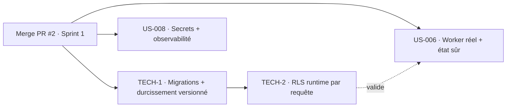

# Sprint Backlog — Sprint 2 (Consolidation technique)

## Vue Kanban (état initial)

| 🔵 To Do | 🔄 En cours | 👀 Review | ✅ Done | 🚫 Bloqué |
|----------|-------------|-----------|---------|-----------|
| TECH-1 (5) | | | | |
| TECH-2 (5) | | | | |
| US-006 (5) | | | | |
| US-008 (5) | | | | |

## Éléments engagés

| ID | Titre | Points | Acteur | Traçabilité | Statut |
|----|-------|--------|--------|-------------|--------|
| TECH-1 | Migrations Doctrine + durcissement analytique versionné | 5 | Équipe technique | `ARC-34`, Rétro S1 A1 | 🔵 To Do |
| TECH-2 | RLS active au runtime par requête (rôle applicatif dédié) | 5 | Équipe technique | `ARC-33/34`, `INV-1`, Rétro S1 A2 | 🔵 To Do |
| US-006 | Exécution FrankenPHP worker réelle + état inter-requêtes sûr | 5 | Équipe technique | `ARC-47..50`, `RSQ-15` | 🔵 To Do |
| US-008 | Secrets hors dépôt/rotatifs + observabilité de base | 5 | Équipe technique | `ENF-SEC-*`, observabilité | 🔵 To Do |

## Graphe de dépendances

## Ordre d'exécution recommandé

1. **TECH-1** (migrations Doctrine) — prérequis : crée la chaîne de migration et y porte le durcissement RLS/trigger. Débloque tout le reste.
2. **TECH-2** (RLS runtime) — rôle applicatif non-superutilisateur + `SET app.current_tenant` par requête ; tests d'intrusion « RLS seule ».
3. **US-006** (worker réel) — en parallèle possible : exécution worker + test anti-fuite d'état inter-requêtes.
4. **US-008** (secrets + observabilité) — en parallèle : gestion des secrets rotatifs + métriques P95 / suivi d'erreurs sur la staging.

## Definition of Ready (vérifiée)

- [x] TECH-1/TECH-2 : périmètre clair (issu de la rétro S1), pas de maquette requise
- [x] US-006/US-008 : critères d'acceptation existants dans le backlog, socle Sprint 0 disponible
- [x] Estimations posées
- [x] Dépendances identifiées (merge PR #2 en tête)
- [ ] **Bloqueur amont** : PR #2 à merger avant démarrage du développement

## Métriques du sprint

- Éléments engagés : 4 · Points : 20
- Objectif : solder la dette Walking Skeleton et durcir le socle avant la valeur métier (Sprint 3).
