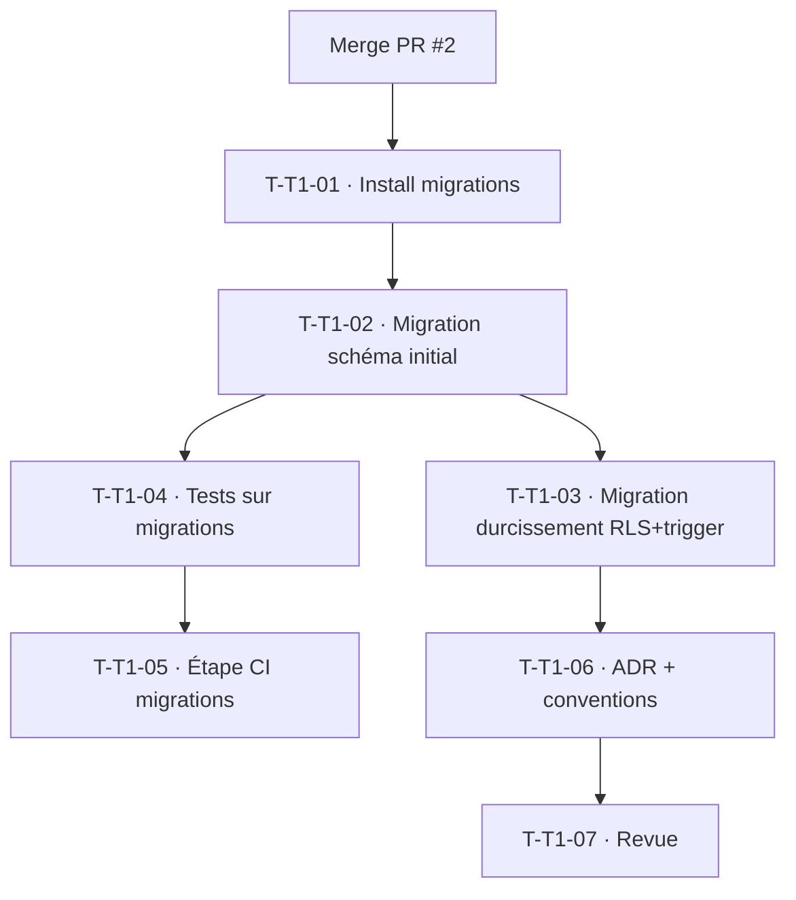

# Tâches — TECH-1 : Migrations Doctrine + durcissement analytique versionné

## Informations
- **Origine** : Rétrospective Sprint 1 · Action 1
- **Story Points** : 5
- **Sprint** : sprint-002-consolidation_technique
- **Traçabilité** : `ARC-34`, ADR-8 (reproductibilité de l'infra de données)

## Objectif
Rendre le schéma reproductible et versionné : introduire `doctrine/migrations`, générer la migration du schéma existant, et porter le durcissement analytique (RLS + trigger, aujourd'hui appliqué par commande/tests) dans une migration idempotente. Supprimer la dépendance à SchemaTool en prod.

## Vue d'ensemble des tâches

| ID | Type | Tâche | Estimation | Dépend de | Statut |
|----|------|-------|------------|-----------|--------|
| T-T1-01 | [OPS] | Installer et configurer `doctrine/migrations` (bundle, `migrations/`, config) | 2h | Merge PR #2 | 🔲 |
| T-T1-02 | [DB] | Migration initiale du schéma existant (diff : tenant, app_user, auth_role, protected_record, event_stream, dim_period, fact_project_revenue) | 3h | T-T1-01 | 🔲 |
| T-T1-03 | [DB] | Migration idempotente du durcissement analytique (RLS ENABLE+FORCE+policy, trigger anti-écriture) — reprise de `AnalyticsSchemaHardener` | 4h | T-T1-02 | 🔲 |
| T-T1-04 | [TEST] | Basculer la préparation de schéma des tests d'intégration sur migrations (ou `migrate` en bootstrap) ; `doctrine:schema:validate` vert | 3h | T-T1-02 | 🔲 |
| T-T1-05 | [OPS] | Étape CI « migrations » : `doctrine:migrations:migrate` sur la base de test + détection de drift (build rouge) | 2h | T-T1-04 | 🔲 |
| T-T1-06 | [DOC] | ADR « Migrations = source du schéma ; durcissement versionné » + MAJ `docs/conventions-developpement.md` | 1h | T-T1-03 | 🔲 |
| T-T1-07 | [REV] | Revue croisée (symfony-reviewer) | 1h | T-T1-06 | 🔲 |

**Total estimé : 16h**

## Détail des tâches clés

### T-T1-01 · Installer doctrine/migrations
- `composer require doctrine/doctrine-migrations-bundle` (version pinée) ; config `config/packages/doctrine_migrations.yaml` ; dossier `migrations/`.
- **Validation** : `php bin/console doctrine:migrations:status` répond ; bundle enregistré.

### T-T1-03 · Durcissement analytique versionné
- Porter le DDL de `AnalyticsSchemaHardener` (RLS `FORCE` + policy `tenant_isolation`, trigger `guard_direct_write`) dans une migration idempotente (`IF EXISTS`/`CREATE OR REPLACE`).
- **Validation** : migration `up` rejouable ; les tests `AnalyticsHardeningTest` (CA-4/CA-6) restent verts après application par migration ; `down` documenté.
- **Note** : conserver `AnalyticsSchemaHardener` pour les tests unitaires du DDL, ou le faire appeler par la migration (source unique).

### T-T1-04 · Tests sur migrations
- Bootstrap PHPUnit : appliquer les migrations sur la base de test au lieu de `SchemaTool::createSchema` (ou garder SchemaTool en test unitaire rapide + un test dédié « migrations = schéma » via `schema:validate`).
- **Validation** : `doctrine:schema:validate` (mapping ↔ base) vert ; suite verte.

## Graphe de dépendances

