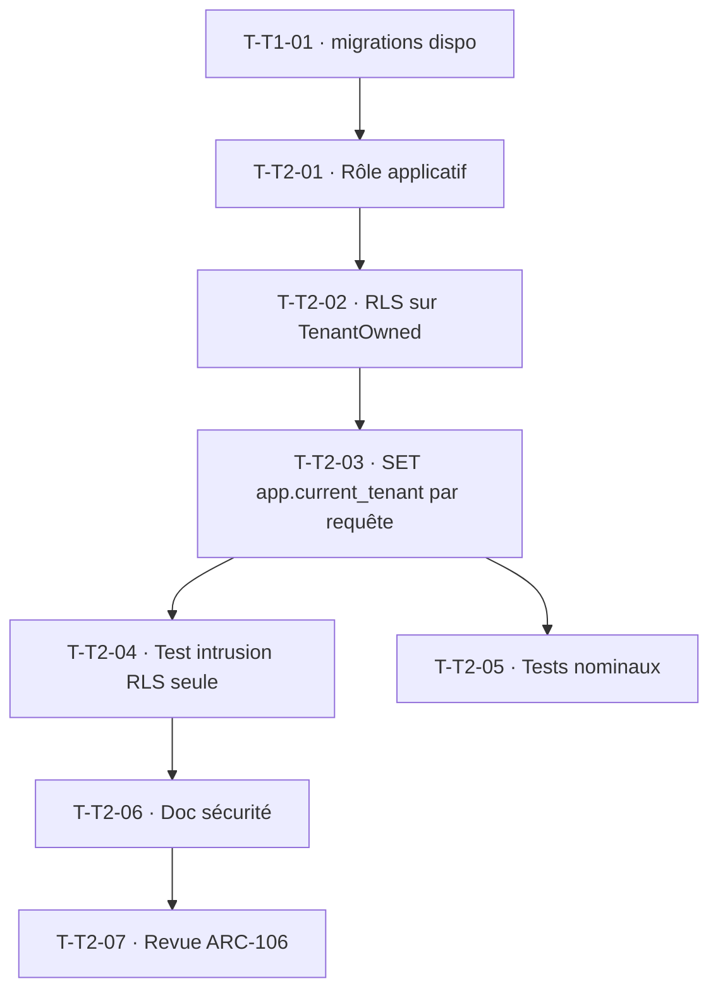

# Tâches — TECH-2 : RLS active au runtime par requête (finition US-001)

## Informations
- **Origine** : Rétrospective Sprint 1 · Action 2 (finition US-001)
- **Story Points** : 5
- **Sprint** : sprint-002-consolidation_technique
- **Traçabilité** : `ARC-33`, `ARC-34`, `INV-1`, `RSQ-2`, `ENF-SEC-4`

## Objectif
Faire passer la RLS du statut « prouvée sous rôle de test » (US-005) à « active en production » : l'application se connecte via un rôle **non-superutilisateur**, positionne `app.current_tenant` à chaque requête (worker-safe), et la RLS couvre toutes les entités `TenantOwned`. Double barrière (filtre ORM + RLS) réellement opérante.

## Vue d'ensemble des tâches

| ID | Type | Tâche | Estimation | Dépend de | Statut |
|----|------|-------|------------|-----------|--------|
| T-T2-01 | [DB] | Migration : rôle applicatif PostgreSQL non-superutilisateur à privilèges minimaux ; `DATABASE_URL` applicatif l'utilise (superuser réservé aux migrations) | 3h | T-T1-01 | 🔲 |
| T-T2-02 | [DB] | Migration : RLS `ENABLE`+`FORCE`+policy `tenant_isolation` sur toutes les tables `TenantOwned` (tenant, app_user, auth_role, protected_record) | 3h | T-T2-01 | 🔲 |
| T-T2-03 | [BE] | Listener requête : `SET app.current_tenant` après résolution du tenant ; **reset en fin de requête** (worker-safe, `ARC-47`) ; cohérent avec `AuthenticatedTenantResolver` | 4h | T-T2-02 | 🔲 |
| T-T2-04 | [TEST] | Test d'intrusion « RLS seule » (filtre ORM désactivé) en contexte requête réel : cross-tenant → 0 ligne sur `ProtectedRecord` et les faits | 3h | T-T2-03 | 🔲 |
| T-T2-05 | [TEST] | Tests nominaux sous rôle applicatif : requêtes légitimes OK (pas de régression d'accès, INSERT/SELECT/UPDATE) | 2h | T-T2-03 | 🔲 |
| T-T2-06 | [DOC] | MAJ `.claude/rules/11-security` / doc socle : double barrière active, rôle applicatif, `app.current_tenant` | 1h | T-T2-04 | 🔲 |
| T-T2-07 | [REV] | Revue croisée (security-auditor) — relecture ligne à ligne (ARC-106) | 2h | T-T2-06 | 🔲 |

**Total estimé : 18h**

## Détail des tâches clés

### T-T2-01 · Rôle applicatif dédié
- Migration créant un rôle `NOSUPERUSER NOBYPASSRLS` avec `GRANT` minimaux (SELECT/INSERT/UPDATE/DELETE sur les tables applicatives, USAGE schéma). L'app se connecte via ce rôle ; les migrations continuent via un rôle privilégié.
- **Validation** : l'app démarre et sert les requêtes sous le rôle ; `SELECT current_user` = rôle applicatif.

### T-T2-03 · Positionnement runtime, worker-safe
- Listener (priorité après `AuthenticatedTenantResolver`) exécutant `SET app.current_tenant = :tenant` sur la connexion pour la requête ; **`RESET` / re-set** garanti entre requêtes du même worker (pas de fuite d'état — `RSQ-15`).
- **Validation** : deux requêtes successives (tenant A puis B) sur le même worker voient chacune leur périmètre ; couvre le cas non authentifié (pas de tenant → aucune ligne TenantOwned visible).

### T-T2-04 · Test d'intrusion « RLS seule »
- Désactiver explicitement le filtre ORM, positionner `app.current_tenant` sur A, requêter → seules les données de A ; sans contexte → 0 ligne. Sous le rôle applicatif réel (pas superuser).
- **Validation** : critère de sortie `ENF-SEC-4` étendu au runtime.

## Graphe de dépendances

