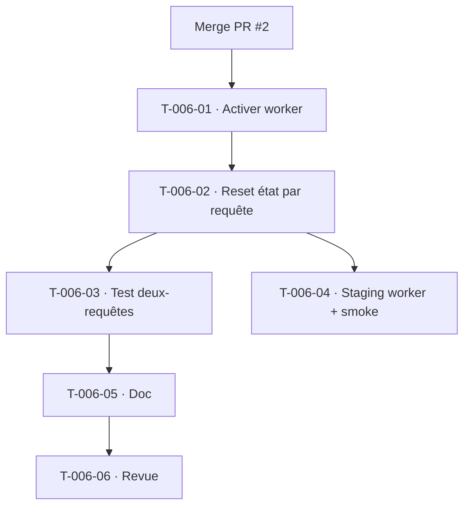

# Tâches — US-006 : Exécution FrankenPHP worker réelle + état inter-requêtes sûr

## Informations US
- **Epic** : EPIC-000
- **Persona** : Équipe technique
- **Story Points** : 5 (résiduel — squelette, Deptrac, CLI, DTO API livrés au Sprint 0)
- **Sprint** : sprint-002-consolidation_technique
- **Traçabilité** : `ARC-47..50`, `RSQ-15` (fuite d'état worker), CA-1 d'US-006

## Résumé
Passer d'un runtime FrankenPHP standard à un **mode worker réel** en garantissant l'absence de fuite d'état entre deux requêtes servies par le même worker (contexte tenant, sécurité, filtre Doctrine).

## Vue d'ensemble des tâches

| ID | Type | Tâche | Estimation | Dépend de | Statut |
|----|------|-------|------------|-----------|--------|
| T-006-01 | [OPS] | Activer FrankenPHP worker (Caddyfile `worker`, script worker, `APP_RUNTIME`), nombre de workers configurable | 3h | Merge PR #2 | 🔲 |
| T-006-02 | [BE] | Audit + reset des services à état par requête (`RequestTenantContext`, filtre `tenant`, contexte sécurité) — kernel reset entre requêtes (`ARC-47`) | 4h | T-006-01 | 🔲 |
| T-006-03 | [TEST] | Test « deux requêtes, même worker » : tenant A puis tenant B → aucune fuite d'état (`RSQ-15`) | 3h | T-006-02 | 🔲 |
| T-006-04 | [OPS] | Déploiement staging en mode worker + smoke test (`/health`, `/api/status`, login) 200 | 2h | T-006-02 | 🔲 |
| T-006-05 | [DOC] | Doc runtime worker + pièges d'état (services stateful interdits sans reset) | 1h | T-006-03 | 🔲 |
| T-006-06 | [REV] | Revue croisée | 1h | T-006-05 | 🔲 |

**Total estimé : 14h**

## Détail des tâches clés

### T-006-02 · État inter-requêtes sûr
- Vérifier que `RequestTenantContext` (et tout service `@RequestScope`/mutable) est réinitialisé entre requêtes ; s'appuyer sur le reset du kernel Symfony Runtime en mode worker ; désactiver le filtre `tenant` en fin de requête si nécessaire.
- **Validation** : aucun service ne conserve le tenant/token de la requête précédente.

### T-006-03 · Test anti-fuite
- Scénario worker : requête authentifiée tenant A → réponse ne fuit rien ; requête suivante tenant B (ou anonyme) → ne voit jamais l'état de A. Idéalement via un test qui simule deux requêtes sur le même kernel booté.
- **Validation** : `RSQ-15` couvert ; critère de sortie du Sprint Goal (« worker éprouvé »).

## Graphe de dépendances

