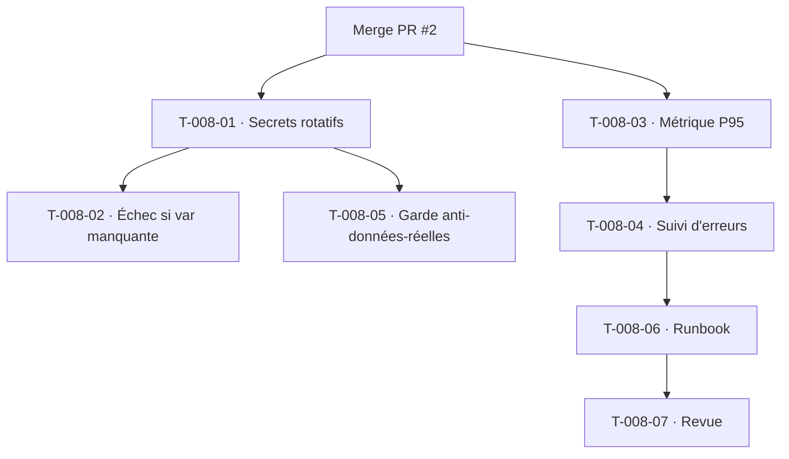

# Tâches — US-008 : Secrets hors dépôt/rotatifs + observabilité de base

## Informations US
- **Epic** : EPIC-000
- **Persona** : Équipe technique
- **Story Points** : 5 (résiduel — staging Railway déjà en ligne au Sprint 0)
- **Sprint** : sprint-002-consolidation_technique
- **Traçabilité** : `ENF-SEC-10` (rotation sans redéploiement), `ADR-13` (pas de données réelles en staging), CA-2..CA-5 d'US-008

## Résumé
Compléter le socle staging : secrets gérés hors dépôt et rotatifs, échec explicite si variable obligatoire manquante, observabilité minimale (P95 + suivi d'erreurs), garde anti-données-réelles.

## Vue d'ensemble des tâches

| ID | Type | Tâche | Estimation | Dépend de | Statut |
|----|------|-------|------------|-----------|--------|
| T-008-01 | [OPS] | Secrets hors dépôt & rotatifs (Symfony Secrets vault ou variables Railway) ; rotation sans redéploiement du code (`ENF-SEC-10`) | 3h | Merge PR #2 | 🔲 |
| T-008-02 | [OPS] | Validation au boot : variable obligatoire manquante → échec explicite du déploiement (CA-4) | 2h | T-008-01 | 🔲 |
| T-008-03 | [OPS] | Observabilité : métrique P95 de temps de réponse exposée (endpoint `/metrics` Prometheus ou équivalent) + dashboard (CA-2) | 4h | Merge PR #2 | 🔲 |
| T-008-04 | [OPS] | Suivi d'erreurs (Sentry ou logs structurés + alerte) branché sur la staging | 3h | T-008-03 | 🔲 |
| T-008-05 | [TEST] | Garde « pas de données réelles en staging » (`ADR-13`) : contrôle au déploiement / fixtures anonymisées | 2h | T-008-01 | 🔲 |
| T-008-06 | [DOC] | Runbook staging (secrets, rotation, métriques, alertes) | 1h | T-008-04 | 🔲 |
| T-008-07 | [REV] | Revue croisée (devops-engineer) | 1h | T-008-06 | 🔲 |

**Total estimé : 16h**

## Détail des tâches clés

### T-008-01 · Secrets rotatifs
- Secrets applicatifs hors dépôt (Symfony Secrets chiffrés + clé hors git, ou variables Railway) ; démontrer la rotation d'un secret **sans redéployer le code** (`ENF-SEC-10`).
- **Validation** : rotation d'une clé effective sans nouveau build.

### T-008-03 · P95
- Instrumenter le temps de réponse et exposer P95 (endpoint métriques ou intégration Grafana/Prometheus). Compatible avec le plan Railway (endpoint applicatif si pas de sidecar).
- **Validation** : P95 visible sur un dashboard.

### T-008-05 · Anti-données-réelles
- Vérifier au déploiement/staging qu'aucune donnée réelle n'est chargée (fixtures synthétiques uniquement — cf. `app:fixtures:load`, `ADR-13`).
- **Validation** : tentative de charger un dump réel refusée / bloquée.

## Graphe de dépendances

