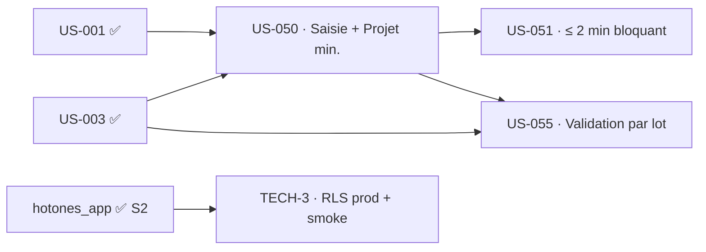

# Sprint Backlog — Sprint 3 (Première saisie de temps)

## Vue Kanban (état initial)

| 🔵 To Do | 🔄 En cours | 👀 Review | ✅ Done | 🚫 Bloqué |
|----------|-------------|-----------|---------|-----------|
| US-050 (5) | | | | |
| US-051 (8) | | | | |
| US-055 (5) | | | | |
| TECH-3 (5) | | | | |

## Éléments engagés

| ID | Titre | Points | Persona | Traçabilité | Statut |
|----|-------|--------|---------|-------------|--------|
| US-050 | Saisie hebdo/quotidienne (+ Projet minimal) | 5 | P1 Camille | `EF-TMP-*`, `INV-2` | 🔵 To Do |
| US-051 | Semaine ≤ 2 min (bloquant) | 8 | P1 Camille | `RSQ-1`, `ENF-PERF-2` | 🔵 To Do |
| US-055 | Validation par lot | 5 | P2 Marc | `HAB-*`, `ARC-19` | 🔵 To Do |
| TECH-3 | RLS prod + smoke déploiement | 5 | Équipe technique | `DBT-RUN-2`, Rétro S2 A1/A3 | 🔵 To Do |

## Graphe de dépendances

## Ordre d'exécution recommandé

1. **US-050** — pose l'entité `Project` minimale + `TimeEntry` + la saisie (débloque US-051 et US-055).
2. **US-051** — optimise la saisie pour le critère ≤ 2 min (bloquant `RSQ-1`).
3. **US-055** — validation par lot par le chef de projet (habilitation « ses projets »).
4. **TECH-3** — activation RLS prod + smoke, parallélisable (indépendant du métier).

## Definition of Ready (vérifiée)

- [x] US-050/051/055 : critères d'acceptation Gherkin présents dans le backlog
- [x] Dépendances métier satisfaites (US-001, US-003 livrés)
- [x] Estimations posées
- [x] Périmètre cadré (Projet minimal, valorisation reportée S4) — voir sprint-goal
- [ ] UX de saisie ≤ 2 min : maquette/parcours à préciser en Planning P2 (risque `RSQ-1`)

## Métriques du sprint

- Éléments : 4 · Points : 23
- Critère de sortie phare : **saisie d'une semaine ≤ 2 min** mesurée (bloquant).
