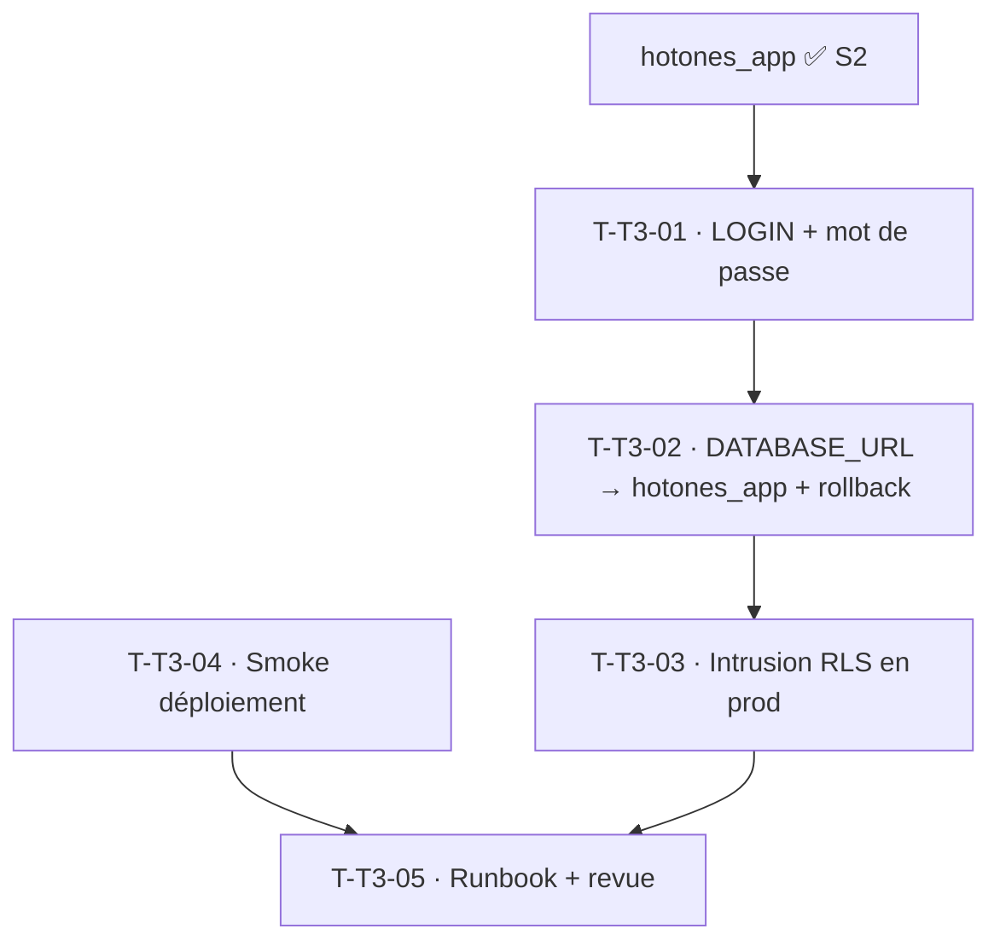

# Tâches — TECH-3 : Activer la RLS en production + smoke de déploiement

## Informations
- **Origine** : Rétrospective Sprint 2 (Actions A1 + A3), dette `DBT-RUN-2`
- **Story Points** : 5 · **Sprint** : sprint-003-saisie_temps
- **Traçabilité** : `ARC-34`, `ENF-SEC-4`, `RSQ-2`

## Résumé
Rendre la seconde barrière d'isolation (RLS) **réellement active en production** en connectant l'application via le rôle non-superutilisateur `hotones_app` (créé au Sprint 2), et sécuriser les déploiements par un smoke test automatisé.

## Vue d'ensemble des tâches

| ID | Type | Tâche | Estimation | Dépend de | Statut |
|----|------|-------|------------|-----------|--------|
| T-T3-01 | [DB] | Donner LOGIN + mot de passe à `hotones_app` (migration ou commande d'ops) ; secret généré, hors dépôt (ARC-88) | 2h | — | 🔲 |
| T-T3-02 | [OPS] | Basculer `DATABASE_URL` (prod) sur `hotones_app` (variable Railway) ; procédure de rollback préparée (retour à l'utilisateur privilégié) | 2h | T-T3-01 | 🔲 |
| T-T3-03 | [TEST] | Vérification d'intrusion **en production** : requête cross-tenant → 0 ligne (RLS active, filtre ORM non requis) ; test nominal (accès légitime OK) | 2h | T-T3-02 | 🔲 |
| T-T3-04 | [OPS] | Smoke de déploiement automatisé (`make smoke URL=…` ou étape CD) : `/health`, `/metrics`, `/api/status` → 200 ; `/api/login` (mauvais id) → 401 ; rouge si dérive | 3h | — | 🔲 |
| T-T3-05 | [DOC][REV] | MAJ runbook (bascule rôle, rollback, smoke) + revue (security-auditor) ; clôturer `DBT-RUN-2` | 1h | T-T3-03, T-T3-04 | 🔲 |

**Total estimé : 10h**

## Détails clés

### T-T3-01/02 · Bascule du rôle applicatif
- `hotones_app` créé au Sprint 2 en `NOLOGIN` : lui accorder `LOGIN` + mot de passe (migration idempotente ou commande d'ops), puis pointer `DATABASE_URL` prod dessus. Les **migrations** continuent via le rôle privilégié (superutilisateur), l'**application** via `hotones_app`.
- **Rollback** : documenté et testé (revenir à l'ancien `DATABASE_URL` si régression).

### T-T3-03 · Preuve d'isolation en prod
- Sous le rôle applicatif réel, une requête cross-tenant renvoie 0 ligne même filtre ORM désactivé — `ENF-SEC-4` étendu à la production (aujourd'hui seulement prouvé sous rôle de test).

## Graphe de dépendances

