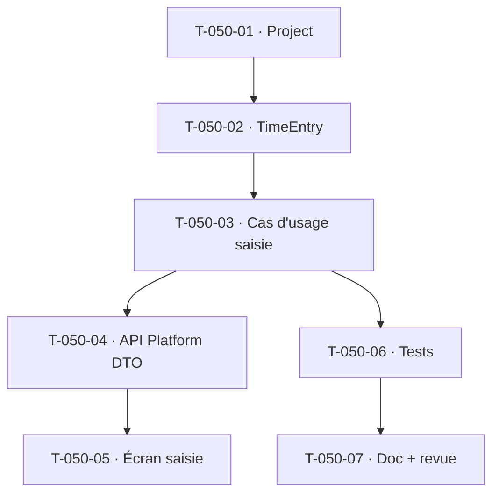

# Tâches — US-050 : Saisie d'imputation hebdomadaire et quotidienne

## Informations
- **Epic** : EPIC (Temps & activité) · **Persona** : P1 Camille (collaborateur)
- **Story Points** : 5 · **Sprint** : sprint-003-saisie_temps
- **Traçabilité** : `EF-TMP-*`, `INV-2`, `ARC-19`, `ARC-106`

## Résumé
Permettre à un collaborateur de saisir ses imputations de temps sur ses projets (hebdo/quotidien), avec duplication de semaine/jour et commentaire. Introduit un **référentiel Projet minimal** pour imputer.

## Vue d'ensemble des tâches

| ID | Type | Tâche | Estimation | Dépend de | Statut |
|----|------|-------|------------|-----------|--------|
| T-050-01 | [DB] | Entité `Project` minimale (tenant, code, nom, actif — TenantOwned) + migration | 2h | — | 🔲 |
| T-050-02 | [DB] | Entité `TimeEntry` (tenant, user, project, date, minutes:int, comment) + migration + unicité (user, project, date) | 3h | T-050-01 | 🔲 |
| T-050-03 | [BE] | Cas d'usage `RecordTimeEntry` (Application) : habilitation « ses données » (Authorizer), projet actif, durée > 0 et plafond journalier ; duplication semaine/jour | 4h | T-050-02 | 🔲 |
| T-050-04 | [BE] | Ressource API Platform (DTO strict) POST/GET imputations, sécurité par utilisateur (ARC-18/19) | 3h | T-050-03 | 🔲 |
| T-050-05 | [FE-WEB] | Écran de saisie (Twig + Turbo + Stimulus) hebdo/quotidien, duplication, commentaire | 4h | T-050-04 | 🔲 |
| T-050-06 | [TEST] | Unit (cas d'usage : plafond, duplication, habilitation) + intégration (isolation tenant) + fonctionnel (POST 201, 403 hors périmètre) | 3h | T-050-03 | 🔲 |
| T-050-07 | [DOC][REV] | Doc + revue croisée (symfony-reviewer) | 2h | T-050-06 | 🔲 |

**Total estimé : 21h**

## Détails clés

### T-050-02 · TimeEntry
- Durée en **minutes entières** (INV-2, jamais de flottant). Contrainte d'unicité `(tenant_id, user_id, project_id, work_date)` (une ligne par projet/jour, cumul via mise à jour).
- Migration Doctrine (le schéma prod passe par migrations — ADR-0017).

### T-050-03 · Habilitation à la source (ARC-19/ARC-106)
- Un collaborateur ne saisit que **pour lui-même** ; vérification côté cas d'usage via l'`Authorizer` (US-003), jamais déléguée à l'UI.
- Règles : projet **actif**, durée journalière ≤ plafond paramétré (valeur par défaut au sprint, paramétrage fin ultérieur).

## Graphe de dépendances

