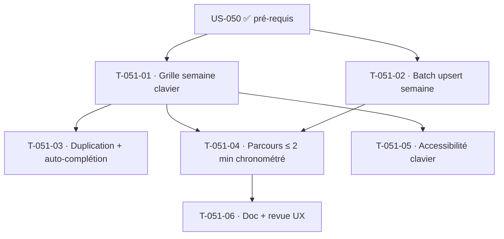

# Tâches — US-051 : Saisie d'une semaine nominale en ≤ 2 minutes (critère bloquant)

## Informations
- **Persona** : P1 Camille · **Story Points** : 8 · **Sprint** : sprint-003-saisie_temps
- **Traçabilité** : `RSQ-1` (adoption — critère de sortie **bloquant**), `ENF-PERF-2`
- **Dépend de** : US-050

## Résumé
Rendre la saisie d'une semaine complète (3–5 projets + absences) faisable en **moins de 2 minutes**, pour maximiser l'adoption. C'est le critère qui décide de la réussite du module.

## Vue d'ensemble des tâches

| ID | Type | Tâche | Estimation | Dépend de | Statut |
|----|------|-------|------------|-----------|--------|
| T-051-01 | [FE-WEB] | Grille de saisie **semaine** (lignes projets + absences, colonnes jours), navigation clavier (tab/entrée), pas de souris requise | 5h | US-050 | 🔲 |
| T-051-02 | [BE] | Enregistrement **en masse** d'une semaine en une requête (batch upsert), transactionnel | 3h | US-050 | 🔲 |
| T-051-03 | [FE-WEB] | Duplication « semaine précédente » + auto-complétion projet (projets récents de l'utilisateur) | 3h | T-051-01 | 🔲 |
| T-051-04 | [TEST] | Parcours chronométré (E2E Panther/script) : semaine 5 projets + absences saisie en **≤ 2 min** ; assertion sur la durée | 4h | T-051-01, T-051-02 | 🔲 |
| T-051-05 | [TEST] | Accessibilité clavier (WCAG) : saisie complète sans souris ; tests de tabulation/focus | 2h | T-051-01 | 🔲 |
| T-051-06 | [DOC][REV] | Doc UX + revue (ux-ergonome + accessibility-expert) | 2h | T-051-04 | 🔲 |

**Total estimé : 19h**

## Détails clés

### T-051-01 · Grille semaine, clavier d'abord
- Ergonomie « tableur » : saisie fluide au clavier, focus enchaîné, totaux journaliers/hebdo en direct (Stimulus + Turbo). Pas de rechargement de page.

### T-051-04 · Mesure du critère bloquant
- **Critère de sortie du sprint** : un parcours représentatif (5 projets + absences) mesuré ≤ 2 min. Si non tenu, le sprint n'est pas « done » sur US-051. Mesure automatisée (E2E chronométré) + validation sur parcours humain si possible.

## Graphe de dépendances

