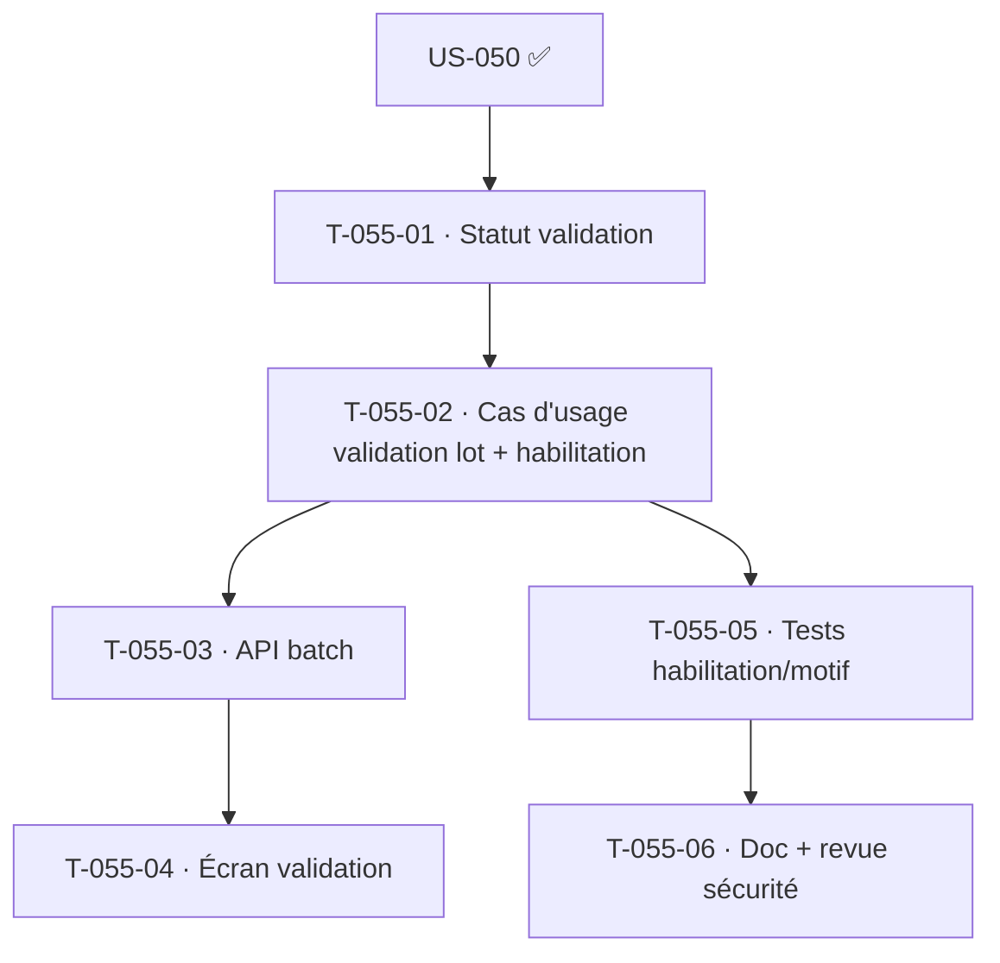

# Tâches — US-055 : Validation des temps par lot

## Informations
- **Persona** : P2 Marc (chef de projet) · **Story Points** : 5 · **Sprint** : sprint-003-saisie_temps
- **Traçabilité** : `HAB-*`, `ARC-19`, `ARC-106`
- **Dépend de** : US-050 (données à valider), US-003 (habilitation)

## Résumé
Permettre à un chef de projet de valider/refuser par lot les imputations de son équipe (sélection multiple, action en masse), motif obligatoire au refus, en < 5 minutes.

## Vue d'ensemble des tâches

| ID | Type | Tâche | Estimation | Dépend de | Statut |
|----|------|-------|------------|-----------|--------|
| T-055-01 | [DB] | Statut de validation sur `TimeEntry` (soumis / validé / refusé + motif + validateur + horodatage) + migration | 2h | US-050 | 🔲 |
| T-055-02 | [BE] | Cas d'usage `ValidateTimeEntries` (lot) : habilitation « chef de projet sur **ses** projets » (Authorizer + périmètre), motif obligatoire au refus, événement d'audit (HAB-6) | 4h | T-055-01 | 🔲 |
| T-055-03 | [BE] | API de validation par lot (DTO, sélection multiple), 403 hors périmètre | 3h | T-055-02 | 🔲 |
| T-055-04 | [FE-WEB] | Écran validation par lot (sélection multiple, action en masse, saisie du motif) — Twig + Turbo + Stimulus | 4h | T-055-03 | 🔲 |
| T-055-05 | [TEST] | Unit (habilitation périmètre, motif obligatoire) + fonctionnel (validation lot 200 ; refus sans motif 422 ; hors périmètre 403) | 3h | T-055-02 | 🔲 |
| T-055-06 | [DOC][REV] | Doc + revue (security-auditor sur l'habilitation) | 2h | T-055-05 | 🔲 |

**Total estimé : 18h**

## Détails clés

### T-055-02 · Habilitation « ses projets » (ARC-106)
- Un chef de projet ne valide que les imputations sur **les projets dont il est responsable** — périmètre de données (`DataScope`) vérifié côté serveur via l'`Authorizer` (US-003). Jamais délégué à l'UI.
- Refus → **motif obligatoire** ; toute validation/refus est **tracée** (audit sécurité, HAB-6).

## Graphe de dépendances

