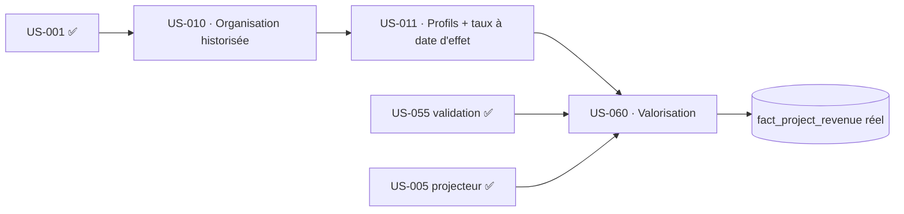

# Sprint Backlog — Sprint 4 (Valorisation)

## Vue Kanban (état initial)

| 🔵 To Do | 🔄 En cours | 👀 Review | ✅ Done | 🚫 Bloqué |
|----------|-------------|-----------|---------|-----------|
| US-010 (5) | | | | |
| US-011 (8) | | | | |
| US-060 (8) | | | | |

## Éléments engagés

| ID | Titre | Points | Persona | Traçabilité | Statut |
|----|-------|--------|---------|-------------|--------|
| US-010 | Structure organisationnelle + rattachements historisés | 5 | Admin | `EF-REF-*`, historisation à date d'effet | 🔵 To Do |
| US-011 | Profils : coûts & taux de vente historisés | 8 | Admin | `EF-REF-*`, `INV-2` | 🔵 To Do |
| US-060 | Valorisation auto après validation (≤ 15 min) | 8 | P2/P6 | `ARC-113`, `ADR-9`, `INV-2` | 🔵 To Do |

## Graphe de dépendances

## Ordre d'exécution recommandé

1. **US-010** — organisation + rattachements (VO période de validité, réutilisable par US-011).
2. **US-011** — profils + coûts/taux **historisés à date d'effet** (résolution du tarif à une date, TDD).
3. **US-060** — valorisation : à la validation, snapshot coût/vente au tarif en vigueur → événement → projecteur → faits ; non-divergence.

## Definition of Ready (vérifiée)

- [x] US-010/011/060 : critères Gherkin présents dans le backlog
- [x] Dépendances métier satisfaites (US-001, US-005, US-055 livrés)
- [x] Estimations posées ; périmètre cadré (voir sprint-goal)
- [ ] Modélisation « période de validité » (à date d'effet) à préciser en Planning P2 (risque principal)

## Métriques du sprint

- Éléments : 3 · Points : 21
- Critère de sortie phare : **temps validé → marge projet** avec tarif temporel figé, non-divergence verte.
