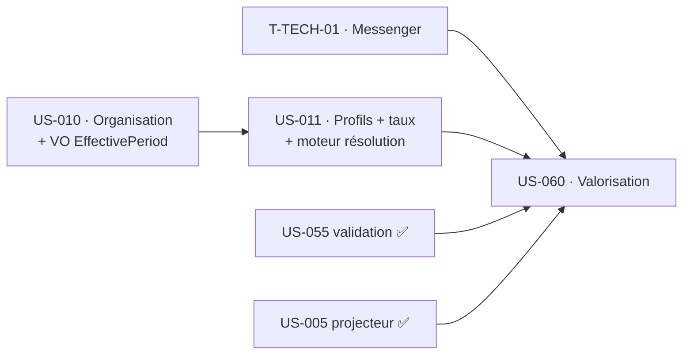

# Tâches — Sprint 4 (Valorisation automatique du temps validé)

## Vue d'ensemble

| Élément | Titre | Points | Tâches | Heures | Statut |
|---------|-------|--------|--------|--------|--------|
| US-010 | Structure organisationnelle + rattachements historisés | 5 | 8 | 23h | 🔵 |
| US-011 | Profils : coûts & taux de vente historisés à date d'effet | 8 | 8 | 27h | 🔵 |
| US-060 | Valorisation auto après validation (≤ 15 min) | 8 | 8 | 28h | 🔵 |
| TECH-4 | Prérequis techniques (Messenger, RLS métier) | — | 2 | 6h | 🔵 |
| **Total engagé** | | **21** | **26** | **84h** | |

> **Réserve (actions rétro S3, hors engagement)** : E2E chronométré ≤ 2 min (`RSQ-1`), fixtures de démo — traitées **si capacité** (voir `technical-tasks.md`). Le sprint-goal donne priorité au métier.

## Répartition par type (engagé)

| Type | Heures (~) | % |
|------|-----------|---|
| [DB] | 17h | 20 % |
| [BE] | 30h | 36 % |
| [FE-WEB] | 12h | 14 % |
| [TEST] | 12h | 14 % |
| [OPS] | 6h | 7 % |
| [DOC]/[REV] | 7h | 9 % |

> Sprint **greenfield** : 2 nouveaux sous-domaines (`Organization`, `Pricing`) + 1 (`Valuation`), le maillon `validation → événement` et l'async Messenger. Dominante [DB]/[BE] logique.

## Fichiers
- [US-010 — Organisation historisée](./US-010-tasks.md)
- [US-011 — Profils + taux à date d'effet](./US-011-tasks.md)
- [US-060 — Valorisation automatique](./US-060-tasks.md)
- [Tâches techniques transverses](./technical-tasks.md)

## Ordre d'exécution (séquentiel — dépendances fortes)

1. **T-TECH-01** (installer Messenger, transport Doctrine — `ADR-0007`) — prérequis à US-060, parallélisable dès J1.
2. **US-010** — organisation + rattachements. Livre le **VO `EffectivePeriod`** (date d'effet), réutilisé par US-011. Étend la RLS aux tables métier (amorce `DBT-SEC-1`).
3. **US-011** — profils + coûts/taux **historisés**. Livre le **moteur de résolution tarifaire à une date** (`ARC-6`), pivot de la valorisation.
4. **US-060** — valorisation : à la validation → événement → handler async → snapshot figé (`INV-2/INV-3`) → `RevenueRecognized` réel → projecteur → `fact_project_revenue` ; non-divergence (`ARC-113`).

## Conventions (rappel projet)
- **ID** : `T-<élément>-<NN>`. **Taille** : 0,5–8 h. **Statuts** : 🔲 🔄 👀 ✅ 🚫.
- **Archi** : couches strictes `Domain ← Application ← UI`, `Infrastructure → Domain/Application` (Deptrac `ARC-63`). Cas d'usage = service `final readonly` invoqué directement (pas de bus CQRS ; **Messenger** uniquement pour l'**async** US-060).
- **Persistance** : entités Doctrine = agrégats du Domain (mapping par attributs). Repository = port Domain + adapter `Doctrine*` en Infrastructure.
- **INV-2 / INV-3** : montants en **centimes entiers**, durées en **minutes entières** — jamais de flottant. Valorisation **figée** (snapshot), jamais recalculée rétroactivement.
- **Historisation à date d'effet** : VO `EffectivePeriod` testé (bornes, non-chevauchement, pas de trou).
- **Sécurité NON déléguée (`ARC-106`)** : isolation multi-tenant (filtre ORM + RLS) et habilitation (`Authorizer`, en Application `ARC-19`) écrites/relues/testées à la main. Revue `security-auditor` obligatoire.
- **DoD par tâche** : `make ci` vert (PHPStan max, Deptrac 0, cs-fixer, Rector, gitleaks), TDD (test nommé d'après chaque `RG-*`, `ARC-103`), couverture ≥ 80 % sur le code touché, tests worker (`ARC-50`).
