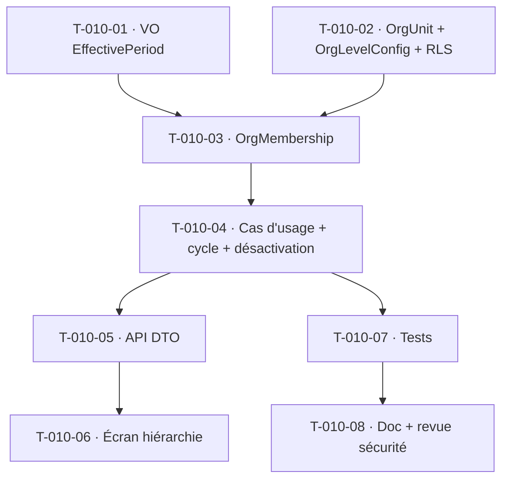

# Tâches — US-010 : Structure organisationnelle et rattachements historisés

## Informations
- **Epic** : EPIC-001 · **Persona** : ADMIN (admin tenant)
- **Story Points** : 5 · **Sprint** : sprint-004-valorisation
- **Traçabilité** : `EF-REF-1/2/3`, `RG-REF-1`, historisation à date d'effet
- **Dépend de** : US-001 (multi-tenant ✅)

## Résumé
**En tant qu'** admin tenant, **je veux** paramétrer une hiérarchie organisationnelle (1..N niveaux, sans dev) et historiser à date d'effet les rattachements des collaborateurs, **afin de** refléter l'organisation réelle à tout instant et consolider par entité juridique.

## Vue d'ensemble des tâches

| ID | Type | Tâche | Estimation | Dépend de | Statut |
|----|------|-------|------------|-----------|--------|
| T-010-01 | [DB] | VO `EffectivePeriod` (`src/Domain/Shared`) : date d'effet (from + to nullable), `contains(date)`, `overlaps()`, non-chevauchement — **réutilisé par US-011** | 2h | — | 🔲 |
| T-010-02 | [DB] | Entités `OrgUnit` (tenant, parent nullable, nom, actif) + `OrgLevelConfig` (niveaux nommés paramétrables) + migration + policy RLS | 3h | — | 🔲 |
| T-010-03 | [DB] | Entité `OrgMembership` (tenant, userId, orgUnitId, `EffectivePeriod`) + migration + `OrgMembershipRepository` (port Domain + adapter Doctrine) | 2h | T-010-01, T-010-02 | 🔲 |
| T-010-04 | [BE] | Cas d'usage `ConfigureOrgHierarchy` / `AttachCollaborator` : habilitation ADMIN (`Authorizer`), **détection de cycle serveur** (CA-6), refus suppression d'unité référencée → désactivation (CA-5 / RG-REF-1), non-chevauchement des rattachements | 4h | T-010-03 | 🔲 |
| T-010-05 | [BE] | API Platform (DTO strict, `ARC-18`) : unités + rattachements + timeline collaborateur ; 403 hors ADMIN | 3h | T-010-04 | 🔲 |
| T-010-06 | [FE-WEB] | Écran paramétrage hiérarchie (arbre N niveaux) + rattachements + désactivation (Twig/Turbo/Stimulus, WCAG) | 4h | T-010-05 | 🔲 |
| T-010-07 | [TEST] | Unit (`EffectivePeriod` bornes/chevauchement ; cycle ; désactivation — nommés `RgRef1*`) + intégration (isolation tenant + RLS) + fonctionnel (403 / consolidation multi-entités CA-4) | 3h | T-010-04 | 🔲 |
| T-010-08 | [DOC][REV] | Doc + revue `symfony-reviewer` + `security-auditor` (habilitation ADMIN, RLS métier) | 2h | T-010-07 | 🔲 |

**Total estimé : 23h**

## Détails clés

### T-010-01 · VO `EffectivePeriod` (risque n°1 du sprint)
- **Aucun VO de plage temporelle n'existe** aujourd'hui (les intervalles sont des `from/to` à nu). Ce VO `final readonly` (constructeur privé + factory, validation dans le constructeur, `equals()`) est le socle de l'historisation à date d'effet, **partagé** avec US-011 (`ProfileRate`). Placé en `src/Domain/Shared/` (même couche Domain, conforme Deptrac).
- Invariants testés : `from <= to` (ou `to` = NULL « en cours »), `contains(DateTimeImmutable)`, `overlaps(self)`, pas de trou/chevauchement sur une série.

### T-010-02 / T-010-03 · Modèle org paramétrable + historisé
- Nombre de niveaux **piloté par `OrgLevelConfig`** (tenant-scoped), zéro code spécifique pour passer de 1 à N (CA-1/CA-2).
- Rattachement historisé via `OrgMembership` + `EffectivePeriod` : les données passées restent liées à l'ancienne unité (CA-3). Filtre temporel appliqué dans les lectures de reporting.
- Nouvelles tables `TenantOwned` → **policy RLS déclarée dès la migration** (amorce l'action rétro `DBT-SEC-1`, relue à la main `ARC-106`).

### T-010-04 · Règles serveur (jamais déléguées à l'UI)
- **Anti-boucle** : détection de cycle **avant toute écriture** (CA-6).
- **RG-REF-1** : aucune suppression d'un référentiel utilisé → **désactivation** à date d'effet (CA-5). L'unité reste visible dans l'historique.
- Habilitation ADMIN vérifiée en couche Application (`Authorizer`, `ARC-19`).

## Graphe de dépendances

