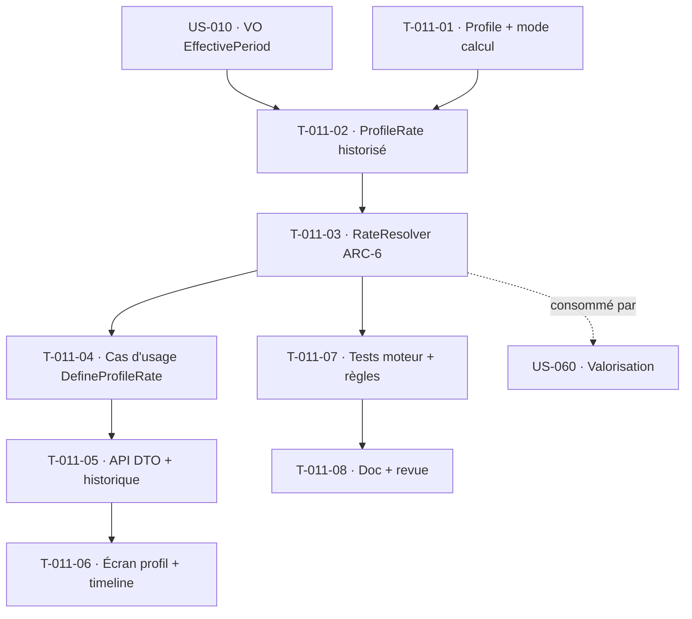

# Tâches — US-011 : Référentiel de profils, coûts & taux de vente historisés à date d'effet

## Informations
- **Epic** : EPIC-001 · **Persona** : ADMIN (admin tenant)
- **Story Points** : 8 · **Sprint** : sprint-004-valorisation
- **Traçabilité** : `EF-REF-4/5/20`, `INV-2`, `RG-REF-2/4`
- **Dépend de** : US-001 (multi-tenant ✅), US-010 (VO `EffectivePeriod`)

## Résumé
**En tant qu'** admin tenant, **je veux** un référentiel de profils portant un **coût de revient** (mode direct / chargé / complet) et un **taux de vente**, historisés à date d'effet, **afin de** valoriser les temps au tarif en vigueur à la période, sans jamais modifier les valeurs passées lors d'une révision.

## Vue d'ensemble des tâches

| ID | Type | Tâche | Estimation | Dépend de | Statut |
|----|------|-------|------------|-----------|--------|
| T-011-01 | [DB] | Entité `Profile` (tenant, nom, `CalculationMode` enum direct/chargé/complet, actif) + migration + RLS | 2h | — | 🔲 |
| T-011-02 | [DB] | Entité `ProfileRate` (tenant, profileId, `EffectivePeriod`, `costPriceCents:int`, `sellingPriceCents:int`, mode) + migration + `ProfileRateRepository` | 3h | US-010 (VO), T-011-01 | 🔲 |
| T-011-03 | [BE] | **Moteur de résolution tarifaire** `RateResolver` (Domain, service unique `ARC-6`) : tarif en vigueur à une date (`from <= date < to`) — TDD lourd (bornes, trou, chevauchement) | 4h | T-011-02 | 🔲 |
| T-011-04 | [BE] | Cas d'usage `DefineProfileRate` : habilitation ADMIN, refus chevauchement (CA-5), refus valeur ≤ 0 (CA-6), **calcul coût chargé** (CA-2), modif rétroactive → confirmation + audit `INV-2` (CA-3) | 5h | T-011-03 | 🔲 |
| T-011-05 | [BE] | API Platform (DTO) : profils + entrées tarifaires + **vue historique tarifaire** | 3h | T-011-04 | 🔲 |
| T-011-06 | [FE-WEB] | Écran profil : édition entrées tarifaires, **timeline historique** (ligne active en évidence, CA-4), avertissements (chevauchement / rétroactif / négatif) | 4h | T-011-05 | 🔲 |
| T-011-07 | [TEST] | Unit `RateResolver` (`RgRef2*`, `RgRef4*`, `INV-2`) + chevauchement + coût chargé + intégration tenant + fonctionnel (422 négatif, confirmation rétroactive) | 4h | T-011-03 | 🔲 |
| T-011-08 | [DOC][REV] | Doc + revue `security-auditor` (lecture coût journalisée `HAB-6`) + `symfony-reviewer` (moteur `ARC-6`) | 2h | T-011-07 | 🔲 |

**Total estimé : 27h**

## Détails clés

### T-011-02 · Historisation (le pivot de la valorisation)
- Table `profile_rate` : `(profile_id, tenant_id, effective_from, effective_to, cost_price_cents, selling_price_cents, calculation_mode)`. **Montants en centimes entiers** (`INV-2`, jamais de flottant), aligné sur `RevenueRecognized`/`FactProjectRevenue` existants.
- Réutilise le VO `EffectivePeriod` (US-010) — pas de duplication de la logique de non-chevauchement (DRY).

### T-011-03 · `RateResolver` — moteur unique (`ARC-6`)
- Résout **le tarif en vigueur à une date** : `effective_from <= date < effective_to` (ou `to IS NULL` = en cours). C'est **la brique consommée par la valorisation US-060** — d'où le service unique testé, jamais dupliqué backend/frontend.
- TDD exhaustif : borne inférieure incluse, borne supérieure exclue, absence de tarif à la date (→ exception métier consommée par CA-4 de US-060), série sans trou.

### T-011-04 · Règles serveur
- **CA-5** chevauchement refusé (via `EffectivePeriod::overlaps`), **CA-6** coût/taux ≤ 0 refusés (422).
- **CA-2** coût « chargé » : `(brut × (1 + tauxCharge)) / 218 j`, calculé en centimes ; taux de vente reste saisie libre indépendante.
- **CA-3** modification rétroactive : avertissement volume impacté + confirmation explicite (`RG-REF-4`) + événement d'audit (auteur, date, avant/après, volume — `INV-2`, alimente US-020).

## Graphe de dépendances

