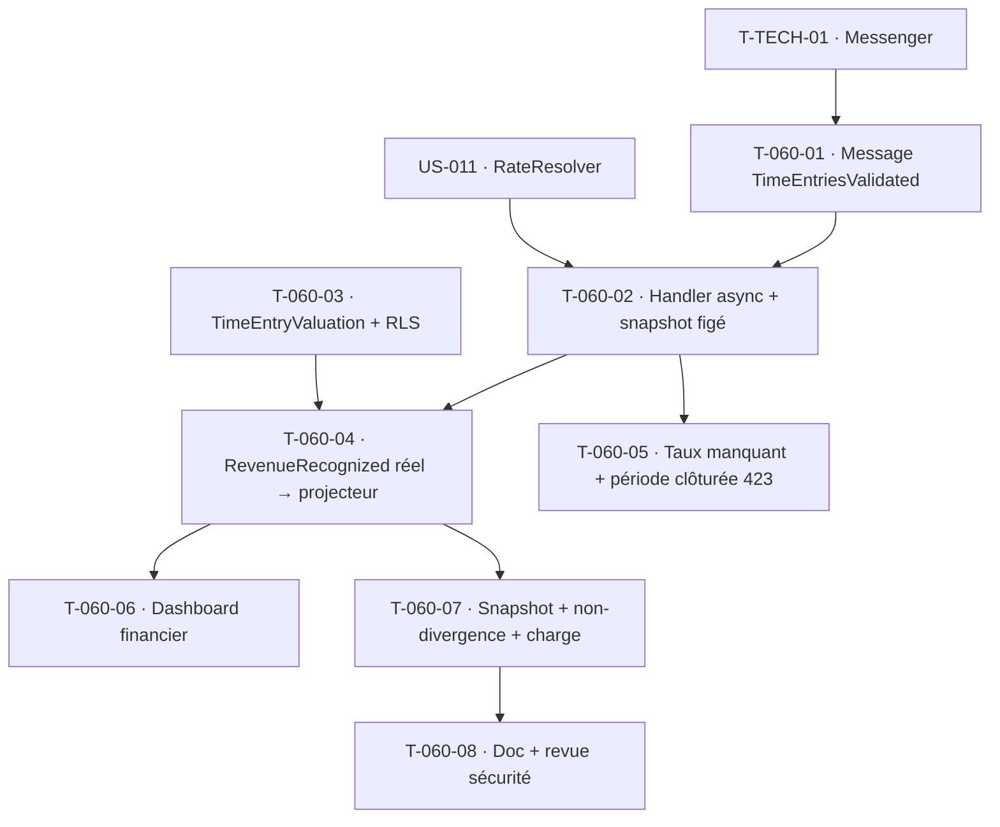

# Tâches — US-060 : Valorisation automatique après validation (≤ 15 minutes)

## Informations
- **Epic** : EPIC-003 · **Persona** : P2 Marc (chef de projet), P6 Élodie (dirigeante / contrôle de gestion)
- **Story Points** : 8 · **Sprint** : sprint-004-valorisation
- **Traçabilité** : `EF-TMP-29`, `INV-2`, `INV-3`, `ENF-PERF-5`, `ARC-113`, `ADR-9`
- **Dépend de** : T-TECH-01 (Messenger), US-011 (`RateResolver`), US-055 (validation ✅), US-005 (projecteur ✅)

## Résumé
**En tant que** chef de projet et dirigeante, **je veux** que les indicateurs financiers (coût, marge, occupation) se mettent à jour ≤ 15 min après la validation des temps, avec une **valorisation figée** à la date de validation, **afin de** disposer d'une vision fiable sans ressaisie et garantir l'intégrité historique malgré les révisions tarifaires.

## Vue d'ensemble des tâches

| ID | Type | Tâche | Estimation | Dépend de | Statut |
|----|------|-------|------------|-----------|--------|
| T-060-01 | [BE] | **Maillon déclencheur** : `ValidateTimeEntries` publie un message `TimeEntriesValidated` (tenant, entryIds, validatedAt) sur le bus Messenger (async, transport Doctrine) | 3h | T-TECH-01 | 🔲 |
| T-060-02 | [BE] | Handler async `ValueValidatedTimeHandler` : résout le tarif à `workDate` (`RateResolver`), calcule **coût & vente** en centimes (`ARC-6`), **fige le snapshot** ; lots de 100, atomique par lot (CA-3) | 5h | T-060-01, US-011 | 🔲 |
| T-060-03 | [DB] | Entité `TimeEntryValuation` (tenant, timeEntryId, `costCents`, `revenueCents`, `snapshotRateCents`, `snapshotRateDate`, `valuedAt`, statut valued/missing_rate) + migration + RLS | 2h | — | 🔲 |
| T-060-04 | [BE] | Production de l'événement analytique **réel** `RevenueRecognized` (temps validé × taux) → `EventStore::append` → projecteur → `fact_project_revenue` (**remplace la sonde**) | 3h | T-060-02, T-060-03 | 🔲 |
| T-060-05 | [BE] | CA-4 (taux manquant → valorisation partielle + alerte + re-déclenchement auto) et CA-5 (période clôturée US-057 → `POST /api/valorisation/recompute` renvoie **423 Locked**, recalcul tracé) | 4h | T-060-02 | 🔲 |
| T-060-06 | [FE-WEB] | Dashboard financier projet : fraîcheur « Mise à jour il y a X min », progression (642/1000), audit trail du taux appliqué (ℹ️), bandeau alerte valorisation incomplète | 4h | T-060-04 | 🔲 |
| T-060-07 | [TEST] | Unit **snapshot figé** (révision taux ultérieure sans impact — `INV-2/INV-3`, CA-2) + **non-divergence** (`DivergenceChecker` sur l'indicateur valorisé, `ARC-113`) + **charge** (1 000 imputations ≤ 15 min, `ENF-PERF-5`) + fonctionnel (423, alerte) | 5h | T-060-04 | 🔲 |
| T-060-08 | [DOC][REV] | Doc (flux validation → valorisation → projection) + revue `security-auditor` (pas de recalcul rétroactif, isolation) + `symfony-reviewer` | 2h | T-060-07 | 🔲 |

**Total estimé : 28h**

## Détails clés

### T-060-01 / T-060-02 · Couplage par événement + async (le trou à combler)
- Aujourd'hui `ValidateTimeEntries` **n'émet aucun événement** (mutation + `save` + journal sécurité). Le Sprint 4 ajoute la **publication d'un message** `TimeEntriesValidated` — couplage **par événement, pas par appel direct** (sprint-goal, `Notes` US-060).
- Traitement **asynchrone** (Messenger, transport Doctrine — `ADR-0007`) : lots de 100 (configurable), throughput cible ≥ 67 imputations/s pour tenir `ENF-PERF-5`. Parité worker FrankenPHP (contexte tenant posé/effacé par message — `ARC-47`).

### T-060-02 / T-060-03 · Snapshot figé (invariant non négociable `INV-2/INV-3`)
- Le taux appliqué est **copié dans `TimeEntryValuation`** (`snapshotRateCents`, `snapshotRateDate`), pas seulement lu dans la table des taux. Une révision tarifaire ultérieure **ne réécrit jamais** une valorisation passée (CA-2). Montants en **centimes entiers**.

### T-060-04 · Fin de la sonde (`ADR-9` / `ARC-111`)
- La valorisation **produit un `RevenueRecognized` réel** appended à l'`EventStore` ; le `DoctrineAnalyticsProjector` (rejeu, idempotent, trigger anti-écriture directe) alimente `fact_project_revenue`. Le fait n'est **jamais écrit directement**.
- *Note de périmètre* : le fait actuel ne porte que le CA (`amount_cents`). Le **coût/marge** dans l'étoile (nouveau fait ou colonnes) est une extension — périmètre minimal du sprint : **revenue réel d'abord**, coût porté par `TimeEntryValuation` + dashboard. À arbitrer en affinage si le fait coût entre dans le sprint.

### T-060-07 · Non-divergence (`ARC-113`)
- Réutiliser le `DivergenceChecker` (US-005) sur l'indicateur `project_revenue` valorisé (recalcul source `EventStore` vs modèle `fact_project_revenue`). *Rappel* : l'implémentation actuelle compare source-vs-modèle (rebuild complet), pas « incrémental vs reconstruction » — suffisant ici, à tracer si l'incrémental devient requis.

## Graphe de dépendances

