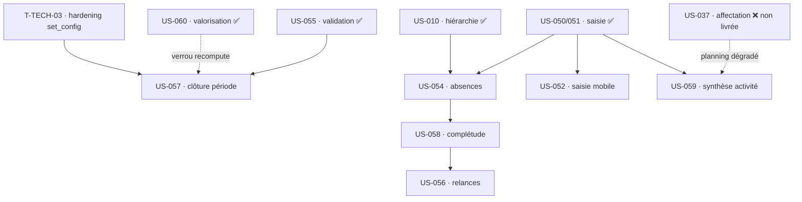

# Dépendances — Sprint 5 (Complétude et clôture du cycle temps)

## Graphe inter-US (ordre de valeur)

## Prérequis externes (tous livrés sauf mention)

| US | Dépend de | Statut | Impact si absent |
|----|-----------|--------|------------------|
| US-057 | US-055, US-060, US-003 | ✅ | — (raccorde le stub `PeriodClosureStatus`) |
| US-054 | US-050/051, US-010 (manager N+1), US-003 | ✅ | — |
| US-058 | US-050, US-054 (jours attendus), US-003 | ⏳ US-054 en parallèle | complétude sans déduction des absences (dégradé) |
| US-056 | US-058, T-TECH-01 (Messenger ✅), US-003 | ⏳ US-058 | — |
| US-052 | US-050/051 | ✅ | — |
| US-059 | US-050, **US-037 (non livrée)** | ⚠️ | planning « module non activé » (dégradation gracieuse, CA-3) |

## Chemin critique

`T-TECH-03 → US-057 (clôture + raccord US-060) → US-054 (absences) → US-058 (complétude) → US-056 (relances)`

US-052 et US-059 sont **parallélisables** (FE-WEB indépendants) et servent d'amortisseur de charge.

## Risques de dépendance

- **US-057 ↔ US-060** : le `423` du recompute doit rester vert une fois la vraie clôture branchée (non-régression `ValuationRecomputeApiTest`).
- **US-058 ↔ US-054** : le calcul des « jours attendus » déduit les absences validées ; démarrer US-058 sur les jours ouvrés puis intégrer les absences dès US-054-04 disponible.
- **US-059 ↔ US-037** : planning à venir dégradé tant qu'US-037 (affectation) n'est pas planifiée.
