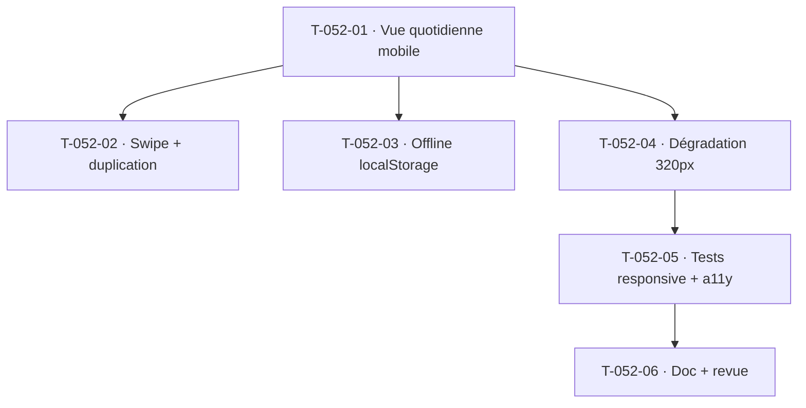

# Tâches — US-052 : Saisie quotidienne sur mobile

## Informations
- **Epic** : EPIC-003 · **Persona** : P1 Camille (collaborateur)
- **Story Points** : 3 · **Sprint** : sprint-005-completude_cloture
- **Traçabilité** : `EF-TMP-6`, `ENF-UX-3`
- **Dépend de** : US-050/051 (saisie web + API ✅)

## Résumé
**En tant que** collaboratrice en déplacement, **je veux** saisir ma journée depuis mon téléphone avec la même complétude fonctionnelle qu'en web, **afin de** ne jamais accumuler de retard.

> **Cadrage** : pas d'application Flutter dans le codebase — le « mobile » est une **vue web responsive mobile-first** (Symfony UX/Turbo/Stimulus) au-dessus de l'API de saisie US-050 existante. Une app native reste une évolution ultérieure.

## Vue d'ensemble des tâches

| ID | Type | Tâche | Est. | Dépend de | Statut |
|----|------|-------|------|-----------|--------|
| T-052-01 | [FE-WEB] | Vue **quotidienne** mobile-first (`< 768 px`) : liste des projets affectés, champs durée `inputmode="decimal"` (clavier numérique), commentaire, bouton « Soumettre » en thumb-zone ; zones tactiles ≥ 44×44 px ; pas de zoom involontaire (`viewport`, `font-size ≥ 16px`) | 4h | — | 🔲 |
| T-052-02 | [FE-WEB] | Navigation entre jours par **swipe** (Stimulus, transitions ≤ 200 ms, sans rechargement complet — Turbo) + indicateur « Mar 25/08 — semaine 35 » ; duplication du jour précédent | 3h | T-052-01 | 🔲 |
| T-052-03 | [FE-WEB] | **Offline (CA-4)** : sauvegarde locale `localStorage` en cas de perte réseau, bandeau « saisie sauvegardée localement », resynchronisation au retour (`online`) en un tap ; aucune perte de données | 3h | T-052-01 | 🔲 |
| T-052-04 | [FE-WEB] | Dégradation gracieuse petits écrans (320 px, CA-5) : `overflow-x: hidden`, hauteur champs ≥ 44 px, tout actionnable sans zoom ; sélecteur projet natif/bottom-sheet | 2h | T-052-01 | 🔲 |
| T-052-05 | [TEST] | Tests fonctionnels responsive (viewports 320/375/390) : parité fonctionnelle US-050 (CA-2), soumission ok ; **a11y** (rôles, focus, pas d'action hover-only — VoiceOver/TalkBack documentés) | 3h | T-052-04 | 🔲 |
| T-052-06 | [DOC][REV] | Doc (choix responsive vs natif, offline localStorage) + revue `symfony-reviewer`/`accessibility-expert` (ENF-UX-3) | 1h | T-052-05 | 🔲 |

**Total estimé : 16h**

## Détails clés
- **Réutilise l'API de saisie US-050** : aucune nouvelle route serveur nécessaire a priori — travail FE-WEB principalement.
- **Parité fonctionnelle (CA-2)** = critère de recette : toutes les actions de US-050 accessibles sans basculer desktop.
- **Offline** : `localStorage` (petites données) ; resynchro sur événement `online` ; le tap est une confirmation, pas une obligation.
- **a11y (ENF-UX-3)** : zones ≥ 44×44, pas de hover-only, clavier numérique ; tests sur ≥ 2 largeurs.

## Graphe de dépendances

