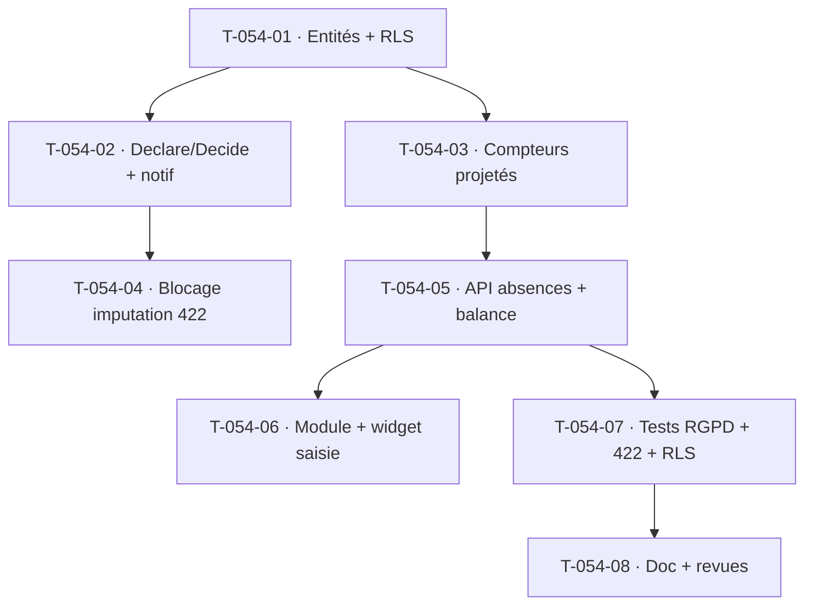

# Tâches — US-054 : Déclaration, validation et compteurs d'absences

## Informations
- **Epic** : EPIC-003 · **Persona** : P1 Camille (collaborateur), P2 Marc (valideur)
- **Story Points** : 5 · **Sprint** : sprint-005-completude_cloture
- **Traçabilité** : `EF-TMP-14`, `EF-TMP-15`, `EF-TMP-16`, `RG-TMP-3`, `HAB-3`
- **Dépend de** : US-050/051 (saisie ✅), US-003 (RBAC ✅), US-010 (hiérarchie/manager N+1 ✅)

## Résumé
**En tant que** collaboratrice et valideur, **je veux** déclarer des absences (type, dates, maille demi-journée), les faire valider via un circuit notifié et consulter mes compteurs en temps réel, **afin de** gérer mes absences sans risque d'imputation de production sur une période d'absence validée.

## Vue d'ensemble des tâches

| ID | Type | Tâche | Est. | Dépend de | Statut |
|----|------|-------|------|-----------|--------|
| T-054-01 | [DB] | Référentiel `AbsenceType` (tenant, libellé normalisé) + entité `AbsenceRequest` (collaborateur, type, période semi-ouverte, maille demi-journée, statut pending/validated/rejected, commentaire, **jamais de motif médical — HAB-3**) + migrations **RLS** | 3h | — | 🔲 |
| T-054-02 | [BE] | Use case `DeclareAbsence` (validation dates/maille, VO période demi-journée) + `DecideAbsence` (valider/refuser par le manager N+1, motif de refus) ; notifications (message async in-app/email) ; journal | 4h | T-054-01 | 🔲 |
| T-054-03 | [BE] | Compteurs (`EF-TMP-16`) : service `AbsenceBalance` — acquis/pris/en attente/solde + **projeté fin de période** (règles d'acquisition paramétrables tenant), calcul déterministe | 3h | T-054-01 | 🔲 |
| T-054-04 | [BE] | **RG-TMP-3** : bloquer l'imputation de production sur une période d'absence validée dans `RecordTimeEntry` → **422** (contrôle serveur, pas seulement UI) ; libération si l'absence est refusée (CA-5) | 2h | T-054-02 | 🔲 |
| T-054-05 | [BE] | API Platform : `POST/GET /api/absences` (déclaration, liste), `POST /api/absences/{id}/decision` (valider/refuser) ; DTO strict, 403/422 via listeners ; widget compteurs `GET /api/absences/balance` | 3h | T-054-03 | 🔲 |
| T-054-06 | [FE-WEB] | Module `/absences` + widget compteurs persistant dans la vue de saisie (badges ⏳✅❌) ; calendrier plage matin/après-midi ; cellules d'absence grisées non éditables dans `/saisie` | 4h | T-054-05 | 🔲 |
| T-054-07 | [TEST] | **CA-4 conformité RGPD** : test qui échoue si un champ `motif_medical`/diagnostic existe dans le schéma ou l'API (HAB-3) ; fonctionnel 422 (blocage imputation), circuit validation/refus ; unit compteurs + RLS d'intrusion `absence_request` | 4h | T-054-05 | 🔲 |
| T-054-08 | [DOC][REV] | Doc module absences + revue `security-auditor` (**HAB-3 minimisation données de santé**, RBAC) + `symfony-reviewer` | 2h | T-054-07 | 🔲 |

**Total estimé : 25h**

## Détails clés
- **HAB-3 (bloquant DoD)** : aucune donnée de santé au-delà du type normalisé + dates + n° justificatif optionnel. Le test T-054-07 est un **gate de conformité** (grep schéma/API).
- **Circuit** : N+1 direct (manager de la hiérarchie US-010). Multi-niveaux hors scope (lot 2).
- **Maille demi-journée** : réutiliser/étendre `EffectivePeriod` avec une granularité AM/PM, ou un VO dédié `HalfDaySpan`.
- **Manager N+1** : résolu via `OrgMembership`/hiérarchie (US-010) — pas de nouveau champ si dérivable.

## Graphe de dépendances

