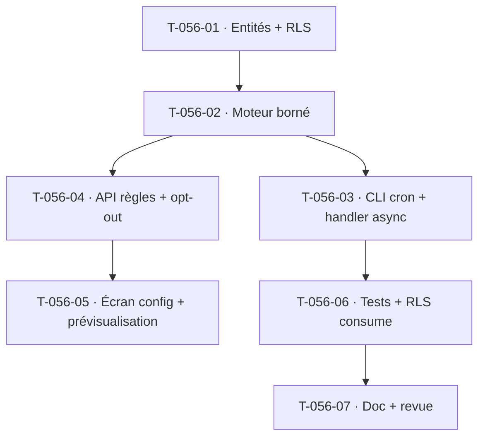

# Tâches — US-056 : Relances automatiques de retard de saisie

## Informations
- **Epic** : EPIC-003 · **Persona** : P1 Camille (destinataire), P2 Marc (paramètre)
- **Story Points** : 3 · **Sprint** : sprint-005-completude_cloture
- **Traçabilité** : `EF-TMP-21`
- **Dépend de** : US-058 (complétude — source des retards), T-TECH-01 (Messenger async ✅), US-003 (RBAC ✅)

## Résumé
**En tant que** chef de projet et collaborateur, **je veux** des relances automatiques paramétrables et bornées, désactivables, **afin d'** atteindre OBJ-1 sans harceler les collaborateurs.

## Vue d'ensemble des tâches

| ID | Type | Tâche | Est. | Dépend de | Statut |
|----|------|-------|------|-----------|--------|
| T-056-01 | [DB] | Entités `ReminderRule` (tenant : délai initial, fréquence, canal, escalade, actif) + `ReminderLog` (destinataire, semaine, canal, date, motif d'annulation) + préférence collaborateur `reminder_opt_out` + migrations **RLS** | 2h | — | 🔲 |
| T-056-02 | [BE] | Moteur `ScheduleReminders` : détecte les retards (via US-058), applique délai + **borne de fréquence** (plancher 1 j ouvré hardcodé, CA-4), escalade N+1 à la 3ᵉ relance ; **arrêt auto à la soumission** (CA-3) ; respecte opt-out (CA-2) et désactivation globale tenant (CA-5) | 4h | T-056-01 | 🔲 |
| T-056-03 | [BE] | Déclenchement périodique : commande CLI `app:reminders:run` (cron) publiant les relances sur le bus (**message tenant-aware async**) + handler d'envoi (in-app + email) ; journalisation | 3h | T-056-02 | 🔲 |
| T-056-04 | [BE] | API config `GET/PUT /api/reminders/rules` (habilité) + préférence opt-out collaborateur `PUT /api/me/reminder-preference` (droit individuel — non forçable par l'admin) | 2h | T-056-02 | 🔲 |
| T-056-05 | [FE-WEB] | Écran config relances (formulaire délai/fréquence/canal/escalade + **prévisualisation** semaine courante) ; historique filtrable ; bandeau discret de rappel dans `/saisie` si opt-out + retard | 3h | T-056-04 | 🔲 |
| T-056-06 | [TEST] | Unit : borne de fréquence (plancher), annulation à la soumission, escalade ; fonctionnel opt-out/désactivation globale ; **RLS-via-consume** du handler d'envoi (action rétro S4) | 3h | T-056-03 | 🔲 |
| T-056-07 | [DOC][REV] | Doc (paramètres, plancher anti-spam, opt-out RGPD) + revue `security-auditor` (opt-out non forçable, pas de rattrapage rétroactif) | 1h | T-056-06 | 🔲 |

**Total estimé : 18h**

## Détails clés
- **Nouveau handler async** → **test d'intrusion RLS via consume** obligatoire (DoD action rétro S4).
- **Plancher anti-spam** : 1 relance / jour ouvré max, hardcodé (non paramétrable), même si la règle est mal configurée.
- **Opt-out** : droit individuel du collaborateur ; l'admin peut désactiver globalement mais **ne peut pas forcer** la réactivation d'un opt-out. Tracer.
- **Ordonnancement** : privilégier une commande CLI déclenchée par cron (scheduler) qui *dispatch* — le calcul de fréquence reste déterministe et testable hors temps réel (Clock injectable).

## Graphe de dépendances

