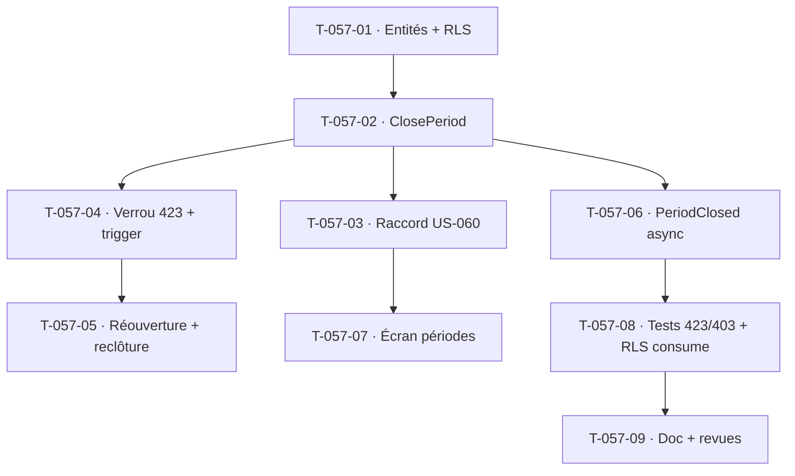

# Tâches — US-057 : Clôture de période et traçabilité des modifications

## Informations
- **Epic** : EPIC-003 · **Persona** : P2 Marc (chef de projet), ADMIN (administrateur tenant)
- **Story Points** : 5 · **Sprint** : sprint-005-completude_cloture
- **Traçabilité** : `EF-TMP-22`, `EF-TMP-23`, `RG-TMP-6`, `INV-7`
- **Dépend de** : US-055 (validation ✅), US-060 (verrou recompute à raccorder ✅), US-003 (RBAC ✅)

## Résumé
**En tant qu'** administrateur/chef de projet habilité, **je veux** clôturer une période pour verrouiller les imputations, déclencher les calculs aval et tracer toute modification ultérieure (auteur, date, avant/après, motif), **afin de** garantir l'intégrité des données historiques (INV-7).

## Vue d'ensemble des tâches

| ID | Type | Tâche | Est. | Dépend de | Statut |
|----|------|-------|------|-----------|--------|
| T-057-01 | [DB] | Entités `PeriodClosure` (tenant, période `YYYY-MM`, statut open/closing/closed, auteur, closedAt) + `ReopeningRequest` (demandeur, approbateur, motif, validité 48h, statut) + `TimesheetAuditLog` (immuable, INSERT-only) + migrations **RLS** | 3h | — | 🔲 |
| T-057-02 | [BE] | Use case `ClosePeriod` (`ensureCan` MANAGE_PERIODS ; CA-3 avertissement imputations non validées + option « clôturer malgré tout » tracée) : passe la période `closed`, marque les imputations `LOCKED`, journalise `periode_cloturee` (auteur, nb) | 4h | T-057-01 | 🔲 |
| T-057-03 | [BE] | **Raccordement US-060** : remplacer le stub `ConfiguredPeriodClosure` par `DoctrinePeriodClosure` (port `PeriodClosureStatus`, lecture par tenant) ; le recompute 423 s'appuie sur la vraie clôture (non-régression du verrou) | 2h | T-057-02 | 🔲 |
| T-057-04 | [BE] | Verrou de modification (CA-4) : `ValidateTimeEntries`/`RecordTimeEntry` refusent une imputation `LOCKED` → **423** (`PeriodLockedException` + listener) ; journal `tentative_modification_periode_cloturee`. Défense en profondeur : trigger PostgreSQL anti-UPDATE/DELETE sur imputations clôturées (INV-7) | 3h | T-057-02 | 🔲 |
| T-057-05 | [BE] | Circuit de réouverture (CA-2/CA-5) : use cases `RequestReopening` (permission dédiée → 403 sinon) + `ApproveReopening` (ADMIN) ; réouverture tracée (demandeur, approbateur, motif, validité) ; modification post-réouverture journalisée (avant/après) ; **reclôture auto** après 48h (message différé) | 4h | T-057-04 | 🔲 |
| T-057-06 | [BE] | Calculs aval async (CA-1) : à la clôture, publier `PeriodClosed` (async) → déclenche la valorisation restante ; statut de traitement visible. **Handler tenant-aware** | 2h | T-057-02 | 🔲 |
| T-057-07 | [FE-WEB] | Écran `/administration/periodes` : liste code couleur (🟢🟡🔴), modale de confirmation avec code de validation, bouton conditionnel (habilitation), historique des modifications par imputation (🔒, tableau Date/Auteur/Avant/Après/Motif) | 4h | T-057-03 | 🔲 |
| T-057-08 | [TEST] | Fonctionnel **423** (modif LOCKED via API) + **403** (réouverture non habilitée) ; unit clôture/reclôture ; **RLS-via-consume** du handler `PeriodClosed` (action rétro S4) ; immuabilité du journal d'audit | 4h | T-057-06 | 🔲 |
| T-057-09 | [DOC][REV] | Doc module (clôture → verrou → réouverture → calculs aval) + revues `security-auditor` (INV-7, immuabilité, 423/403) + `symfony-reviewer` | 2h | T-057-08 | 🔲 |

**Total estimé : 28h**

## Détails clés
- **Permission** : nouvelle `MANAGE_PERIODS` (clôture + approbation réouverture) et une permission de **demande** de réouverture (chef de projet). À ajouter à `Permission` + `DefaultRoleMatrix`.
- **Statut `LOCKED`** : étendre `ValidationStatus` **ou** porter le verrou par la période (préférer la période — évite un 4ᵉ statut sur l'imputation ; le verrou dérive de `PeriodClosure`). À arbitrer en T-057-01/04.
- **Immuabilité du journal** : `timesheet_audit_log` INSERT-only (aucun mutateur, aucune route de modif ; rétention 7 ans — documenter).
- **Non-régression US-060** : le `423` du recompute doit continuer à passer, désormais alimenté par la vraie clôture. Adapter `ValuationRecomputeApiTest` / la source de clôture.

## Graphe de dépendances

