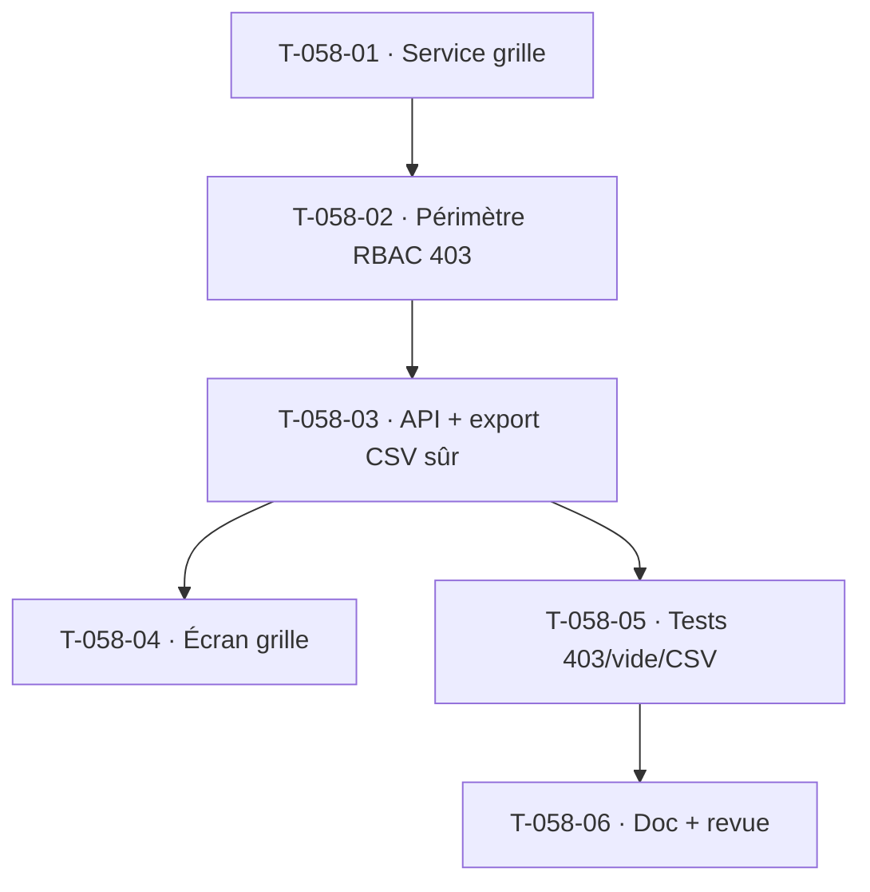

# Tâches — US-058 : Tableau de bord de complétude de saisie

## Informations
- **Epic** : EPIC-003 · **Persona** : P2 Marc (chef de projet), P3 Sophie (directrice de BU)
- **Story Points** : 3 · **Sprint** : sprint-005-completude_cloture
- **Traçabilité** : `EF-TMP-24`, `OBJ-1` (complétude ≥ 90 % à J+2)
- **Dépend de** : US-050 (imputations ✅), US-003 (RBAC/périmètre ✅), US-054 (absences — jours attendus)

## Résumé
**En tant que** chef de projet et directrice de BU, **je veux** un tableau collaborateurs × semaines avec repérage visuel des retards, **afin de** piloter OBJ-1 et cibler les relances.

## Vue d'ensemble des tâches

| ID | Type | Tâche | Est. | Dépend de | Statut |
|----|------|-------|------|-----------|--------|
| T-058-01 | [BE] | Service de lecture `CompletenessGrid` : taux de saisie par (collaborateur, semaine) sur 4 semaines glissantes — 4 états (soumise/partielle/vide J+2 dépassé/en cours), jours ouvrés du tenant hors weekend/fériés, jours d'absence validée déduits des attendus | 4h | — | 🔲 |
| T-058-02 | [BE] | Périmètre RBAC (CA-5) : filtrage par périmètre managérial (`effectiveScope`/`ensureWithinScope`) ; un collaborateur ne voit que **ses** données ; scope équipe → **403** sinon. Filtres projet/BU (CA-3) | 3h | T-058-01 | 🔲 |
| T-058-03 | [BE] | API `GET /api/completude?scope=…` + **export CSV** (colonnes Collaborateur/Semaine/Taux/Statut/Dernière action) protégé contre l'**injection CSV** ; état vide explicite (CA-4, pas de 500/NaN) | 3h | T-058-02 | 🔲 |
| T-058-04 | [FE-WEB] | Écran `/completude` : grille couleur 4 états + légende, taux global en en-tête, infobulle de cellule (détail + « Relancer maintenant » → US-056), sélecteur de semaine, liste triée par statut en mobile | 4h | T-058-03 | 🔲 |
| T-058-05 | [TEST] | Fonctionnel : 403 scope équipe (collaborateur), état vide (CA-4), export CSV sûr (anti-injection) ; unit calcul du taux (J+2 ouvrés, absences déduites) | 3h | T-058-03 | 🔲 |
| T-058-06 | [DOC][REV] | Doc (définition du taux, J+2 ouvré) + revue `symfony-reviewer` (+ perf : cache 15 min si nécessaire) | 1h | T-058-05 | 🔲 |

**Total estimé : 18h**

## Détails clés
- **« Semaine soumise »** : à défaut d'un statut de soumission par semaine, dériver la complétude de la présence d'imputations couvrant les jours ouvrés attendus (moins les absences validées). Documenter la définition.
- **Perf (≤ 3 s / 100 collab × 8 sem.)** : agréger en SQL (pas de N+1) ; prévoir un cache applicatif 15 min si mesuré nécessaire (ne pas optimiser prématurément — mesurer d'abord).
- **Réutilise** le pattern lecture + périmètre RBAC des dashboards existants (`/valorisation`).

## Graphe de dépendances

