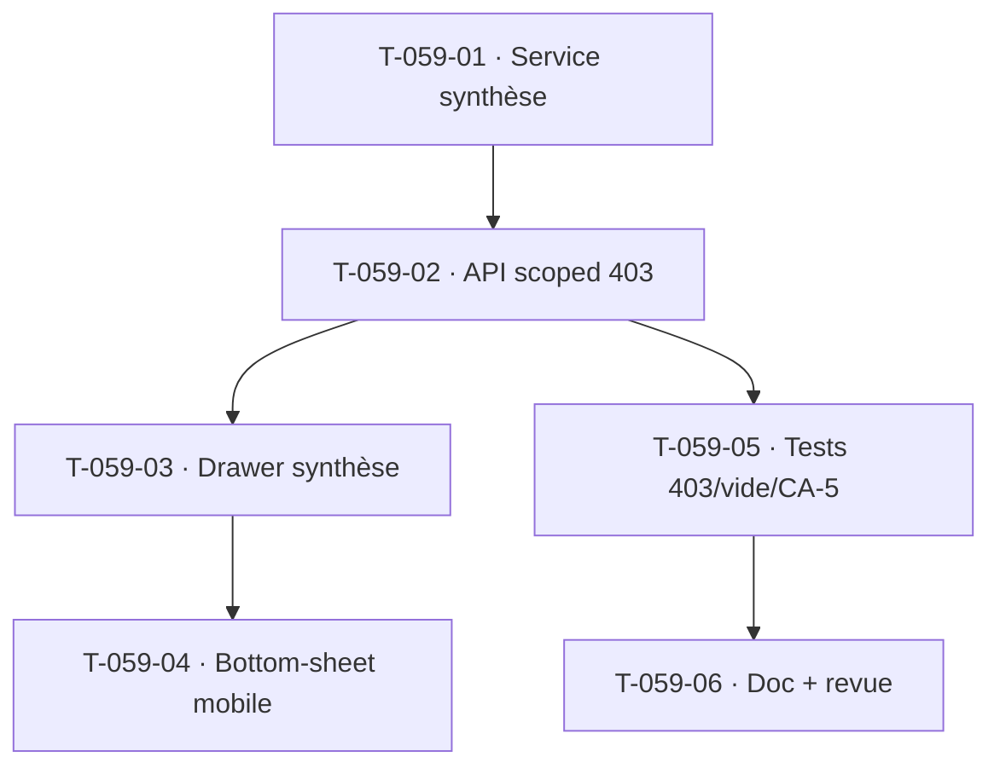

# Tâches — US-059 : Synthèse d'activité et planning depuis l'écran de saisie

## Informations
- **Epic** : EPIC-003 · **Persona** : P1 Camille (collaborateur)
- **Story Points** : 3 · **Sprint** : sprint-005-completude_cloture
- **Traçabilité** : `EF-TMP-26`, `EF-TMP-27`, `RSQ-1` (contrepartie visible → adhésion à la saisie)
- **Dépend de** : US-050 (imputations ✅), US-003 (RBAC ✅) ; US-037 (affectation — **non livrée** → planning dégradé)

## Résumé
**En tant que** collaboratrice, **je veux** accéder en 1 clic depuis l'écran de saisie à une synthèse de mon activité par projet et à mon planning à venir, **afin de** voir l'utilité de mes saisies et d'adhérer à la démarche (RSQ-1).

## Vue d'ensemble des tâches

| ID | Type | Tâche | Est. | Dépend de | Statut |
|----|------|-------|------|-----------|--------|
| T-059-01 | [BE] | Service de lecture `ActivitySummary` : répartition du temps par **projet** et par **type d'activité** sur période glissante (4 sem. paramétrable), taux d'occupation (imputé/attendu) ; statuts VALIDÉ+SOUMIS uniquement (RG-TMP-4) | 3h | — | 🔲 |
| T-059-02 | [BE] | API `GET /api/activity-summary` **strictement scoped soi-même** (CA-4 : `?user_id=` d'un autre → **403**) ; état vide explicite (CA-3, pas de 500) ; planning à venir dégradé si US-037 absente (« module d'affectation non activé ») | 3h | T-059-01 | 🔲 |
| T-059-03 | [FE-WEB] | Panneau latéral (drawer) « Ma synthèse » ouvert **depuis la vue de saisie sans changement de page** (1 clic, EF-TMP-26) : camembert répartition projet (max 7 + « Autres »), barres par type, onglet « Planning à venir » ; **ne perturbe pas la saisie en cours** (CA-5 : valeurs intactes, focus rétabli) | 4h | T-059-02 | 🔲 |
| T-059-04 | [FE-WEB] | Adaptation mobile : bottom-sheet (50-80 % hauteur), graphiques donut/barres verticales, fermeture au swipe réactivant la saisie | 2h | T-059-03 | 🔲 |
| T-059-05 | [TEST] | Fonctionnel : 403 sur `?user_id` d'autrui, état vide (CA-3), non-perturbation de la saisie (CA-5) ; unit calcul répartition/occupation (statuts inclus/exclus) | 3h | T-059-02 | 🔲 |
| T-059-06 | [DOC][REV] | Doc (périmètre RBAC, dégradation planning US-037, statuts inclus) + revue `symfony-reviewer` | 1h | T-059-05 | 🔲 |

**Total estimé : 16h**

## Détails clés
- **1 clic (EF-TMP-26)** : drawer superposé à la vue de saisie, jamais une navigation de page ni un nouvel onglet.
- **Dégradation planning** : US-037 non livrée → afficher un placeholder ; la synthèse **passée** (activité) est le cœur livrable de cette US.
- **Isolation stricte** : scope soi-même automatique (tenant + collaborateur) ; `?user_id` d'autrui → 403 (même projet inclus).
- **Non-perturbation (CA-5)** : le drawer est purement lecture ; aucune sauvegarde/soumission implicite ; restaurer le focus.

## Graphe de dépendances

