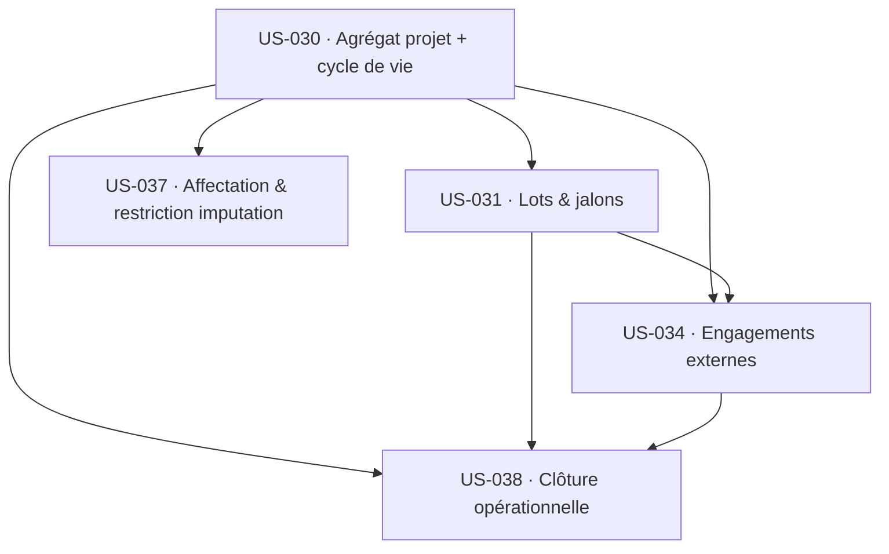

# Dépendances — Sprint 6 : Projets & delivery

## Dépendances externes (déjà livrées)

| US du sprint | Dépend de (livré) | Sprint d'origine |
|--------------|-------------------|------------------|
| US-030 | US-001 (multitenant), US-003 (auth/RBAC), US-010 (organisation/clients), US-011 (profils/taux) | S1, S4 |
| US-031/034/037/038 | US-030 (dans ce sprint) | S6 |
| US-037 | US-010, US-011 (affectation ↔ profil/rôle) | S4 |
| US-038 | Blocage d'imputation (RecordTimeEntry US-050), clôture pattern US-057 | S3, S5 |

## Ordre d'exécution (chemin critique interne)

`US-030` est la **racine** : l'agrégat `Project` enrichi (client, budget, statut) est le socle de
toutes les autres. Ordre retenu :

1. **US-030** — agrégat + cycle de vie + gate d'imputation par statut (bloquant pour tout le reste).
2. **US-031** — lots/jalons (dépend de l'agrégat + budget projet).
3. **US-037** — affectation + restriction d'imputation (dépend de l'agrégat + statut).
4. **US-034** — engagements externes (dépend de l'agrégat ; se rattache aussi aux lots d'US-031).
5. **US-038** — clôture (dépend de l'agrégat, des jalons US-031, des engagements US-034).

## Impact sur l'existant (à surveiller)

- **`RecordTimeEntry` / `RecordWeek`** : la restriction d'imputation s'enrichit — statut projet
  (US-030 CA-2), affectation (US-037 CA-1), projet clôturé (US-038 CA-7) — en plus du blocage de
  période clôturée (US-057) et de l'absence (US-054). Les tests fonctionnels de saisie devront
  SchemaTool-iser les nouvelles entités (piège #5).
- **`TimesheetPageController` / vue jour US-052 / `EnsureAbsenceProject`** : `findAllActive` doit
  refléter le nouveau modèle projet (statut, affectation) sans régression.
- **`ActivitySummary` / `CompletenessGrid`** : lecture des projets — cohérence avec l'agrégat enrichi.
- **Migrations** : nouvelles tables (`project_lot`, `project_milestone`, `project_assignment`,
  `project_external_commitment`, réouverture) + évolution de `project` — toutes avec RLS.

## Dégradations (modules amont absents)

Voir `sprint-goal.md` § Dégradations : facturation (EPIC-005), budget vente (US-033), RAF (US-035),
plan de charge (EPIC-004) sont hors sprint → intentions tracées / vues partielles documentées.
