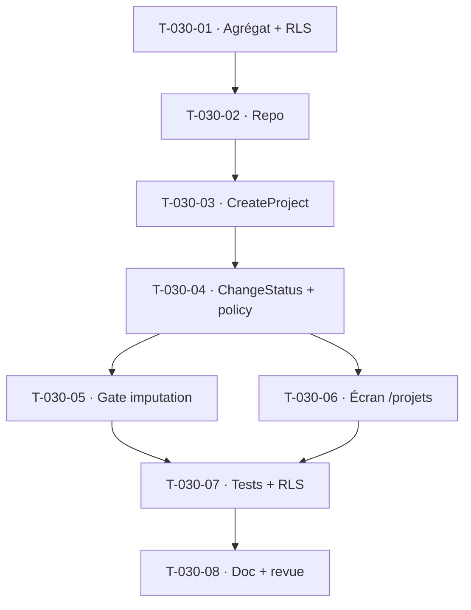

# Tâches — US-030 : Création de projet et cycle de vie

## Informations
- **Epic** : EPIC-002 · **Persona** : P2 Marc (chef de projet) · **Points** : 5
- **Traçabilité** : EF-PRJ-1, EF-PRJ-4, RG-PRJ-1
- **Dépend de** : US-010 (organisation/clients ✅), US-011 (profils/taux ✅)

## Résumé
**En tant que** chef de projet, **je veux** créer un projet (client, responsable, budget obligatoires)
et faire évoluer son statut, **afin de** conditionner les actions permises (imputation, facturation).

## Vue d'ensemble des tâches

| ID | Type | Tâche | Est. | Dépend de | Statut |
|----|------|-------|------|-----------|--------|
| T-030-01 | [DB] | Agrégat `Project` **enrichi** (client, responsable, budget, contractualisation, dates, `ProjectStatus` 7 états) + VO/exception ; migration **RLS** + évolution table `project` | 4h | — | 🔲 |
| T-030-02 | [DB] | Port `ProjectRepository` (find/save/listByTenant/statut) + adapter Doctrine + double in-memory | 1.5h | T-030-01 | 🔲 |
| T-030-03 | [BE] | `CreateProject` (`final readonly`, Authorizer `CREATE_PROJECT`, RG-PRJ-1 : client+responsable+budget obligatoires, id `PRJ-XXXX`, statut initial « En préparation ») | 3h | T-030-02 | 🔲 |
| T-030-04 | [BE] | `ChangeProjectStatus` (transitions autorisées, trace) + politique d'actions par statut (`ProjectStatusPolicy` : imputation, facturation) | 3h | T-030-03 | 🔲 |
| T-030-05 | [BE] | **Gate d'imputation par statut** dans `RecordTimeEntry`/`RecordWeek` (CA-2 : refus si projet ≠ « En cours » → 422) | 2h | T-030-04 | 🔲 |
| T-030-06 | [FE-WEB] | **Conception UX/UI** (ux-ergonome + ui-designer + accessibility-expert) puis écran `/projets` (liste + création + statut), Stimulus, CSRF/PRG | 4h | T-030-04 | 🔲 |
| T-030-07 | [TEST] | Unit (`Project`, statuts, `CreateProject`, gate) + fonctionnel (création 201, 422 sans client/budget, gate imputation) + `ProjectRlsRuntimeTest` | 3h | T-030-05 | 🔲 |
| T-030-08 | [DOC][REV] | Doc `docs/modules/project.md` + revues `security-auditor` / `symfony-reviewer` | 1h | T-030-07 | 🔲 |

**Total estimé : ~21.5h** (borné ; cœur du sprint).

## Détails clés
- **Impact existant** : l'entité `Project` minimale évolue → adapter `TimesheetPageController`,
  `EnsureAbsenceProject`, `ActivitySummary`, `SeedDemoDataCommand` (constructeur enrichi, valeurs par
  défaut) sans régression. Piège #5 : ajouter `Project` enrichi au `$schema` des tests de saisie.
- **Client** : réutiliser le référentiel clients d'US-010 (organisation) ; sinon champ client minimal
  documenté. **Facturation** (CA-3) : la politique de statut expose l'autorisation, l'émission réelle
  relève d'EPIC-005 (dégradé).
- **Permission** : `CREATE_PROJECT`/`EDIT_PROJECT` existent déjà (enum `Permission`).

## Graphe

