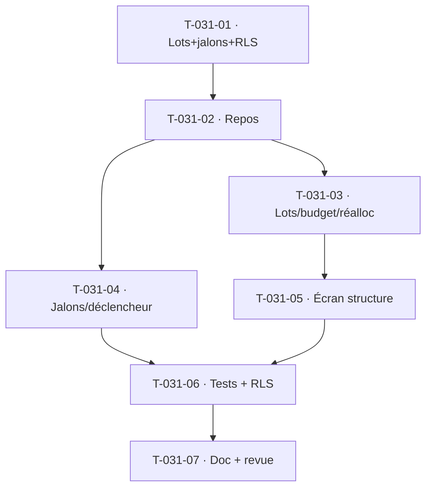

# Tâches — US-031 : Structure en lots et jalons

## Informations
- **Epic** : EPIC-002 · **Persona** : P2 Marc · **Points** : 5
- **Traçabilité** : EF-PRJ-2, EF-PRJ-3 · **Dépend de** : US-030

## Résumé
**En tant que** chef de projet, **je veux** organiser mon projet en lots hiérarchiques (budget charge+montant)
avec jalons datés, **afin de** suivre la répartition du budget et déclencher des actions sur jalons.

## Vue d'ensemble des tâches

| ID | Type | Tâche | Est. | Dépend de | Statut |
|----|------|-------|------|-----------|--------|
| T-031-01 | [DB] | Entités `ProjectLot` (hiérarchie 2 niveaux, budget **charge j + montant €**) + `ProjectMilestone` (date prév./réelle, statut, déclencheur facturation opt.) + migration **RLS** | 4h | — | 🔲 |
| T-031-02 | [DB] | Ports + adapters Doctrine (lots par projet, jalons par projet) + doubles | 1.5h | T-031-01 | 🔲 |
| T-031-03 | [BE] | `ManageProjectLots` : arborescence, somme lots vs budget projet (écart signalé, confirmation dépassement CA-6), **réallocation tracée** (auteur/date/motif — CA-3) | 3h | T-031-02 | 🔲 |
| T-031-04 | [BE] | `ManageMilestones` : statut À venir/Atteint/Retardé, date jalon **dans la période projet** (CA-7), déclencheur facturation **idempotent** (une seule fois — CA-7) — émission **dégradée** (intention tracée, EPIC-005 absent) | 3h | T-031-02 | 🔲 |
| T-031-05 | [FE-WEB] | **Conception UX/UI** puis écran structure projet (arbre lots + budgets + écart, jalons + déclencheurs) | 3h | T-031-03 | 🔲 |
| T-031-06 | [TEST] | Unit (arbre, écart, réallocation, jalon hors période, idempotence facturation) + fonctionnel + RLS | 3h | T-031-04 | 🔲 |
| T-031-07 | [DOC][REV] | Doc + revues | 1h | T-031-06 | 🔲 |

**Total estimé : ~18.5h**

## Détails clés / dégradations
- **Budget bidimensionnel** : charge (jours) **et** montant (€) par lot ; la somme des lots peut différer
  du budget projet, tout écart signalé (orange), dépassement nécessite confirmation explicite (CA-6).
- **Jalon → facture (CA-2)** : **dégradé** — le déclencheur enregistre l'intention + trace, pas
  d'émission (module facturation EPIC-005 non livré). Idempotence garantie (pas de double).
- **Réallocation (CA-3)** : motif obligatoire, tracée, total projet inchangé.

## Graphe

