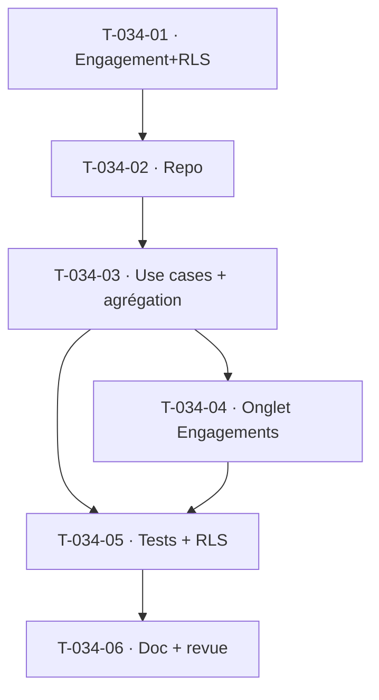

# Tâches — US-034 : Engagements externes rattachés au projet

## Informations
- **Epic** : EPIC-002 · **Persona** : P2 Marc · **Points** : 3
- **Traçabilité** : EF-PRJ-10 · **Dépend de** : US-030 (US-033 budget — **hors sprint**, dégradé)

## Résumé
**En tant que** chef de projet, **je veux** rattacher des engagements externes (sous-traitance, achats,
licences) avec coût et statut, **afin que** la marge intègre l'ensemble des coûts engagés.

## Vue d'ensemble des tâches

| ID | Type | Tâche | Est. | Dépend de | Statut |
|----|------|-------|------|-----------|--------|
| T-034-01 | [DB] | Entité `ExternalCommitment` (type, montant € HT, fournisseur, statut Prévisionnel/Engagé/Facturé/Soldé, projet + lot opt.) + migration **RLS** | 2.5h | — | 🔲 |
| T-034-02 | [DB] | Port + adapter Doctrine (par projet, par lot, filtre type/statut) + double | 1h | T-034-01 | 🔲 |
| T-034-03 | [BE] | `ManageExternalCommitments` : création (montant + fournisseur obligatoires — CA-6), rattachement projet/lot, refus si projet **clôturé** (CA-5, RG-PRJ-5) ; agrégation coûts externes | 2.5h | T-034-02 | 🔲 |
| T-034-04 | [FE-WEB] | **Conception UX/UI** puis onglet « Engagements » (liste filtrable type/statut, sous-totaux, création) | 2.5h | T-034-03 | 🔲 |
| T-034-05 | [TEST] | Unit (validation, refus clôturé, agrégation) + fonctionnel (filtre, 422) + RLS | 2h | T-034-03 | 🔲 |
| T-034-06 | [DOC][REV] | Doc + revues | 0.5h | T-034-05 | 🔲 |

**Total estimé : ~11h**

## Détails clés / dégradations
- **Marge (CA-1)** : le calcul intègre coûts internes (valorisation US-060) + coûts externes ; le
  **budget de vente** et la marge par lot complète relèvent d'US-033 (**dégradé** : vue partielle
  documentée, coûts externes exposés séparément).
- **Rattachement lot (CA-4)** : optionnel ; si présent, comptabilisé dans les coûts du lot.
- Engagements inclus dans la **marge** mais **pas** dans la charge (jours).

## Graphe

