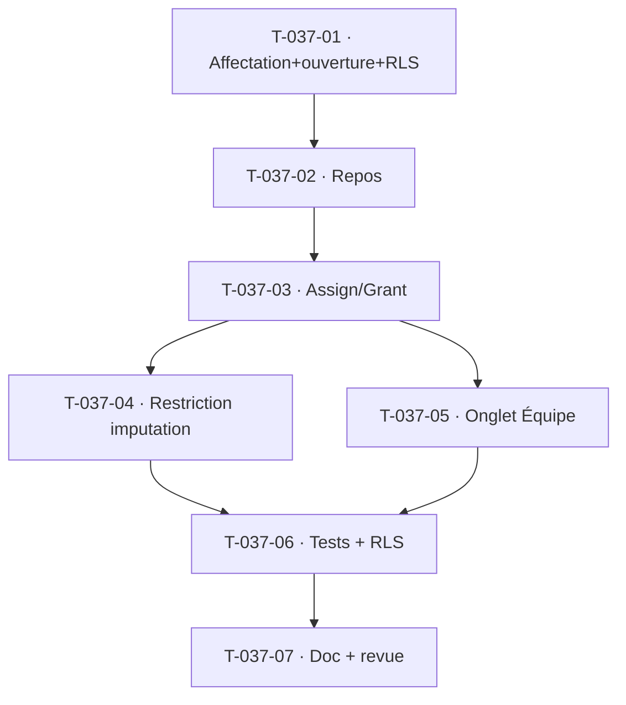

# Tâches — US-037 : Affectation et restriction d'imputation

## Informations
- **Epic** : EPIC-002 · **Persona** : P2 Marc / P3 Sophie · **Points** : 5
- **Traçabilité** : EF-PRJ-19, EF-PRJ-20 · **Dépend de** : US-030, US-010, US-011

## Résumé
**En tant que** chef de projet / resource manager, **je veux** affecter des collaborateurs (rôle, période,
charge prévisionnelle) et restreindre l'imputation aux affectés, **afin de** fiabiliser qui peut pointer.

## Vue d'ensemble des tâches

| ID | Type | Tâche | Est. | Dépend de | Statut |
|----|------|-------|------|-----------|--------|
| T-037-01 | [DB] | Entités `ProjectAssignment` (userId, rôle, période, charge prév.) + `ExceptionalImputationOpening` (auteur, semaine, motif, révocation) + migration **RLS** | 4h | — | 🔲 |
| T-037-02 | [DB] | Ports + adapters Doctrine (affectations par projet/collaborateur, ouvertures actives) + doubles | 1.5h | T-037-01 | 🔲 |
| T-037-03 | [BE] | `AssignCollaborator` / `RemoveAssignment` (Authorizer) + `GrantExceptionalOpening` (tracée, révocation auto en fin de semaine) | 3h | T-037-02 | 🔲 |
| T-037-04 | [BE] | **Restriction d'imputation** dans `RecordTimeEntry`/`RecordWeek` (CA-1 : refus si non affecté ET pas d'ouverture exceptionnelle active — 422) + filtrage des projets visibles à la saisie | 3h | T-037-03 | 🔲 |
| T-037-05 | [FE-WEB] | **Conception UX/UI** puis onglet « Équipe » du projet (liste affectations + ajout + ouverture exceptionnelle) | 3h | T-037-03 | 🔲 |
| T-037-06 | [TEST] | Unit (affectation, restriction, ouverture/révocation) + fonctionnel (projet non affecté invisible, 422 API) + RLS | 3h | T-037-04 | 🔲 |
| T-037-07 | [DOC][REV] | Doc + revues | 1h | T-037-06 | 🔲 |

**Total estimé : ~18.5h**

## Détails clés / dégradations
- **Restriction saisie** : compose avec le gate de statut (US-030), la clôture (US-038), la période
  clôturée (US-057) et l'absence (US-054) → chaîne de gardes dans `RecordTimeEntry`. Ordre et messages
  clairs. `TimesheetPageController`/vue jour ne listent que les projets **affectés et « En cours »**.
- **Charge prévisionnelle** stockée pour alimenter le **plan de charge** (EPIC-004) — **dégradé** :
  la charge est saisie/stockée, l'agrégation plan de charge est ultérieure. Débloque le planning d'US-059.
- **Ouverture exceptionnelle** (CA-2) : tracée, bornée à une semaine, révoquée automatiquement.

## Graphe

