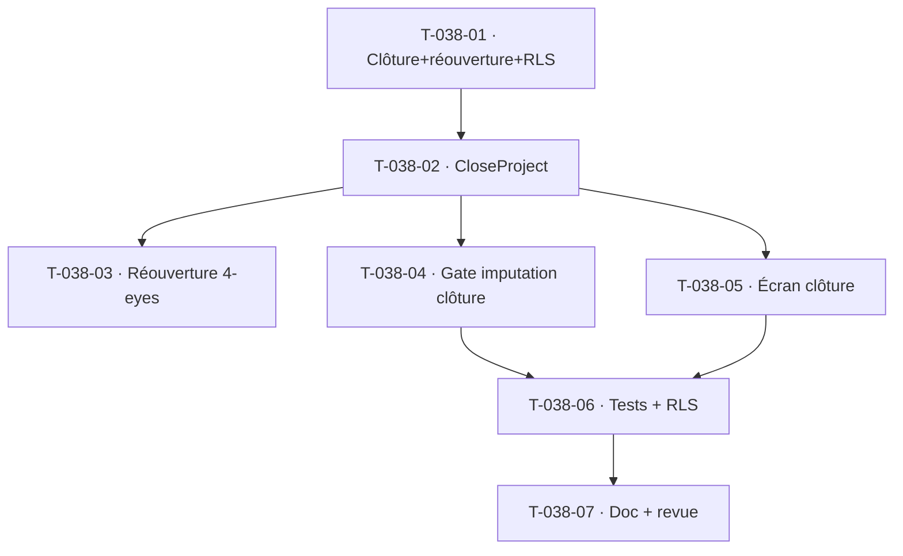

# Tâches — US-038 : Clôture opérationnelle du projet

## Informations
- **Epic** : EPIC-002 · **Persona** : P2 Marc · **Points** : 3
- **Traçabilité** : EF-PRJ-22, RG-PRJ-5, RG-TMP-6 · **Dépend de** : US-030, US-031, US-034 (US-033/035 dégradés)

## Résumé
**En tant que** chef de projet, **je veux** clôturer un projet pour fermer les imputations tout en gardant
l'accès aux données et agrégats, **afin de** garantir l'intégrité après la fin du projet.

## Vue d'ensemble des tâches

| ID | Type | Tâche | Est. | Dépend de | Statut |
|----|------|-------|------|-----------|--------|
| T-038-01 | [DB] | Extension `Project` (clôture : `closedAt`, `closedBy`) + `ProjectReopening` (demandeur, valideur ADMIN, fenêtre, motif) + migration **RLS** | 2h | — | 🔲 |
| T-038-02 | [BE] | `CloseProject` : prérequis **bloquant** imputations non validées (CA-6, RG-PRJ-5) ; **avertissement** jalons non atteints + engagements non soldés (CA-4, confirmation) ; passage statut « Clôturé » + trace | 3h | T-038-01 | 🔲 |
| T-038-03 | [BE] | `RequestProjectReopening` + `ApproveProjectReopening` (**4-eyes** ADMIN, fenêtre bornée, révocation auto) — réutilise le pattern US-057 | 2h | T-038-02 | 🔲 |
| T-038-04 | [BE] | **Gate d'imputation clôture** dans `RecordTimeEntry`/`RecordWeek` (CA-1/CA-7 : refus si projet clôturé sans réouverture active — 422/423 + audit) | 2h | T-038-02 | 🔲 |
| T-038-05 | [FE-WEB] | **Conception UX/UI** puis action « Clôturer » (confirmation + liste points bloquants) + badge « Clôturé »/« Réouvert temporairement » | 2h | T-038-02 | 🔲 |
| T-038-06 | [TEST] | Unit (prérequis, réouverture) + fonctionnel (gate imputation clôture, blocage non validées) + RLS | 3h | T-038-04 | 🔲 |
| T-038-07 | [DOC][REV] | Doc + revues | 1h | T-038-06 | 🔲 |

**Total estimé : ~15h**

## Détails clés / dégradations
- **Réutilise US-057** : clôture/réouverture 4-eyes, fenêtre bornée, audit — même esprit que la clôture
  de période comptable (garde + trace).
- **CA-6** : imputations « Soumise – en attente » **bloquent** la clôture (liste renvoyée).
- **CA-2/CA-5 (agrégats/facture post-clôture)** : **dégradés** — projet clôturé en lecture seule inclus
  dans les lectures existantes ; le suivi financier post-clôture complet relève du reporting/EPIC-005.
- **Chaîne de gardes** : compose avec statut (US-030), affectation (US-037), période (US-057), absence (US-054).

## Graphe

