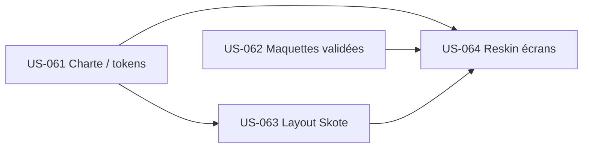

# Sprint 7 — Dépendances

## Dépendances internes (entre US du sprint)

| US | Dépend de | Nature |
|----|-----------|--------|
| US-063 | US-061 | Le layout consomme les tokens (couleurs, espacements, thème clair/sombre) |
| US-064 | US-061, US-062, US-063 | Reskin = tokens + maquette validée, appliqués dans le layout intégré |

## Dépendances externes (hors sprint)

| Élément | Statut | Impact |
|---------|--------|--------|
| PR #12 (EPIC-012 backlog + conception) mergée sur `main` | ⏳ à merger | Prérequis : les US et les artefacts de conception doivent être sur `main` |
| Socle EPIC-000 (`base.html.twig`, AssetMapper, Stimulus) | ✅ livré | Support de l'intégration du layout (US-063) |
| Correctifs PR #10 (recompile assets dev) / #11 (base UI sobre) | ✅ mergés | La CSS se charge ; placeholder `skyblue` retiré |
| Thème Skote (`project-management/Skote_Symfony_v2.2.0/`) | ✅ présent | Source de dérivation des tokens et du layout |
| Décision ADR-0018 (CSS compilé + tokens, sans build Sass) | ✅ actée | Cadre technique de l'intégration |

## Dette technique à résorber en amont

| Item | Origine | Traitement |
|------|---------|------------|
| `sprintf → set_config('app.current_tenant', ?, ...)` (3 sites : projector, configurator, middleware) | Action rétro S4 | À traiter avant le gros du reskin (hygiène RLS, param lié) |

## Chemin critique

`US-061` (tokens) → `US-063` (layout) → `US-064` (reskin). US-062 (maquettes validées) est parallélisable
avec US-061/063 mais **bloque** l'ouverture de US-064 écran par écran (registre de validation).
