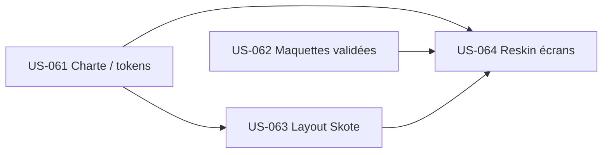

# Sprint 7 : Design system posé et appliqué au lot 1 (EPIC-012)

## Informations

| Attribut | Valeur |
|----------|--------|
| Numéro | 7 |
| Début | 2026-11-10 |
| Fin | 2026-11-21 |
| Durée | 10 jours ouvrés |
| Capacité (prévision) | ~21 points (vélocité S1-S6 : 29/20/23/21/22/21 → moy. ~23, récente ~21 ; 1 dev — HYP-15) |
| Base git | `main` (après merge PR #12 — EPIC-012 backlog + conception) |
| Branche | `feature/sprint-7-design` (dev) ; planning versionné avec EPIC-012 (PR #12) |

## Sprint Goal

> « Le **design system définitif** (thème Skote + tokens accessibles) est **posé et appliqué** aux écrans
> du lot 1 : la charte fait autorité, les **maquettes UX/UI sont validées**, le **layout Skote est intégré**
> sans régression, et les écrans les plus utilisés (saisie, complétude, valorisation) sont **reskinnés** —
> figeant l'ergonomie définitive avant d'étendre le développement front. »

Ce sprint **exécute EPIC-012** (D1→D4). La phase de conception est déjà livrée (ADR-0018, `design-system.md`,
`ux-conception-lot1.md`, maquettes `design-canvas/` — PR #12) : Sprint 7 transforme ces artefacts en code.
Il applique la consigne PO — **conception UX/UI validée avant tout dev front** — puisque les maquettes
précèdent le reskin. L'audit d'accessibilité complet (US-065) et la recette d'ergonomie (US-066) suivent
en Sprint 8.

## Definition of Done (rappel + actions rétro)

- [ ] `make ci` vert (PHPStan max, Deptrac 0, cs-fixer, Rector, gitleaks) ; `schema:validate` OK
- [ ] **Aucune régression fonctionnelle** sur les écrans reskinnés : critères d'acceptance des US d'origine
      toujours satisfaits, recette navigateur re-passée
- [ ] **[Consigne PO]** Reskin d'un écran conditionné à la **validation de sa maquette** (registre de
      `ux-conception-lot1.md`) — US-062 avant US-064, écran par écran
- [ ] Tokens = source unique : aucun hex en dur dans les templates/CSS applicatifs (CA-1/CA-4 US-061)
- [ ] Contrastes WCAG 2.2 AA respectés (charte vérifiée ; audit complet = US-065 en S8) ; info jamais
      portée par la seule couleur (WCAG 1.4.1) ; cibles ≥ 44 px (parité tactile)
- [ ] **[Action rétro S4/S5]** Lot tech-debt `sprintf → set_config` (3 sites) résorbé en amont
- [ ] Budget d'assets maîtrisé (pas de dégradation du temps de chargement — NFR EPIC-012)
- [ ] Documentation mise à jour ; revues `symfony-reviewer` (+ `accessibility-expert` sur l'a11y)

## Sprint Backlog

| Priorité | ID | Titre | Points | Persona | Statut |
|----------|-----|-------|--------|---------|--------|
| 🔴 Must | US-061 | Charte & design system (tokens + composants Skote) | 5 | Tous (P1-P6) | 🔵 To Do |
| 🔴 Must | US-062 | Conception UX/UI des écrans du lot 1 (maquettes validées) | 5 | Tous (P1-P6) | 🔵 To Do |
| 🔴 Must | US-063 | Intégration du layout Skote sur le socle Twig/Stimulus | 5 | Tous (P1-P6) | 🔵 To Do |
| 🔴 Must | US-064 | Reskin des écrans livrés selon les maquettes | 8 | Tous (P1-P6) | 🔵 To Do |

**Total engagé : 23 points.** Légèrement au-dessus de la vélocité récente (~21), assumé car **US-062 est
déjà substantiellement avancée** en phase de conception (plan + maquettes `design-canvas/` produits) — son
reste à faire (formalisation + validation) est plus léger que 5 pts. Filet de sécurité : si le rythme
l'exige, **US-064 est reskinné par priorité d'usage** (saisie + complétude d'abord ; valorisation ensuite),
le reste basculant en S8.

## Séquencement & dépendances

- **US-061** (tokens/composants) est le prérequis de US-063 et US-064 → à démarrer en premier.
- **US-062** (maquettes validées) et **US-063** (layout) peuvent avancer en parallèle une fois les tokens posés.
- **US-064** (reskin) ne démarre, écran par écran, qu'après validation de la maquette correspondante.

## Points à trancher en début de sprint (issus de la conception)

| Point | US | Décision attendue |
|-------|----|-------------------|
| Breakpoint 640 px existant vs 768 px Bootstrap | US-063 | Convention unique pour les nouveaux composants |
| Chargement de la police Poppins (absente de `base.html.twig`) | US-063 | Via Google Fonts `<link>` ou `@font-face` local |
| Checklist de validation UX non négociable vs pression « fast-track » | US-062 / PO | Arbitrage PO explicite |

## Risques identifiés

| Risque | Probabilité | Impact | Mitigation |
|--------|-------------|--------|------------|
| « Maquettes validées » sans panel d'utilisateurs réels disponible | Moyenne | Moyen | Validation PO + heuristiques a11y/ergonomie ; recette utilisateurs → US-066 (S8) |
| 23 pts > vélocité ~21 | Moyenne | Faible | US-062 pré-avancée ; sinon US-064 par priorité d'usage, reliquat → S8 |
| Poids du CSS Bootstrap (budget assets) | Faible | Moyen | Sous-ensemble / purge (ADR-0018) ; mesure du temps de chargement |
| Deux conventions de breakpoint qui dérivent | Faible | Faible | Trancher en début de sprint (US-063) |

## Notes

Décision PO (périmètre) : capitaliser sur le chantier EPIC-012 conçu en amont — poser et **appliquer** le
design (D1→D4) plutôt que d'étendre les référentiels (EPIC-001) sur une base non figée. **US-065** (audit
a11y WCAG 2.2 AA) et **US-066** (recette d'ergonomie) → Sprint 8, une fois les écrans reskinnés.

Pré-requis : merge de la **PR #12** (US-061→066 + conception) sur `main` avant le démarrage du dev.
