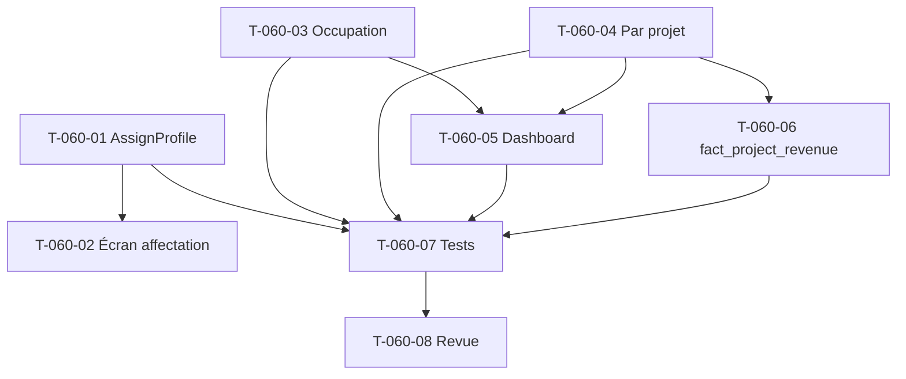

# Tâches — US-060 : Valorisation automatique après validation (≤ 15 min)

## Informations US
- **Epic** : EPIC-003 · **Persona** : P2 Marc, P6 Directeur financier · **Points** : 8 · **Sprint** : sprint-008-valorisation_auth

## ⚠️ État de l'existant (cartographie 2026-09-03)
**~70-80% déjà implémenté.** Le pipeline async fonctionne : `ValidateTimeEntries` émet `TimeEntriesValidated` →
`ValueValidatedTimeHandler` résout profil (`ProfileAssignmentRepository`) + taux (`RateResolver::resolveAt`) →
`TimeEntryValuation` **snapshot figé** (non-rétroactivité déjà garantie) → dashboard `/valorisation` lit
`time_entry_valuation`. Messenger async (`config/packages/messenger.yaml`, transport Doctrine, retry) et
middleware tenant en place. **Ne pas réimplémenter ce socle.**

Le reste à faire cible les manques identifiés (occupation, par-projet, affectations, projection).

## Vue d'ensemble des tâches

| ID | Type | Tâche | Estimation | Dépend de | Statut |
|----|------|-------|------------|-----------|--------|
| T-060-01 | [BE] | Use case `AssignProfile` (affecter collaborateur↔profil sur période) | 3h | - | 🔲 |
| T-060-02 | [FE-WEB] | Écran d'affectation profil↔collaborateur (admin profils) | 3h | T-060-01 | 🔲 |
| T-060-03 | [BE] | Calcul du **taux d'occupation** (capacité vs jours imputés valorisés) | 4h | - | 🔲 |
| T-060-04 | [BE] | **Ventilation par projet** : summary par projet (join `TimeEntry`↔`TimeEntryValuation`) | 4h | - | 🔲 |
| T-060-05 | [FE-WEB] | Dashboard : ventilation par projet + occupation (`valuation/index.html.twig`) | 3h | T-060-03, T-060-04 | 🔲 |
| T-060-06 | [BE] | Projection `fact_project_revenue` dans le flux post-validation (décision archi) | 3h | T-060-04 | 🔲 |
| T-060-07 | [TEST] | Tests : affectation, occupation, par-projet, SLA ≤ 15 min | 3h | T-060-01..06 | 🔲 |
| T-060-08 | [REV] | Revue de clôture `symfony-reviewer` | 1h | T-060-07 | 🔲 |

**Total estimé : 24h** (dont socle déjà livré non recompté).

## Détail (points d'accroche)

### T-060-01 [BE] Use case `AssignProfile`
Créer `src/Application/Pricing/AssignProfile.php` (+ éventuel `ProfileAssignmentRepository::save` déjà présent).
Sans affectation, `resolveProfile()` renvoie `null` → tout part en `MISSING_RATE` (**cause de la valorisation
vide en recette F2**). Garde-fou chevauchement de périodes. **CA-1/CA-2.**
- [ ] `new ProfileAssignment` créé via un use case testé · [ ] chevauchement rejeté · [ ] contexte tenant respecté

### T-060-02 [FE-WEB] Écran d'affectation
À côté de l'admin profils (`ProfilePageController`) : affecter un collaborateur à un profil sur une plage.
- [ ] Formulaire + habilitation (`manage:pricing`) · [ ] affectation reflétée dans la valorisation

### T-060-03 [BE] Taux d'occupation
Absent aujourd'hui (`ValuationSummary` n'a pas d'occupation). Ajouter le calcul (jours ouvrés/capacité vs jours
imputés valorisés) — nouveau service `src/Domain/Valuation/` ou extension de `ValuationSummary`. **CA-1.**
- [ ] Occupation par collaborateur/projet · [ ] test de calcul (absences déduites cf. `CompletenessGrid`)

### T-060-04 [BE] Ventilation par projet
`summaryFor()` agrège au niveau tenant (`GROUP BY status`). `TimeEntryValuation` ne porte pas `projectId` →
join via `TimeEntry`, ou ajouter `project_ref` sur `time_entry_valuation` (décision archi à acter en ADR léger). **CA-1.**
- [ ] Coût réel / marge **par projet** · [ ] pas de rétroactivité (snapshot conservé)

### T-060-05 [FE-WEB] Dashboard par projet + occupation
`templates/valuation/index.html.twig` : ventilation par projet + occupation, en conservant KPIs/fraîcheur/audit trail existants.
- [ ] Tableau par projet · [ ] gating coût (`VIEW_COLLABORATOR_COST`) préservé

### T-060-06 [BE] Projection `fact_project_revenue`
Aujourd'hui peuplée seulement par le batch CLI `RebuildAnalyticsCommand`. Décider : projeter après validation
(brancher `RebuildAnalytics` dans le flux async / projection à la volée sur `RevenueRecognized`).
- [ ] `fact_project_revenue` cohérente après validation · [ ] pas de double comptage

### T-060-07 [TEST] & T-060-08 [REV]
Tests d'intégration (affectation → valorisation non `MISSING_RATE`), occupation, par-projet, **SLA ≤ 15 min**
(latence worker). Revue `symfony-reviewer`.

## Graphe de dépendances

## Résumé
| Type | Tâches | Heures |
|------|--------|--------|
| [BE] | 4 | 14h |
| [FE-WEB] | 2 | 6h |
| [TEST] | 1 | 3h |
| [REV] | 1 | 1h |
| **TOTAL** | **8** | **24h** |
