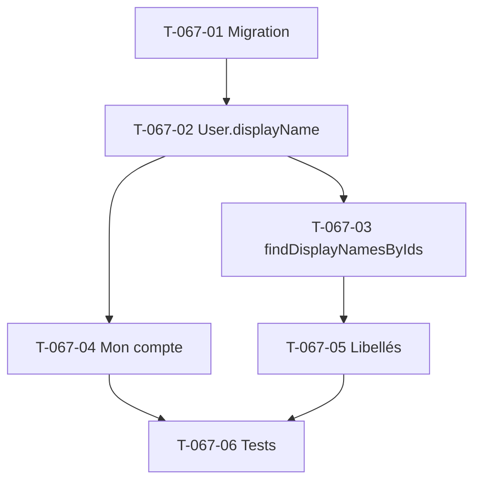

# Tâches — US-067 : Enrichissement du profil utilisateur (nom et prénom)

## Informations US
- **Epic** : EPIC-000 · **Persona** : tous (P1-P6) · **Points** : 3 · **Sprint** : sprint-008-valorisation_auth

## État de l'existant
`src/Domain/User/User.php` (table `app_user`) porte uniquement `id, tenant_id, email, password, roles` — **aucun
nom/prénom**. L'email sert de libellé partout : `UserRepository::findEmailsByIds` → `CompletenessPageController:56`,
`base.html.twig:130` (`app.user.getUserIdentifier()`). Pas d'écran « Mon compte » (`/profils` = profils de tarification).

## Vue d'ensemble des tâches

| ID | Type | Tâche | Estimation | Dépend de | Statut |
|----|------|-------|------------|-----------|--------|
| T-067-01 | [DB] | Migration `first_name` / `last_name` sur `app_user` (nullable) | 1h | - | 🔲 |
| T-067-02 | [BE] | Enrichir `User` : champs + `displayName()` (fallback email si vide) | 2h | T-067-01 | 🔲 |
| T-067-03 | [BE] | `findDisplayNamesByIds` (étend/remplace `findEmailsByIds`) | 1h | T-067-02 | 🔲 |
| T-067-04 | [FE-WEB] | Écran « Mon compte » : afficher/éditer nom-prénom (habilitation) | 3h | T-067-02 | 🔲 |
| T-067-05 | [FE-WEB] | Remplacer email par `displayName` (base, complétude, projets, valorisation) | 2h | T-067-03 | 🔲 |
| T-067-06 | [TEST] | Fallback email (CA-3), édition profil (CA-2), validation entrées (CA-4) | 2h | T-067-04, T-067-05 | 🔲 |

**Total estimé : 11h**

## Détail (points d'accroche)

### T-067-01 [DB] Migration
`first_name` / `last_name` VARCHAR nullable sur `app_user` (rétrocompat CA-3 : comptes existants sans nom).

### T-067-02 [BE] Enrichir `User`
Accesseurs + `displayName()` : « Prénom Nom », **repli sur l'email** si vide (jamais « null null » — CA-3).
Validation longueur/format (CA-4).

### T-067-03 [BE] `findDisplayNamesByIds`
Étendre `DoctrineUserRepository` : retourner un libellé d'affichage (nom si présent, sinon email). Réutilisé
par tous les écrans listant des collaborateurs.

### T-067-04 [FE-WEB] Écran « Mon compte »
Nouveau `AccountPageController` (route `/mon-compte`), `#[CurrentUser]`, formulaire nom/prénom. Habilitation :
l'utilisateur édite **son** profil ; un tiers requiert un droit d'administration (CA-2).

### T-067-05 [FE-WEB] Remplacement des libellés
`base.html.twig:130`, `completeness/index.html.twig` (déjà `userEmails|default`), futurs écrans projets/valorisation
(cohérent avec US-060). Lève le pis-aller F-S5-4.

### T-067-06 [TEST]
Vue complétude affiche « Camille Martin » ; compte sans nom → email (pas d'erreur) ; édition refusée sans droit.

## Graphe de dépendances

## Résumé
| Type | Tâches | Heures |
|------|--------|--------|
| [DB] | 1 | 1h |
| [BE] | 2 | 3h |
| [FE-WEB] | 2 | 5h |
| [TEST] | 1 | 2h |
| **TOTAL** | **6** | **11h** |
