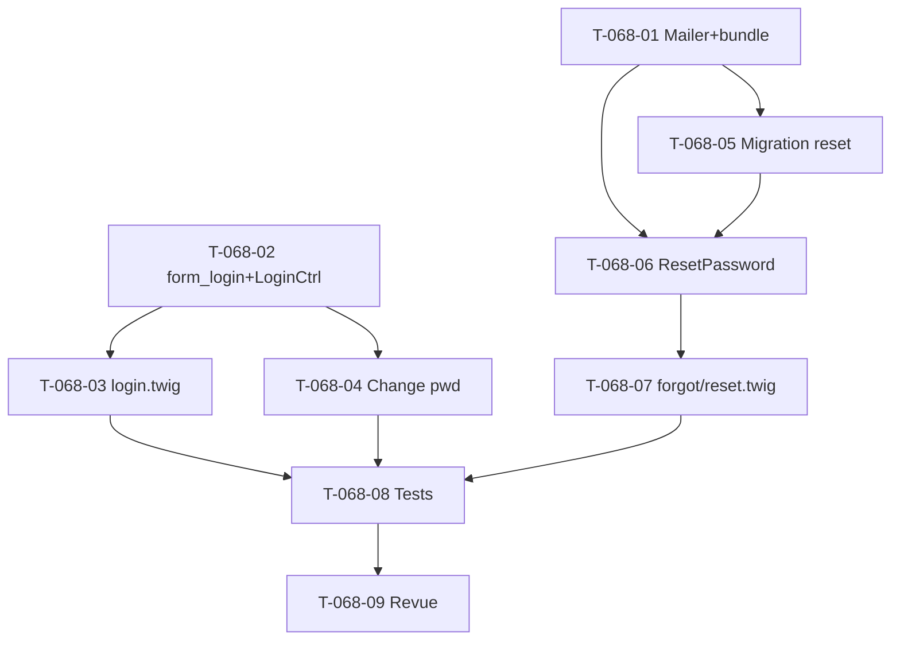

# Tâches — US-068 : Écrans web d'authentification

## Informations US
- **Epic** : EPIC-000 · **Persona** : tous (P1-P6) · **Points** : 8 · **Sprint** : sprint-008-valorisation_auth

## État de l'existant
`config/packages/security.yaml` : **Argon2id configuré** (`algorithm: sodium`), provider `app_users` (email),
firewall `main` avec **`json_login` uniquement** (`/api/login`, `/api/logout`), `access_control` web déjà en place.
**Manque tout l'UI web** : pas de `form_login`, pas de `templates/security/`, pas de `LoginController` web.
**Mailer absent** : `symfony/mailer` pas dans `composer.json`, pas de `mailer.yaml`/`MAILER_DSN` → prérequis du « mot de passe oublié ».
> Hors périmètre (US) : provisionnement/création de compte (pas d'inscription self-service).

## Vue d'ensemble des tâches

| ID | Type | Tâche | Estimation | Dépend de | Statut |
|----|------|-------|------------|-----------|--------|
| T-068-01 | [OPS] | `composer require symfony/mailer symfonycasts/reset-password-bundle` + `mailer.yaml` + `MAILER_DSN` | 2h | - | 🔲 |
| T-068-02 | [BE] | `form_login` dans `security.yaml` + `LoginController` web (GET `/login`, CSRF) | 2h | - | 🔲 |
| T-068-03 | [FE-WEB] | `templates/security/login.html.twig` (+ layout auth, étend `base`) | 2h | T-068-02 | 🔲 |
| T-068-04 | [BE/FE-WEB] | Changement de mot de passe (« Mon compte ») : form + Argon2id (CA-3) | 3h | T-068-02 | 🔲 |
| T-068-05 | [DB] | Migration `reset_password_request` (reset-password-bundle) | 1h | T-068-01 | 🔲 |
| T-068-06 | [BE] | `ResetPasswordController` (forgot + reset) + envoi e-mail (CA-4) | 4h | T-068-01, T-068-05 | 🔲 |
| T-068-07 | [FE-WEB] | `templates/security/{forgot,reset}.html.twig` | 2h | T-068-06 | 🔲 |
| T-068-08 | [TEST] | Parcours login web, logout, changement + reset mot de passe | 3h | T-068-03..07 | 🔲 |
| T-068-09 | [REV] | Revue sécurité (`security-auditor` / `symfony-reviewer`) | 1h | T-068-08 | 🔲 |

**Total estimé : 20h**

## Détail (points d'accroche)

### T-068-01 [OPS] Mailer + reset-password-bundle
Ajouter les dépendances (règle 11 : versions pinées), `config/packages/mailer.yaml`, `MAILER_DSN` (`.env` +
`.env.dist`). En dev/test : transport `null://` ou capture (pas d'envoi réel en test).

### T-068-02 [BE] `form_login` + `LoginController` web
Ajouter `form_login` au firewall `main` (login_path `/login`, check_path, **CSRF activé**, default_target_path
vers l'accueil) **sans casser** `json_login` API. `LoginController::login` (GET) via `AuthenticationUtils`.
Session sécurisée (cookie httpOnly/secure/sameSite — CA-1). Logout web.

### T-068-03 / T-068-07 [FE-WEB] Templates
`login.html.twig`, `forgot.html.twig`, `reset.html.twig` étendant `base.html.twig` (design system Tailwind).
Écrans sobres, messages d'erreur génériques (pas de révélation — CA-3/CA-4).

### T-068-04 [BE/FE-WEB] Changement de mot de passe
Depuis « Mon compte » (US-067) : mot de passe actuel + nouveau (≥ 12 car., politique OWASP) + confirmation,
hachage **Argon2id**, refus sans révélation si actuel incorrect (CA-3).

### T-068-05 / T-068-06 [DB/BE] Mot de passe oublié
`reset_password_request` (migration) ; `ResetPasswordController` (demande → token → e-mail → formulaire de reset).
Token à durée limitée, usage unique. Message générique même si e-mail inconnu (anti-énumération).

### T-068-08 [TEST] & T-068-09 [REV]
Login web OK/KO, logout invalide la session, changement de mot de passe, reset (token valide/expiré). Revue sécurité.

## Graphe de dépendances

## Résumé
| Type | Tâches | Heures |
|------|--------|--------|
| [OPS] | 1 | 2h |
| [BE] | 3 | 9h |
| [FE-WEB] | 3 | 6h |
| [TEST] | 1 | 3h |
| [REV] | 1 | 1h |
| **TOTAL** | **9** | **21h** |
