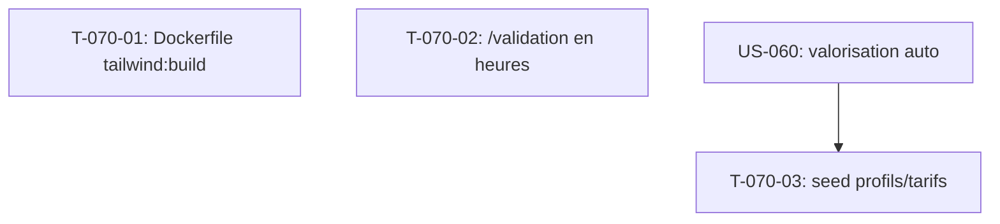

# Tâches — US-070 : Suites de la recette US-069 (findings à traiter)

## Informations US
- **Epic** : EPIC-012 (transverse : EPIC-005 finance, EPIC-011 industrialisation)
- **Persona** : P2 Marc (manager) + équipe dev/OPS
- **Story Points** : 3
- **Sprint** : sprint-008-valorisation_auth
- **Source** : recette peuplée US-069 — `.recette/reports/REC-20260903-us069-report.md`

## Vue d'ensemble des tâches

| ID | Type | Tâche | Estimation | Dépend de | Statut |
|----|------|-------|------------|-----------|--------|
| T-070-01 | [OPS] | `Dockerfile` : `tailwind:build --minify` avant `asset-map:compile` | 1h | - | 🔲 |
| T-070-02 | [FE-WEB] | `/validation` : afficher la durée en heures (cohérence saisie) | 2h | - | 🔲 |
| T-070-03 | [DB] | Seed démo : profils + tarifs + `make db-reset` (valorisation démontrable) | 4h | US-060 (calcul) | 🔲 |

**Total estimé** : 7h

---

## Détail des tâches

### T-070-01 : `Dockerfile` — build Tailwind avant compile des assets *(à faire EN PREMIER)*
- **Type** : [OPS] · **Estimation** : 1h · **Dépend de** : -

**Description** : le build image lance `asset-map:compile` sans `tailwind:build` → `make up` échoue
(« Built Tailwind CSS file does not exist »). Ajouter `php bin/console tailwind:build --minify` **avant**
`asset-map:compile` (conforme ADR-0019). Finding **F-INFRA-1** + action rétro S7 #1.

**Fichiers** : `Dockerfile`

**Critères de validation** :
- [ ] `make up` build **de zéro** (sans `var/tailwind` préexistant) aboutit sans erreur Tailwind
- [ ] `tailwind:build --minify` s'exécute avant `asset-map:compile`
- [ ] CI verte

---

### T-070-02 : `/validation` — durée en heures (cohérence avec la saisie décimale)
- **Type** : [FE-WEB] · **Estimation** : 2h · **Dépend de** : -

**Description** : l'écran `/validation` affiche « Minutes / 420 » alors que la saisie est en heures décimales
(US-066). Présenter la durée en heures (« 7h00 » ou décimal) — finding **F3**.

**Fichiers** : `src/UI/Http/Controller/ValidationPageController.php`, `templates/timesheet/validation.html.twig`
(+ éventuel helper de formatage min→heures réutilisable).

**Critères de validation** :
- [ ] Colonne durée en heures, cohérente avec l'écran de saisie
- [ ] Test de vue (assertion sur le format horaire, plus « 420 » brut)
- [ ] Domaine/API restent en minutes (conversion à l'affichage uniquement)

---

### T-070-03 : Seed démo représentatif + `make db-reset`
- **Type** : [DB] · **Estimation** : 4h · **Dépend de** : US-060 (le seed peuple ce que la valorisation calcule)

**Description** : le seed ne crée ni profils ni tarifs (`profile`/`profile_rate` = 0) → valorisation à 0 €
(finding **F2**). Enrichir `SeedDemoDataCommand` : profils + tarifs + assignations, pour rendre
`/valorisation` démontrable. Ajouter une cible `make db-reset` (purge + migrate + seed unique) — action
rétro S7 #2 (éviter l'accumulation de tenants).

**Fichiers** : `src/UI/Cli/SeedDemoDataCommand.php`, `Makefile` (cible `db-reset`).

**Critères de validation** :
- [ ] `/valorisation` non nulle après seed (CA reconnu > 0, imputations valorisées > 0)
- [ ] `/validation` déjà peuplé (Marc responsable — fait en US-069)
- [ ] `make db-reset` : un seul tenant après exécution
- [ ] Recette de contrôle tracée dans `.recette/`

> **Ordre** : T-070-01 en premier (débloque le dev), puis US-060 (calcul), puis T-070-03 (peuple), T-070-02 en parallèle.

## Graphe de dépendances

## Résumé

| Type | Tâches | Heures |
|------|--------|--------|
| [OPS] | 1 | 1h |
| [FE-WEB] | 1 | 2h |
| [DB] | 1 | 4h |
| **TOTAL** | **3** | **7h** |
